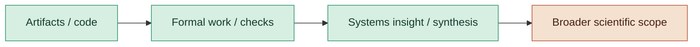

# Author's Note

This paper is written in a more formal register than feels natural to me. That is appropriate for the kinds of claims it makes, but it strips out some of the voice that got me here. I want to add back a little of that.

I am uncomfortable naming a unit after myself. "Bule" survived mostly because other naming chances had already gone elsewhere: Wallace "Wally" Wallington for the scheduling line, "Whip Worthington" for the crossover term, and Charley Wallace for the crank factor. By the time I got to the deficit unit, I had run out of excuses.

At the time, I thought of it as a small internal joke and a way to remind myself that the goal of a deficit metric is zero. If the name sticks, I hope it is taken in that spirit.

The idea itself started less grandly than the paper may make it seem. I was working on a distributed inference pipeline and got stuck on a basic question: if latency behaves like a rolling constraint, can that constraint be rotated, shared, or amortized instead of simply endured? The shower-bottle anecdote is true. So is the pyramid-log image. Most of the useful questions arrived sounding a little stupid at first.

One note I kept returning to was this:

> Success is measured by the grit you show in achieving this goal divided by the number of times you stop before its completion. If any new voids open up during work, they are to be closed before considering success. We are to explore all logical stones.

In retrospect, that note rhymes with the drift and closure language that appears later in the formal sections. I would not claim it predicted the theorems. It did, however, capture a working instinct that turned out to matter: unfinished work accumulates cost, and systems stay honest only when that cost is accounted for.

If I have contributed anything here, I think it is narrower than a universal theory and broader than a single optimization. I built a set of tools, models, and experiments around one recurring systems shape and pushed them as far as I could: through code, tests, protocol design, language design, and formalization. The results are bounded. The ambitions are larger. Replication and time will decide how much of it lasts.

To be sure:

> A skeptical but fair reader would probably say that this is an unusually ambitious and end-to-end synthesis project: real artifacts, real formal work, real systems insight, but with structural rhetoric that sometimes outruns the narrowest proved scope. I hope to be clear in my intention to dial it back. I know my engineering achievement is substantial, and I am excited to see whether others find these ideas useful.

What I do believe strongly is that failure deserves better treatment in engineering language. In many systems, failure is not only something to eliminate; it is also something to isolate, price, route, and learn from. Fast failure can be useful. Local failure can be healthy. Ignoring those facts usually just pushes the cost somewhere less visible.

That is the spirit in which terms like Bule, Wallington, and the Void appear here. They are not claims of cosmic law. They are handles: ways to point at recurring costs, topological mismatch, and the choice every real system makes about where it pays for certainty.

If any of this lasts, I hope it lasts for ordinary reasons: because the code is useful, because the models clarify something real, and because the formal pieces give future readers something firmer than metaphor to argue with.
