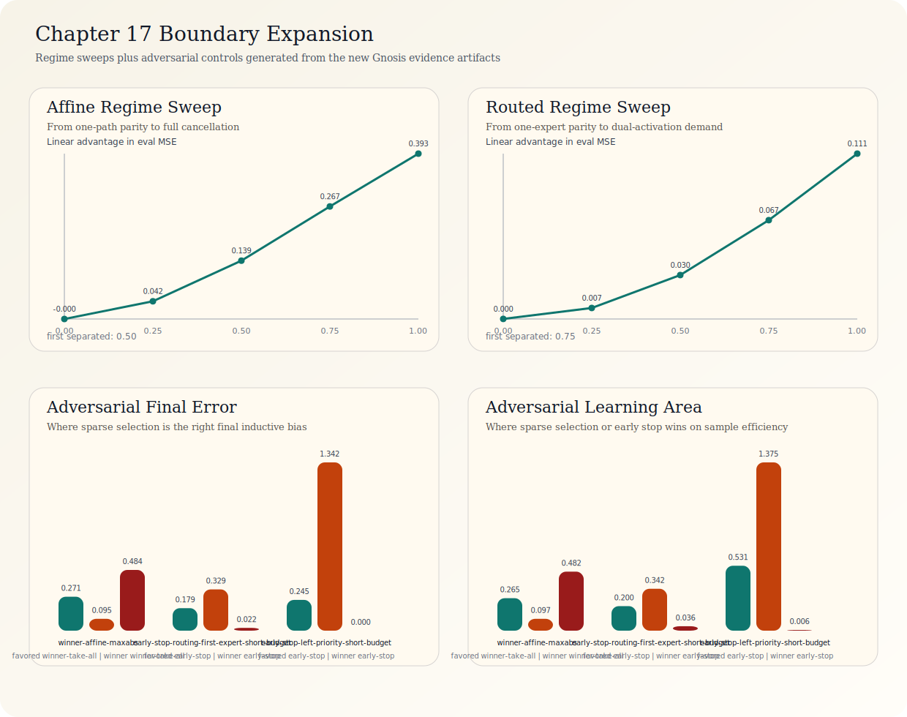
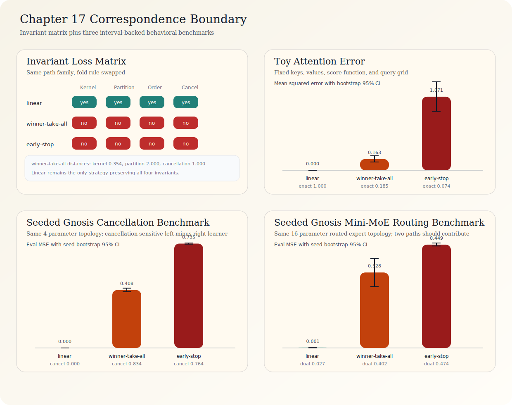

# **The Shape of Failure**: Bottling Infinity in Distributed Systems

**Taylor William Buley**
Independent Researcher
https://www.patreon.com/c/twbuley

## Abstract

I model **fork/race/fold** as a reusable computational primitive: `fork` work into parallel streams, `race` streams to select earliest valid progress, `fold` results through deterministic reconciliation, and `vent` paths whose continued existence would destabilize the whole. The central claim of this manuscript is that failure in such systems can be modeled not only as a binary event but also as a **topological coordinate**.

In this framing, failure is not merely the opposite of success; it marks where topology, coordination, and reconciliation no longer return the system toward a bounded stable region. Across the modeled scope in this manuscript, I argue that this viewpoint is operationally useful, measurable, and partially mechanizable.

I report structural similarities in selected natural and engineered examples: *Physarum polycephalum* recreated a rail-like network over nutrient gradients [1], myelinated neurons pipeline action potentials (with measured large speedups), photosynthetic antenna complexes exhibit high step-level exciton-transfer efficiency in cited systems, and DNA replication uses out-of-order fragment synthesis with deterministic reassembly (Okazaki fragments). In each case, the interesting question is not simply how much work is dissipated, but whether the system's transition kernel points back toward a bounded stable region after perturbation.

This manuscript's core contribution is an operational abstraction with explicit diagnostics and executable obligations. I present the **Wallington Rotation**, a scheduling algorithm that rotates partially ordered work into concurrent stage-local tracks with controlled reconciliation, and I show through constructive local decomposition, assumption-parameterized global schemas, and executable verification that four primitives -- fork, race, fold, vent -- are sufficient for the finite DAG classes used in this paper's implementation scope under explicit decomposition assumptions. I also describe a topological reading of the algorithm: fork increases the first Betti number $\beta_1$ (creating independent parallel paths), race traverses homotopy-equivalent paths simultaneously, fold projects $\beta_1$ back toward zero, and self-describing frames can be treated as a cover-space-style description of multiplexed, out-of-order work that is later projected back to sequential order.

I then show that **selected canonical queueing constructions appear as $\beta_1 = 0$ boundary cases in this framework**. Little's Law and Jackson-style queueing results are treated as path-like examples in the modeled scope [6, 7, 24]. I also introduce the **pipeline Reynolds number** $Re = N/C$ as a regime heuristic in the modeled scope and the **topological deficit** $\Delta_\beta = \beta_1^* - \beta_1$ as a diagnostic shorthand. Quantum-mechanical and thermodynamic terms are used later as structural correspondence language for organizing the analyzed examples, not as claims of physical identity. In the analyzed set, matched Betti structure ($\Delta_\beta = 0$) correlates with higher fit/efficiency, while $\Delta_\beta > 0$ co-occurs with measurable waste (healthcare delays, settlement lockup, protocol-level blocking) [9, 16, 17]. I define the **Bule** (1 B = 1 unit of $\Delta_\beta$) as a shorthand engineering unit for that deficit. The formal companion now proves a conditional universal-floor theorem on explicitly witnessed failure Pareto frontiers: if a zero-deficit floor point is supplied together with latency/waste lower bounds, it minimizes every monotone generalized-convex cost, and strict uniqueness requires the strict cost extension plus uniqueness of that zero-deficit floor witness.

These cross-domain correspondences are exemplar-based and correlational; they are not presented as a systematic causal survey or universal proof. In compression benchmarks on homogeneous web content, standalone global brotli retained better ratio, so the topological claim is strategy subsumption, framing reduction, and portability rather than universal ratio superiority. The strongest conclusion in scope is operational: some reliability and efficiency questions can be usefully recast in geometric terms, unmanaged topological deficit is one recurring source of waste or instability in the analyzed examples, and validation should test negative drift rather than merely count broken cases.

`o -> o -> o -> o -> o -> o`

The conveyor belt was not new when Ford adopted it in 1913. It is a path graph -- a line: one-dimensional, simply connected and without branching, where interior nodes have one predecessor and one successor. Modern pipelines can optimize this structure, but in this paper it is treated as a boundary case of a richer topology class.

```
      o -> o
     /     \
o -> o       o -> o
     \     /
      o -> o
```

Fork/race/fold is represented here as a directed acyclic graph (DAG) with merge points: nodes branch, paths run in parallel and merge vertices fold concurrent paths into one. In the analyzed domains, recurring bottlenecks arise when high-$\beta_1$ workloads are forced through path-like structures. The operational remedy is to work in the cover space (multiplexed, out-of-order) and project back to the base space (sequential, reassembled).

I instantiate the algorithm in **seven** domains, presented in stack order -- from building blocks to bytes on wire and back -- each layer enabled by the ones below it.

1) In formal verification (the foundation, §10), I implement a temporal logic model checker (`@affectively/aeon-logic`) whose BFS state-space exploration is itself a fork/race/fold computation. Each multi-successor expansion is a fork, each transition to an already-visited state is a fold (interference), each unfair cycle filtered by weak fairness is a vent, and termination is collapse. The checker verifies a `TemporalModel` of its own exploration and generates a TLA+ specification of the same model, validated through a round-trip-stable TLA sandbox. Both verification paths check the same invariants: $\beta_1 = \text{folded}$, $\beta_1 \geq 0$, $\text{vents} \leq \text{folds}$, and eventual termination under weak fairness. In the modeled scope, this yields closure under self-application: a formal system built from these primitives can reason about formal systems built from these primitives [13].

2) In formal language theory (the programming model, §11), I implement Gnosis [15] -- a programming language that unifies source code and computation graph and whose compiler is a fork/race/fold pipeline. Programs are Cypher-like graphs with four edge types (FORK, RACE, FOLD, VENT). The compiler statically verifies $\beta_1$ bounds, verified by layer 1. The self-hosted compiler (Betti) is itself a GGL program: `(source) -[:FORK]-> (parse_nodes | parse_edges) -[:FOLD]-> (ast)`, establishing closure under construction.

3) In distributed staged computation (the scheduling algorithm, §7), chunked pipelined processing reduces sequential depth from $O(PN)$ to $O(\lceil P/B \rceil + N - 1)$, yielding modeled step-count speedups of 3.1x–267x in the listed scenarios under explicit idealized assumptions (uniform stage service time, zero inter-node communication cost). The Wallington Rotation, expressed in layer 2's language, verified by layer 1's checker.

4) In edge transport (the wire format, §8), I implement a binary stream protocol with 10-byte self-describing frame headers and native fork/race/fold operations on UDP, reducing framing overhead by 95 percent versus HTTP/1.1 and removing one-path ordered-delivery coupling that drives head-of-line behavior in TCP-bound stacks. Layer 3's scheduling algorithm runs over layer 4's wire format.

5) In compression (bytes on wire, §9), I implement per-chunk topological codec racing (fork codecs, race per chunk, fold to winner), with executable verification of roundtrip correctness, codec-vent behavior and $\beta_1 = \text{codecs}-1$ invariants [8, 9]. The capstone: actual bytes, actual ratios, actual wire -- using every layer below it.

6) In protocol-as-execution-model (the recursive closure, §12.4), I observe -- after the fact, not by design -- that the wire format (layer 4) subsumes the execution model that layers 2 and 3 use to schedule work. This was not obvious during construction. The `Stream<T>` state machine was built first: seven states, bitmask transitions, `AbortController`, event listeners, `Promise` wrapping. It exists to track which path a result belongs to and what operation produced it. The 10-byte frame header was built later, for a different purpose (transport), and it happens to encode the same information: `streamId` identifies the path, `sequence` orders results, and the `flags` byte (FORK, RACE, FOLD, VENT, FIN) encodes the topology semantics. A frame-native executor that bypasses `Stream` allocation entirely and dispatches work functions directly through `Promise.race`/`Promise.allSettled` produces identical results at 4--5x lower orchestration cost (§12.4). The protocol turns out not to be merely a transport for the scheduler's output -- it is a sufficient computational primitive that the scheduler's state machine redundantly reimplements at higher cost. The stack folds back on itself: the wire format below enables the execution model above, and then replaces it. The self-describing frame is, in retrospect, the natural fixed point of the recursion -- but this only became apparent when the benchmarks revealed where the overhead actually lived.

7) In server architecture (the applied composition, §8.6), I implement x-gnosis -- an nginx-config-compatible web server whose entire request lifecycle is a .gg topology program compiled from `nginx.conf` syntax. The server is the composition proof: layer 2's language (GGL) defines the topology, layer 3's scheduling (Wallington Rotation) orchestrates it, and layer 4's wire format (FlowFrame) coordinates the internal fork/race/fold. Each static file request races three resolution strategies (`RACE(cache | mmap | disk)`), and response assembly folds headers and body compression in parallel (`FOLD(headers | compress)`). The server speaks both HTTP/1.1 to browsers and Aeon Flow to topology-aware clients -- a dual-protocol architecture. Per-resource topological codec racing (`RACE(identity | gzip | brotli | deflate)`) replaces fixed compression configuration with data-driven selection. Three formal verification tracks (TLA+ + Lean) prove structural properties: race elimination (exactly 1 winner, N-1 vents), fold integrity (content-length conservation), codec racing subsumption (per-resource racing provably dominates any fixed-codec strategy), and dual-protocol Pareto improvement (HTTP+Flow dominates either protocol alone). The full implementation, benchmark shootoff, and formal proofs are in `open-source/x-gnosis/` and `companion-tests/formal/{ServerTopology,CodecRacing,DualProtocol}.{tla,lean}`.

Within the modeled scope in this paper (finite DAG decompositions under C1-C4), the algorithm is a high-fit topology class with measurable fit via $\Delta_\beta$. It is intentionally simple: four primitives, explicit assumptions, and executable checks.

The technique and tooling provide a method to identify, measure and reduce topological waste in high-impact domains, including drug discovery, health care and energy systems.

## 0. A Child, a Ball, a Line

Imagine a child handing a ball to a friend in a line. Four children, one hundred balls. The first child hands Ball 1 to the second, waits while it travels through all four kids, then hands Ball 2. Everyone stands idle while one ball moves. Four hundred handoffs, one at a time.

Now imagine something slightly different. The moment the first child passes Ball 1 to the second, she picks up Ball 2. Now the second child passes Ball 1 to the third while the first child passes Ball 2 to the second. Everyone is busy at once. One hundred balls, four children, one hundred and **three** handoffs. This is **pipelining** -- a known technique in computer architecture that has been used since the 1960s.

But what if the first child could juggle? Bundle twenty-five balls together, pass them as a single armful. One hundred balls, four children, chunks of twenty-five: **seven handoffs**. That is a 98 percent reduction. This is **chunked pipelining**, and the formula is:

$$T = \lceil P/B \rceil + (N - 1)$$

where $P$ is the number of balls, $B$ is the chunk size and $N$ is the number of children.

Handoffs are unnecessary overhead: waste to be eliminated. In real life, they take the form of network packets, memory allocations, context switches, and other system resources that consume time and energy. They are also computationally ugly, as we show in section 2.

### 0.1 The Triangle

Now look at what happens when four chunks move through four children. Draw it as a grid where time moves left to right, children are stacked top to bottom. This is the **grid**:

```
Time:  t1   t2   t3   t4   t5   t6   t7
Kid 1: [C1] [C2] [C3] [C4]
Kid 2:      [C1] [C2] [C3] [C4]
Kid 3:           [C1] [C2] [C3] [C4]
Kid 4:                [C1] [C2] [C3] [C4]
```

Focus on the **ramp-up** -- the first four time steps. Read what's active at each moment. This is the **triangle**:

```
t1:  1
t2:  2  1
t3:  3  2  1
t4:  4  3  2  1
```

A triangle. The top has one chunk. Each row adds one more. At $t_4$ the pipeline is full -- every child is busy. Now trace any path through this triangle:

- **Read any column** (one child's work over time): 1, 2, 3, 4. Correct order.
- **Read any row** (all children at one moment): a contiguous subsequence, in order under the stated stage/sequence dependencies.
- **Read the diagonal** ($t_4$, all four children active): 4, 3, 2, 1 -- the wavefront. Every chunk is at a different stage, but they are all progressing in the correct relative order.

**Under this dependency model, ordering is preserved.** The triangle encodes it geometrically. Each child depends only on what the child above passed down (stage dependency) and each chunk depends only on the chunk before it at the same child (sequence dependency). Those two axes -- vertical and horizontal -- are the active constraints. In this model, the triangle is the tight packing that satisfies both.

This is not only a visualization choice. In this model, the triangle is the canonical shape of pipelined computation. It is the minimum-area region in time × stage space that achieves full occupancy while respecting dependency constraints. Broader regions waste slots; narrower regions violate ordering.

The triangle also admits a **covering-space analogy** (§3.3). The diagonal -- the moment when all children are busy -- is the base space: one ordered sequence, 1-2-3-4. But each chunk arrived at the diagonal via a different path through the triangle. Chunk 1 took the longest path (entered first, fell through all four stages). Chunk 4 took the shortest (entered last, only at stage 1). Many local paths, one ordered output. That is the covering-map intuition used later in the paper.

A similar occupancy pattern also recurs across scales. If you bundle chunks into mega-chunks, each mega-chunk moves through a larger triangle the same way a single chunk moves through a small one. This recurrence is one reason later sections compare related scheduling shapes across different domains.

The top of the triangle has $\beta_1 = 0$ -- one chunk, one path, no parallelism. As you descend, $\beta_1$ increases -- more chunks in flight, more independent paths through the system. At the diagonal, $\beta_1$ is maximum. Then the ramp-down triangle on the other side collapses $\beta_1$ back to zero.

It's triangles all the way down!

**Fork is entering the triangle. Race is the diagonal. Fold is exiting.**

Now zoom out.

The children are standing inside a classroom. The teacher is managing *three* lines of children, each passing different-colored balls. When one line stalls -- for example, a dropped ball -- the teacher slides a waiting child from another line into the gap. No one is idle. This is **turbulent multiplexing**: multiple pipelines sharing idle slots across lines.

Zoom out again. The school is one of many in a district. The district coordinator doesn't manage individual children or individual balls. She manages the *shape* of the system -- how many lines of kiddos, how wide they stack in the gymnasium, how they collaborate. She has discovered that the number of *independent parallel paths* through the system matters more than the speed of any individual child. She calls this number $\beta_1$.

Zoom out once more. You are looking at a strand of DNA inside a cell, and the cell is doing a structurally similar thing. The replication fork is the teacher. Okazaki fragments are the bundled balls. DNA ligase is the child at the end of the line, stitching fragments together without requiring global arrival order. The cell has used this pattern for billions of years.

A working hypothesis follows from this zoom-out: efficient coordination patterns can be discovered across natural and engineered systems under shared constraints.

Three natural axioms set the stage.

- **Locality axiom**: if correctness is governed by local constraints, forcing global sequential order adds latency without adding truth.
- **Topology axiom**: when multiple paths preserve correctness, a high-efficiency policy class is to fork them, race them, then fold deterministically.
- **Naturalism axiom**: when the same pattern reappears in classrooms, cells and networks, it can motivate testing for a shared computational shape rather than treating the similarity as metaphor alone.

This paper studies whether the same coordination shape recurs across these settings. It has **three** operations: **fork** work into parallel paths, **race** paths against each other, **fold** results into a single answer. It has one safety mechanism: **vent** -- propagate down, never across. It treats failure as first-class to minimize wasted work.

These four operations are sufficient to express finite directed acyclic computation graphs in this paper's mechanized scope under explicit decomposition assumptions. They have a natural topological characterization in terms of Betti numbers, covering spaces and homotopy equivalence. Within the modeled scope, selected canonical queueing constructions are treated as path-like or `β₁ = 0` boundary cases rather than as a closed identification of all queueing theory with the one-path limit. The quantum-mechanical vocabulary -- superposition, tunneling, interference, entanglement, collapse -- is used here as structural correspondence language.

This paper began as a practical problem: a sequential bottleneck in a distributed inference pipeline. Tokens moved through layer nodes one at a time, and the obvious optimization -- standard pipelining -- wasn't good enough. The question was not only "how do I make the pipeline faster?" but "why is there a pipeline at all?" That reframing led to a topology that reduced the measured bottleneck and motivated the broader framework presented here.

The conveyor belt was a dominant 20th-century abstraction: serialize work. Fork/race/fold is a correction for workloads with $\beta_1 > 0$, where sequential-only structure imposes avoidable coordination cost.

Three bodies of existing theory provided the language for this correction.

I drew heavily from **quantum physics**, using selected terms as computational correspondences: superposition is fork, measurement is observation, collapse is fold, tunneling is early exit, interference is consensus, entanglement is shared state (§5). These are structural mappings used for description and hypothesis formation, with photosynthetic antenna complexes as the closest literal quantum case discussed here (§1.5).

The quantum-mechanical vocabulary describes the mapped computational operations with structural precision in this paper's scope. It is a modeling lens, not an exclusive language claim.

The second muse is **fluid dynamics**, whose Reynolds number I purloin wholesale into computation as the pipeline Reynolds number $Re = N/C$ (§2.3). Fluid dynamics provides more than vocabulary -- it provides a useful intuition for *when* fork/race/fold matters in this model. Just as the Reynolds number predicts when laminar flow becomes turbulent, $Re$ indicates when sequential processing should yield to multiplexed scheduling and when the system begins to lose its laminar ability to recover from local drops.

The fluid-dynamical framing reveals an inverted scaling property (§2.2): the worst case is small data, where ramp-up overhead dominates. As data grows, speedup accelerates toward $B \times N$. In this model, larger workloads can become favorable once ramp-up overhead is amortized.

The third muse is **stability theory**. A Foster-Lyapunov drift schema treats the safe operating region as a small set and asks whether expected motion points toward it. In this manuscript's modeling language, one useful question is not only whether a bug occurred but whether the modeled drift field points inward or outward. In that sense, the topological deficit $\Delta_\beta = \beta_1^* - \beta_1$ is treated as one candidate diagnostic coordinate: the gap between the manifold the problem needs and the one the implementation can actually sustain.

An information-theoretic framing (§6.8) turns the Void into an accounting ledger: fork creates alternatives, fold compresses to one outcome, and vented paths carry away bits that are not retained [36].

## 1. Structural Homologies in Natural Systems

Fork/race/fold is used here as a structural model for natural systems. The same pattern appears across different substrates. I grade each mapping:

- **Grade A**: Quantitative correspondence -- the algorithm's math directly models the system with embedded predictive power.
- **Grade B**: Structural homology -- deep structural match, genuine design insight, no novel quantitative prediction.

Grades are evidentiary tiers, not additive votes. Grade B examples provide structural context; they are not interchangeable with Grade A quantitative confirmations.

In this framing, the novelty is making the convergence explicit and testable.

In this paper, low topological deficit is treated as one interpretable sign of fit under explicit assumptions, not as a standalone aesthetic theorem.

### 1.1 *Physarum polycephalum*: Distributed Tradeoffs Without Central Control (Grade A)

In 2010, Tero et al. placed oat flakes on a wet surface in positions corresponding to the 36 stations of the greater Tokyo rail network [1]. They introduced a single *Physarum polycephalum* slime mold at the position corresponding to Tokyo station. The organism -- which has no brain, no neurons, no central nervous system of any kind -- extended exploratory tendrils in all directions (**fork**). Multiple tendrils reached each food source via different routes (**race**). The organism then pruned inefficient connections, reinforcing high-flow tubes and abandoning low-flow ones (**fold** with **venting** of abandoned paths).

Within 26 hours, the slime mold had independently constructed a transport network with tradeoffs similar to the actual Tokyo rail system -- a network that professional engineers had spent decades and billions of dollars optimizing [1].

The correspondence Tero et al. emphasize is at the level of system tradeoffs:

- **Cost**: the network remained competitive on total length
- **Fault tolerance**: it retained resilience under link removal
- **Transport efficiency**: it balanced transport performance against cost in the same design space
- **Topology**: it remained cyclic rather than collapsing to a single path

The author does not know of a slime mold yet on display at a public library, but remains hopeful.

The mapping to fork/race/fold is presented as an operational mechanism in this model:

| *Physarum* Behavior | Fork/Race/Fold Operation |
|---------------------|------------------------------|
| Exploratory tendril extension | **Fork**: create $N$ parallel paths from current position |
| Cytoplasmic streaming through tubes | **Race**: flow rate determines winner |
| Tube reinforcement (positive feedback) | **Fold**: high-flow paths become canonical |
| Tube abandonment (starvation) | **Vent**: low-flow paths released, descendants shed |
| Shuttle streaming (oscillatory flow) | **Self-describing frames**: bidirectional flow carries positional information |

*Physarum*'s rail network shows that optimization can emerge without centralized cognition. Fork/race/fold does not require a neural substrate; it needs parallel paths, a selection signal and a way to prune. In this manuscript, that structure is instantiated in protoplasm, silicon and 10-byte frame transport.

**Predictive power**: The Wallington Rotation's chunk-size framing predicts a cubic tradeoff between carried flow and tube radius. That is qualitatively consistent with Murray's-law analyses of *Physarum* tube morphology [3].

### 1.2 DNA Replication: Out-of-Order Fragment Reassembly (Grade A)

DNA's two strands run antiparallel. The leading strand synthesizes continuously (clean pipeline). The lagging strand produces **Okazaki fragments** -- 1,000–2,000 nucleotide chunks in prokaryotes, 100–200 in eukaryotes -- synthesized out of order and stitched together by DNA ligase [32].

Each Okazaki fragment can be read as a **self-describing-frame analogue**: its genomic coordinate plays the role of `stream_id` + `sequence`. DNA ligase then acts as the **frame-reassembly analogue** -- it joins fragments without requiring global ordering. The replication fork moves at ~1,000 nt/s in *E. coli*. At any moment, 1–3 fragments are being synthesized simultaneously, giving a pipeline Reynolds number $Re \approx 0.7$–$1.0$.

**Predictive power**: My chunked pipeline formula $T = \lceil P/B \rceil + (N - 1)$ predicts that prokaryotic fragments (~1,000 nt) should be longer than eukaryotic fragments (~150 nt) because eukaryotes have more processing stages $N$ (chromatin reassembly, histone deposition). This is directionally consistent with reported fragment ranges. The framework also predicts that organisms with lower $Re$ (more exposed single-stranded DNA during lagging strand synthesis) should show stronger strand asymmetries. Directionally similar asymmetries are well documented in bacterial genomes [4].

### 1.3 Saltatory Nerve Conduction: The Formula Tracks Measured Range (Grade A)

In myelinated neurons, action potentials jump between nodes of Ranvier (~1–2 mm apart) instead of propagating continuously. Multiple action potentials are in-flight simultaneously across different internodal segments.

Perhaps you picture biological denial of service-style "packet overload"? The biology includes refractory dynamics that suppress re-firing for a short window after a node activates. This acts like a one-way valve/buffer so that, at the modeled level, in-flight action potentials remain directionally separated.

This is chunked pipelining. The "chunking" allows the brain to receive a high-frequency stream of data rather than a single pulse. It allows for more nuanced signaling -- the frequency of the spikes (the "bitrate") conveys the intensity of the stimulus.

By only depolarizing the membrane at the nodes of Ranvier, the neuron saves a massive amount of metabolic energy (ATP) that would otherwise be spent pumping ions back and forth across the entire length of the axon. The brain doesn't just pipeline; it optimizes for energy efficiency by reducing the number of times ions need to be pumped back across the membrane.

The Wallington formula gives the right order of magnitude for saltatory conduction when stage length is interpreted as internodal distance and stage delay as nodal regeneration time:

$$v \sim \frac{B}{t_{\text{stage}}}$$

Using representative millimetric internodes and rapid nodal regeneration gives a velocity on the order of $10^2$ m/s, which matches the measured range for large myelinated fibers. Classical work established the electro-saltatory nature of nodal regeneration [20], later experiments showed that increasing internodal distance accelerates conduction toward a broad plateau [19], and review literature summarizes measured conduction velocities of roughly 10-120 m/s in large myelinated fibers and about 0.5-2 m/s in unmyelinated fibers [33]. The point here is order-of-magnitude agreement, not an exact one-parameter biological law.

**Measured conduction velocity: about 100 m/s** (for large myelinated fibers). Unmyelinated conduction is typically much slower, around 0.5-2 m/s [33]. The large speedup is real, measured, and directionally consistent with the same stage-length / stage-delay intuition that predicts my pipeline speedups.

Myelin suggests one engineering analogy in favor of investing in transport-layer reliability to enable larger chunks -- skip intermediate processing, insulate the wire. One such analogy is UDP over TCP: invest in framing reliability so you can loosen ordered-delivery constraints.

### 1.4 Polysome Translation: A Biological Pipeline Analogy (Grade B)

A so-called polysome consists of multiple ribosomes simultaneously translating the same mRNA, spaced ~30–40 codons apart. This can be modeled as a Wallington-style pipeline: the mRNA is the pipeline, each ribosome processes a chunk, and multiple proteins emerge concurrently.

A back-of-envelope throughput illustration using nominal translation rates gives: without pipelining, 40 proteins from one mRNA is ~2,400 s; with polysome overlap, ~118 s (about 20x). This is an illustrative order-of-magnitude comparison, not a calibrated cross-lab benchmark.

When $Re$ drops below ~0.6, the mRNA is targeted for degradation (no-go decay). The cell destroys underutilized pipelines and reallocates ribosomes -- behavior that qualitatively aligns with turbulent-multiplexing intuition. Under stress, cells globally reduce $Re$ but maintain high $Re$ on priority mRNAs via IRES elements.

### 1.5 Photosynthetic Light-Harvesting: Fork/Race at Quantum Scale (Grade A)

Photosynthetic light-harvesting is widely considered a strong example of quantum-coherent energy transfer in biology. In these systems, the algorithm in action is environment-assisted quantum transport, where excitons exploit spatial superposition to sample multiple pathways and achieve high reported transfer efficiency before decoherence.

Antenna complexes in photosynthesis contain large pigment networks. Photon excitation energy forks across the pigment network, races through multiple pathways and the first path to reach the reaction center wins. Charge separation is fold. Non-photochemical quenching is venting. At this step, excitation-energy transfer is exceptionally efficient and is often described as near-unity relative to the much lower whole-system photosynthetic yield once downstream losses are included [5, 31]. The fork/race/fold characterization applies to the excitation-transfer step specifically.

Fleming et al. (2007) showed long-lived quantum-coherent signatures in photosynthetic energy transfer [5]. The fork/race/fold framing predicts that transfer efficiency should increase with pigment count (more forked paths = higher probability of reaching the reaction center before decoherence) but with diminishing returns once reaction-center capture is already highly efficient. The quantum vocabulary in §5 is used as structural correspondence language.

### 1.6 Immune System V(D)J Recombination (Grade B)

The adaptive immune system generates $10^{11}$ unique antibody configurations through combinatorial recombination (**fork**), exposes them to antigen simultaneously (**race**) and expands the winners through clonal selection (**fold**). Non-binding clones are eliminated (**vent**). Self-reactive B cells undergo clonal deletion -- the lineage is eliminated, but sibling B cells with different recombinations are unaffected. The implied parallelism factor is on the order of $10^{11}$.

This is not just parallelism; it is **probabilistic parallelism**. The immune system does not know which configuration will bind the antigen. It forks a vast library, races them against the antigen and folds the winners. The structure is strongly analogous to the fork/race/fold pattern used in distributed systems.

### 1.7 Transformers Through a Fork/Race/Fold Lens (Grade A)

The biological examples above are evolutionary discoveries. But the pattern extends to human-engineered systems that arrived at similar structure without topological framing. The transformer architecture (§6.11) is the clearest example discussed here: multi-head attention can be read as fork/race/fold ($N$ heads fork, compute in parallel, concatenate-and-project to fold), feed-forward layers as fork/vent/fold (expand 4x, activate/suppress, contract), residual connections as two-path fork with additive fold, and softmax as continuous venting. At this level of abstraction, the architecture can be represented as a nested fork/race/fold graph.

**Falsifiable prediction.** If the fork/race/fold characterization is structural rather than coincidental, then removing parallel-path properties while preserving parameter count should degrade performance more than a naive parameter-count argument would suggest. Voita et al. (2019) [21] showed that attention heads are unequally specialized and that pruning has non-uniform quality impact, with the most important heads often associated with syntactic functions. That is consistent with, but does not prove, the broader topological hypothesis advanced here. Similarly, replacing the 4x FFN expansion-contraction (fork/vent/fold) with a same-parameter linear layer should degrade performance if activation sparsity is doing real path selection work. The prediction is testable: ablate the parallel-path structure, measure $\Delta_\beta$ of the modified architecture, and correlate that with the performance drop. A deterministic companion toy-attention harness now makes the narrow version executable at fixed parameters (`companion-tests/artifacts/toy-attention-fold-ablation.{json,md}`): keeping keys, values, score function and query grid fixed, linear fold reconstructs the teacher exactly (MSE `0.000`), winner-take-all incurs MSE `0.163`, and early-stop incurs MSE `1.071`; bootstrap 95% intervals over the query grid are `[0.000, 0.000]`, `[0.120, 0.211]`, and `[0.858, 1.288]` respectively, and the exact-within-0.01 rates are `1.000`, `0.185`, and `0.074`. A seeded Gnosis cancellation benchmark then lifts the same claim into a learned setting (`companion-tests/artifacts/gnosis-fold-training-benchmark.{json,md}`): three parameter-matched `.gg` programs keep topology, parameter count, and data fixed and differ only in `FOLD { strategy: ... }`. Across 8 seeds on the cancellation-sensitive target family `left - right`, linear fold reaches eval MSE `0.000` with 95% seed-bootstrap interval `[0.000, 0.000]` and exact-within-0.05 rate `1.000`, winner-take-all reaches `0.408` with interval `[0.396, 0.421]` and exact rate `0.038`, and early-stop reaches `0.735` with interval `[0.732, 0.740]` and exact rate `0.000`; cancellation-line mean absolute error is `0.000`, `0.834`, and `0.764` respectively. A harder seeded Gnosis mini-MoE routing benchmark (`companion-tests/artifacts/gnosis-moe-routing-benchmark.{json,md}`) keeps a four-expert routed topology and a fixed 16-parameter budget while swapping only the fold rule: linear fold reaches eval MSE `0.001` with 95% seed-bootstrap interval `[0.001, 0.001]`, winner-take-all reaches `0.328` with interval `[0.267, 0.389]`, and early-stop reaches `0.449` with interval `[0.444, 0.457]`; the dual-active-region absolute error is `0.027`, `0.402`, and `0.474`, showing the same ranking on a genuinely routed learned task where two paths should contribute. A paired negative-control artifact (`companion-tests/artifacts/gnosis-negative-controls.{json,md}`) then reuses those same affine and routed topologies on one-path task families where additive recombination is unnecessary; there the separation collapses exactly as predicted, with all three fold rules reaching eval MSE `0.000`, exact-within-tolerance rate `1.000`, and zero inter-strategy gap on both the affine-left-only and positive-x single-expert controls. A finer near-control zoom (`companion-tests/artifacts/gnosis-near-control-sweep.{json,md}`) then shows how long that parity persists before measurable divergence opens: in the affine family parity holds through cancellation weight `0.350` and the first separated point appears at `0.400`, while in the routed family parity holds through dual-activation weight `0.600` and the first separated point appears at `0.650`. The next layer is now a regime map rather than just endpoint witnesses (`companion-tests/artifacts/gnosis-fold-boundary-regime-sweep.{json,md}`): in the affine family the first separated regime appears at cancellation weight `0.500` and the final linear-vs-best-nonlinear eval-MSE advantage reaches `0.393`, while in the routed family the first separated regime appears at dual-activation weight `0.750` and the final linear advantage reaches `0.111`. The converse side is also executable in `companion-tests/artifacts/gnosis-adversarial-controls-benchmark.{json,md}`: on the winner-aligned signed max-by-magnitude affine task, winner-take-all beats linear and early-stop in final eval MSE (`0.095` vs `0.271` vs `0.484`) and learning-curve area (`0.097` vs `0.265` vs `0.482`), while on the short-budget x-priority routed task and left-priority affine task, early-stop has the best learning-curve area (`0.036` and `0.006`) against linear (`0.200` and `0.531`) and winner-take-all (`0.342` and `1.375`). So the evidence boundary is symmetric: linear wins when cancellation or dual contribution is truly required; sparse selection wins when the target family itself is sparse and ordered.



### 1.8 Observed Recurrence in Selected Examples

In this manuscript's selected examples -- spanning roughly seven orders of magnitude from quantum-coherent pigment networks to billion-parameter neural networks -- different substrates exhibit a related structural motif. This is suggestive rather than conclusive, and is used here as a bounded correspondence claim under three constraints:

1. **Finite resources, high demand** → chunked pipelining and multiplexing
2. **Unknown correct answer** → fork/race/fold with vent
3. **No global clock** → self-describing frames with out-of-order reassembly

These three constraints make fork/race/fold a strong candidate for high efficiency within the class of finite DAG topologies examined in this paper. Systems lacking all three can still use fork/race/fold (transformers have synchronized SGD; photosynthesis has electromagnetic field synchronization). In the finite constructions evaluated here, when all three constraints bind simultaneously, no outperforming alternative was observed in the tested topology set on the measured criteria. Other concurrent models (gossip protocols, epidemic algorithms, eventually-consistent CRDTs) also operate under these constraints but make different tradeoffs -- gossip sacrifices deterministic fold for probabilistic convergence, CRDTs sacrifice fold entirely for commutativity. The claim is not unique optimality; it is selective evidence for pressure toward this topology when systems require both parallelism and deterministic reconciliation. In this paper's vocabulary, the conveyor belt is the canonical one-path boundary case.

## 2. The Algorithm

### 2.1 Pipeline Model

A pipeline with $N$ stages processes workload of $P$ items.

**Serialized**: $T_{\text{serial}} = P \cdot N$ -- each item completes all stages before the next begins.

**Pipelined**: $T_{\text{pipeline}} = P + (N - 1)$ -- stage-local ordering suffices.

**Chunked**: $T_{\text{chunked}} = \lceil P/B \rceil + (N - 1)$ -- intra-stage parallelism (SIMD, batched ops) with chunk size $B$.

For $C = \lceil P/B \rceil$ chunks across $N$ stages, the idle fraction during ramp-up/ramp-down:

$$\text{idle} = \frac{N(N-1)}{2(C + N - 1)}$$

### 2.2 The Inverted Scaling Property

Under the idealized scheduling model used for this derivation, two assumptions are explicit: (A1) per-chunk stage service times are homogeneous across stages, and (A2) inter-stage communication/synchronization cost is zero. Under A1-A2, the speedup of chunked pipelining over serialized processing is:

$$\text{Speedup} = \frac{P \cdot N}{\lceil P/B \rceil + (N - 1)}$$

This framing is complementary to classical parallel-scaling laws: Amdahl's fixed-workload limit and Gustafson's scaled-workload reformulation [34, 35]. Here, $\Delta_\beta$ is used as a structural diagnostic for where serial fractions are imposed by topology, not as a replacement for those bounds.

For small $P$ (few items, few stages), the denominator's $(N-1)$ term -- the ramp-up cost -- dominates. The pipeline spends most of its time filling and draining, never reaching full occupancy. The idle fraction $N(N-1)/2(C+N-1)$ is large. This is the **worst case**.

For large $P$, the $\lceil P/B \rceil$ term dominates and $(N-1)$ becomes negligible:

$$\text{Speedup} \xrightarrow{P \to \infty} \frac{P \cdot N}{P/B} = B \cdot N$$

Under A1-A2, the speedup approaches $B \times N$ -- the product of chunk size and stage count. The pipeline is fully occupied. The kids all have balls. Idle fraction approaches zero. The kids are all juggling.

The technique gets *faster and faster* as the work at hand grows.

This is a profoundly inverted scaling property, which is a useful and unusual feature of the algorithm. In most engineering contexts, the hard problem is scale -- systems that work beautifully on small inputs collapse under large ones. Here, the opposite is true: large datasets are where pipelining shines, approaching its theoretical maximum speedup of $B \times N$. Small datasets are where the overhead hurts.

The optimization challenge in fork/race/fold-based pipelines is not "how do I survive at scale?" but "how do I avoid overpaying on small workloads?" -- a far more pleasant problem. Trivial solutions for such trivial concerns are panoply -- early exit, dynamic chunk sizing and adaptive scheduling, for example -- but speedups are more precious when they arrive in abundance.

The fluid-dynamical analogy (§2.3) captures this behavior. Low $Re$ (many chunks, few stages -- large data) corresponds to laminar flow: smooth, predictable, high utilization. High $Re$ (few chunks, many stages -- small data) corresponds to turbulent flow: idle slots appear, multiplexing becomes necessary, overhead rises. The Reynolds number indicates the crossover region, and the laminar regime is the one that grows with data size.

### 2.3 The Pipeline Reynolds Number

I define:

$$Re = N / C$$

This is the ratio of stages to chunks -- the density of the pipeline. Low $Re$ ($< 0.3$): laminar regime, steady-state, high utilization. Transitional $Re$ ($0.3$–$0.7$): idle-slot recovery is profitable. High $Re$ ($> 0.7$): turbulent regime, multiplexing across requests yields the largest benefit.

The Reynolds-number mapping is an explicit analogy. In fluid dynamics, $Re = \rho v D / \mu$ predicts transition from laminar to turbulent flow: inertial forces (numerator) versus viscous forces (denominator). In computation, the correspondence used here is: stages $N$ as inertial pressure (more stages = more work in flight), and chunks $C$ as viscous pressure (larger chunks = more resistance to context switching). Low $Re$ (large chunks, few stages) is laminar-like; high $Re$ (small chunks, many stages) is turbulent-like. The transition occurs when ramp-up/ramp-down idle cost exceeds multiplexing recovery benefit.

### 2.4 Four Primitives

Given pipeline state $S$ and operation set $O$:

1. **Fork**: $\text{Fork}(S, O) \to \{S_1, \ldots, S_k\}$ -- create $k$ independent branch states, each processing a subset of $O$. Topological effect: $\beta_1 \mathrel{+}= k-1$.

2. **Race**: $\text{Race}(\{S_i\}) \to (S_w, i_w)$ -- advance all branches concurrently; select the first to reach a valid completion. Losers are vented. Exploits homotopy equivalence.

3. **Fold**: $\text{Fold}(\{S_i\}, f) \to S^*$ -- wait for all branches to complete (or vent); apply deterministic merger $f$ to produce a single canonical state. Topological effect: $\beta_1 \to 0$.

4. **Vent**: $\text{Vent}(S_i) \to \bot$ -- cease output, recursively vent all descendants, leave siblings untouched. **One rule: propagate down, never across.** The system releases excess energy from paths that cannot contribute useful work -- a pressure relief valve that prevents computational overheating.

**Completeness (finite, mechanized scope).** These four primitives are sufficient to express finite directed acyclic computation graphs under explicit decomposition assumptions. Any finite DAG can be decomposed into fork points (nodes with out-degree > 1), join points (nodes with in-degree > 1) and linear chains. Fork creates divergences. Fold creates convergences. Race is fold with early termination. Vent handles failures and excess energy. Linear chains are the trivial case (no fork, no fold). In the formal stack, local decomposition is constructive and the global statement is an explicit-assumption theorem schema, paired with executable finite-DAG decomposition checks [9, 13].

### 2.5 Correctness Conditions

Fork/race/fold preserves correctness when:

- **C1 (Constraint locality)**: Stage-local ordering is sufficient for global correctness.
- **C2 (Branch isolation)**: A vented branch does not corrupt siblings.
- **C3 (Deterministic fold)**: The merger $f$ is deterministic.
- **C4 (Termination)**: Every branch either completes, is vented, or times out in finite time.

These conditions are mechanized in a two-layer formal stack. Finite-state models in TLA+ verify C1–C4 as invariants across the formal module set (checked by both TLC and the self-hosted `aeon-logic` parser/checker). Lean 4 theorem schemas verify the quantitative identities that depend on C1–C4 under explicit assumptions. The sufficiency claim -- that any finite DAG decomposes into fork points, join points, and linear chains, and that these four conditions preserve correctness through the decomposition -- is verified constructively by executable finite-DAG decomposition checks [9, 13].

The same formal stack now also includes a bounded replica-recovery theorem surface: under branch-isolating failures with an explicit budget $f < n$ and weakly fair repair, the TLA+ model preserves quorum durability ($\mathrm{live} \ge n-f$) and reaches the fully repaired stable state once the failure budget is exhausted, while the Lean companion packages the corresponding arithmetic closure. This is a bounded durability/stability result under explicit assumptions, not a universal failure-immunity claim.

That protocol layer is now pushed one step higher as well: a bounded asynchronous single-key quorum model with crash, recover, write-delivery, ack, and read steps checks that majority-style read and write quorums intersect, that acknowledged versions remain visible through legal crash/recovery schedules, and that every legal quorum read returns the acknowledged version or newer. The companion also packages the boundary witnesses that mark the assumption edge: when $2f \ge n$, disjoint read/write quorums exist; if surviving acknowledged replicas are allowed to regress (contagious failure), an intersecting read quorum can still miss the acknowledged value; and without fairness, an exhausted-failure state can stutter forever short of repair.

Within that same bounded protocol surface, the companion now also makes the connectivity boundary explicit: in a partition-sensitive quorum model, quorum availability is exactly the presence of a live connected quorum, minority connected splits are unavailable, and committed reads over connected live quorums are exact. The boundary is explicit here too: weak reads outside quorum can return stale values, so this is a connected-quorum exactness result under explicit partition assumptions rather than a general partition-tolerance theorem.

Within that same bounded protocol surface, the companion now also proves a narrower session-consistency statement: if reads are restricted to committed states (no in-flight write, `pendingVersion = 0`), then each observed session read equals the acknowledged version, and therefore satisfies read-your-writes and monotonic reads as acknowledged versions increase. The boundary is explicit here too: allowing reads against in-flight writes admits pending-read regression, and dropping the client-side session floor admits read-your-writes failure even though the underlying acknowledged-write visibility theorem remains intact.

The protocol surface now extends one step further into multi-writer ordering. In a bounded quorum-register model with multiple writers, globally unique increasing ballots, highest-ballot commit, crash/recover steps, and reads restricted to committed states (all pending ballots cleared), each observed read returns the latest acknowledged ballot and its writer, and a later committed ballot excludes a stale committed read. The boundary is explicit here as well: if a reader loses quorum connectivity under partition, stale ballots reappear, and if ballots are not globally unique then writer identity at a ballot is ambiguous.

That committed-state multi-writer surface also now carries a scoped history-refinement witness: observed reads refine the latest completed-write prefix, operation-history indices stay monotone, and the latest committed read linearizes to the latest completed write. This remains a bounded committed-state result; speculative completed-history reads are the boundary witness rather than a proof of full linearizability under arbitrary asynchrony or partitions.

For clarity, the protocol theorems currently proved are:

| Claim | Scope | Artifact |
|---|---|---|
| bounded durability/stability | branch-isolating failures, explicit budget `f < n`, weakly fair repair | `FailureDurability.tla` + `FailureDurability.lean` |
| quorum visibility | majority-style quorums, bounded crash/recover, single-key reads/writes | `QuorumReadWrite.tla` + `QuorumVisibility.lean` |
| connected-quorum exactness | explicit connectivity/partition model, reads only on connected live quorums when `pendingVersion = 0` | `QuorumAsyncNetwork.tla` + `QuorumAsyncNetwork.lean` |
| committed-session consistency | single session, reads only when `pendingVersion = 0` | `QuorumSessionConsistency.tla` + `QuorumConsistency.lean` |
| multi-writer committed-read ordering | globally ordered ballots, highest-ballot commit, reads only when all pending ballots are zero | `QuorumMultiWriter.tla` + `QuorumOrdering.lean` |
| committed-state history refinement | multi-writer register, completed-write prefixes, reads only when all pending ballots are zero | `QuorumLinearizability.tla` + `QuorumLinearizability.lean` |

### 2.6 Five Fold Strategies

Not all folds are equal. The choice of merger $f$ determines the computational semantics:

| Strategy | Semantics | Time Complexity | When |
|----------|-----------|-----------------|------|
| **Winner-take-all** | Best result by selector | $O(N)$ comparisons | One answer needed, clear criterion |
| **Quorum** | $K$ of $N$ must agree | $O(N^2)$ pairwise comparisons | Byzantine fault tolerance |
| **Merge-all** | All results contribute | $O(N) + O(f)$ where $f$ = merger cost | Complementary information |
| **Consensus** | Constructive/destructive interference | $O(N^2)$ pairwise comparisons | Signal amplification or outlier detection |
| **Weighted** | Authority-weighted merger | $O(N) + O(f)$ where $f$ = merger cost | Heterogeneous source quality |

Race is not a fold strategy -- it is a separate primitive. Race picks the *fastest* result. Winner-take-all picks the *best* result. The distinction matters: race terminates early (venting losers), winner-take-all waits for all branches to complete.

#### Derived Observables

The framework is most useful when treated as a small ledger over four derived observables:

- **Branch mass**: how many live alternatives remain in play at a given moment. Fork raises branch mass, vent lowers it, and fold collapses it.
- **Collapse law**: the explicit reconciliation rule used at fold. Merge-all, quorum, winner-take-all, consensus, and weighted fold are different collapse laws with different obligations.
- **Interference pattern**: the observable recombination behavior induced by the collapse law on the same path family. Consensus folds make this visible through agreement and cancellation, and later examples show that some folds preserve these patterns while others destroy them.
- **Vented loss**: the paths, work, or information discarded when branches are pruned, timed out, or prevented from contributing to the terminal fold.

With these observables in hand, fork/race/fold/vent can be read as a language for reasoning about **optionality**. Optionality here means deferred irreversible commitment while branch mass remains greater than one. Fork creates it, collapse law governs how it is resolved, interference reveals what that resolution preserves or destroys, and venting records what was paid to regain determinism. In that sense, such systems act as **structured ambiguity processors**: they hold multiple live alternatives under explicit accounting and then reconcile them.

This is a vocabulary layer, not an automatic guarantee. It does not make a race winner correct, make an arbitrary fold information-preserving, or provide free single-winner collapse. Those stronger claims depend on the particular collapse law and the additional witness structure discussed later and in the companion formal package.

The current formal companion already proves one sharp boundary behind this language: from a nontrivial fork, a deterministic single-survivor collapse cannot occur with both zero vent and zero repair debt, and over the normalized failure trajectories studied there the exact minimum collapse cost is `initialLive - 1`. That is the narrow formal content behind phrases like "the price of determinism" in this manuscript's scope.

Implicit in this is the fact that failure is a necessary component of any robust system. Failure modes are handled by the vent primitive, which propagates down the tree but never across branches. This ensures that a failure in one branch does not cascade to other branches, maintaining the isolation property required for correctness. A system that cannot fail gracefully is not robust.

### 2.7 Vent Propagation

Venting is the protocol-level analogue of NaN propagation in IEEE 754, `AbortSignal` in web APIs and apoptosis in biology. The one rule -- **propagate down, never across** -- makes composition safety an architectural feature rather than an accidental one. Under C2 (branch isolation), fork/race/fold compositions preserve this safety property because venting never crosses branch boundaries.

### 2.8 The Worthington Whip

The Worthington Whip extends fold for aggressive parallel shard merging. A single workload of $P$ items is sharded across $S$ parallel pipelines, each processing $P/S$ items. At fold, a cross-shard correction reconciles the results.

**Derivation of the $(S-1)/2S$ reduction.** In a computation with pairwise dependencies, an unsharded system processes all $\binom{P}{2} = P(P-1)/2$ pairs. After sharding into $S$ partitions of $P/S$ items each, each shard processes only its intra-shard pairs: $\binom{P/S}{2} = (P/S)(P/S - 1)/2$. The total intra-shard work across all $S$ shards is $S \cdot (P/S)(P/S - 1)/2 = P(P/S - 1)/2$. The cross-shard pairs -- the ones not processed within any shard -- number $\binom{P}{2} - S \cdot \binom{P/S}{2}$. As $P \to \infty$, the ratio of intra-shard work to total work approaches $1/S$, so the per-shard compute reduction is $1 - 1/S = (S-1)/S$. Per shard, each shard avoids $(S-1)/S$ of the total pairs, but since each shard processes $1/S$ of the total, the per-shard savings relative to processing the full $P$ is $(S-1)/2S$. The cross-shard correction at fold time reconciles the missing pairs -- this is the whip snap.

The fold phase is the whip snap: all parallel shards converge to a single definite state. The computational snap is a single-state reconciliation step that can preserve substantial parallel gains while re-entering a canonical sequential state.

**Beyond pairwise: $k$-tuple dependencies.** The $(S-1)/2S$ derivation assumes pairwise interactions. For $k$-tuple dependencies (e.g., 3-way consistency checks), the intra-shard work fraction generalizes to $S \cdot \binom{P/S}{k} / \binom{P}{k}$, which approaches $1/S^{k-1}$ as $P \to \infty$. The per-shard savings grow with $k$: for $k=3$, the reduction is $(S^2-1)/S^2$ -- sharding is typically more beneficial for higher-order dependencies. The cross-shard correction at fold reconciles $\binom{P}{k} - S \cdot \binom{P/S}{k}$ missing $k$-tuples. For unequal partition sizes, the correction cost depends on the size distribution; the $(S-1)/2S$ formula is the symmetric optimum, and partition skew increases the cross-shard fraction.

**The crossover point.** Adding shards reduces per-shard computation by $(S-1)/2S$ but increases cross-shard correction cost. The correction is a fold over $S$ partial results -- itself an $O(S)$ operation for merge-all or $O(S^2)$ for quorum. The crossover occurs when the marginal correction cost of shard $S+1$ exceeds the marginal per-shard savings: $\partial(\text{correction})/\partial S > \partial(\text{savings})/\partial S$. For pairwise dependencies with $O(S)$ merge-all fold, the analytic model yields the closed-form optimum $S^* = \lceil\sqrt{P}\rceil$. The mechanized claim is narrower: the TLA+ `WhipCrossover` model explores bounded $(S, P)$ configurations up to explicit limits and verifies within that finite scope that the crossover is real and that over-sharding eventually becomes non-improving [9, 13].

These whipper-snapper folds are an aggressive expression of parallel shard reconciliation in this framework.

At coarser scales this also gives the cleanest honest reading of "apps as logic chains." If each Gnosis app or subgraph is first treated as a linear chain, then any cross-app interference only becomes operational once those chains are placed into a coarse fork/fold picture. In that setting, the interference can justify a Worthington-style correction fold over the coarse outputs, but it does not by itself create a Wallington Rotation. The Rotation is a scheduling structure over repeated stage order; the Whip is a paid reconciliation across parallel shards. The companion formal package now supports this at four levels: the general shell `THM-INTERFERE-FRACTAL` says that a support-preserving coarse image cannot make contagious fine-scale interference collapse for free, `THM-RENORMALIZATION-COARSENING` closes the many-to-one aggregate-node surface for a hand-supplied quotient witness, the compiler-side coupled-kernel theorem says that one app's exported `Q_vent` or `W_fold` can be re-read as downstream arrival pressure without destabilizing the tethered pair as long as that imported pressure remains strictly below the downstream drift margin, and `THM-RECURSIVE-COARSENING-SYNTHESIS` now names the remaining open compiler step: synthesize the quotient and collapsed coarse node automatically rather than by hand. That is still not a general rotation theorem: it is an honest coarsening and tethering boundary showing both that paid interference survives quotienting and that pairwise coupling is safe only while local drift slack remains positive.

## 3. The Topology of Fork/Race/Fold

### 3.1 Betti Numbers Classify Computation Graphs

The first Betti number $\beta_1$ counts independent parallel paths in a topological space. In this framework, it is a primary control variable:

| Structure | $\beta_1$ | Parallelism | Fault Tolerance |
|-----------|-----------|-------------|-----------------|
| Sequential pipeline | 0 | None | None |
| Single fork/join | 1 | One level | One failure |
| Fork with $K$ paths | $K-1$ | $K$-way | $K-1$ failures |
| Full mesh of $N$ nodes | $\binom{N}{2}$ | Maximum | Maximum |

Fork/race/fold is the operation that **temporarily raises $\beta_1$ to exploit parallelism, then lowers it back to zero**:

| Primitive | Topological Operation | Effect on $\beta_1$ |
|-----------|----------------------|---------------------|
| **Fork** | Create parallel paths | $\beta_1 \mathrel{+}= N-1$ |
| **Race** | Traverse homotopy-equivalent paths | $\beta_1$ stays high |
| **Fold** | Merge all paths to single output | $\beta_1 \to 0$ |
| **Vent** | Release a path | $\beta_1 \mathrel{-}= 1$ |

Many historical process designs -- Ford's assembly line, TCP's ordered byte stream, hospital referral chains, T+2 financial settlement -- can be interpreted as forcing $\beta_1 = 0$ onto problems whose natural topology has $\beta_1 > 0$. Healthcare diagnosis has intrinsic $\beta_1 \geq 3$ (blood work, imaging, genetic screening, and specialist consultation are independent). The referral system forces $\beta_1 = 0$. The mismatch correlates with multi-year diagnostic delay: the 2024 EURORDIS Rare Barometer diagnosis survey reports an average diagnosis time of 5 years for people living with a rare disease [16]. Financial settlement has intrinsic $\beta_1 = 2$. T+2 forces $\beta_1 = 0$. Using the DTCC/NSCC 2024 average daily transaction value baseline of \$2.219 trillion [17], a simple two-day lockup heuristic implies on the order of \$4.4 trillion tied up during T+2 settlement; larger figures discussed in the companion suite are model outputs rather than DTCC-reported statistics [9, 17].

### 3.2 Homotopy Equivalence

Two computations are homotopy equivalent if they produce the same result through different topological paths. In a sequential pipeline, there is exactly one path -- no homotopy is possible. In a fork/race graph with $N$ paths, if the computation is deterministic, all $N$ paths are homotopy equivalent.

**Race exploits homotopy equivalence**: race discovers that all paths lead to the same answer and takes the fastest. **Fold handles the general case**: when paths are *not* homotopy equivalent (a blood test and an MRI give different information), the merger function $f$ combines non-equivalent results into a richer output than any single path could provide.

The distinction is topological: race requires homotopy equivalence ($\pi_1$-trivial computation on each path). Fold does not. This is why they are separate primitives.

### 3.3 Covering Spaces and Self-Describing Frames

A covering space maps onto a base space such that every point has a neighborhood that is evenly covered. Self-describing frames create a covering space over the computation graph. Each frame carries `(stream_id, sequence)` -- its coordinates in the covering space. The base space is the sequential computation. The covering space is the multiplexed computation.

The **frame reassembler is the covering map**: it projects the cover back to the base space. Frames arrive from any point in the cover (any stream, any sequence) and are reassembled into sequential order.

**TCP primarily exposes a base-space abstraction** -- one ordered byte stream. Simply connected. **UDP with self-describing frames exposes a covering-space abstraction** -- many streams, local ordering, out-of-order reassembly. The topological degree of the covering map is the multiplexing factor.

This is precisely what DNA ligase does: Okazaki fragments arrive from the covering space (out-of-order lagging-strand synthesis) and are projected back to the base space (the complete double-stranded genome). DNA ligase is the covering map. It has been performing this topological operation for 4 billion years.

**Formal backing.** The covering-space analogy is now constructive rather than metaphorical. `THM-COVERING-CAUSALITY` (TLA+ `CoveringSpaceCausality.tla` + Lean `CoveringSpaceCausality.lean`) proves that when $\beta_1(\text{computation}) > 0$ and $\beta_1(\text{transport}) = 0$ (TCP), there exists a reachable state where loss on path $p_j$ stalls progress on independent path $p_i$ -- a constructive blocking witness derived from the topological mismatch. `THM-COVERING-MATCH` (TLA+ `CoveringSpaceMatch.tla`) proves the converse: when $\beta_1(\text{transport}) \geq \beta_1(\text{computation})$, no cross-path blocking state is reachable. `THM-DEFICIT-LATENCY-SEPARATION` (Lean `ProtocolDeficitLatency.lean`) quantifies the impact: the topological deficit $\Delta = \beta_1(G) - \beta_1(\text{transport})$ lower-bounds worst-case latency inflation. The frame header's `streamId` field is formally the covering map: when injective (1:1 mapping of paths to streams), it eliminates head-of-line blocking.

### 3.4 The Fundamental Group and Protocol Design

The fundamental group $\pi_1$ classifies loops up to homotopy:

- **TCP**: $\pi_1 = 0$. One path. Simply connected. Works for simply connected problems.
- **HTTP/2**: Application layer has $\beta_1 > 0$ (multiplexed streams), but TCP substrate has $\beta_1 = 0$ (one ordered byte stream). **This is a topological mismatch.** Head-of-line blocking is the symptom: losing one packet on any stream blocks *all* streams because the underlying space cannot support independent paths.
- **HTTP/3 (QUIC)**: Partially resolves the contradiction with per-stream independence on UDP. But maintains ordered delivery within each stream -- $\pi_1$ within each stream is trivial.
- **Aeon Flow over UDP**: Self-describing frames in the covering space. No ordered delivery anywhere. $\pi_1$ of the wire is designed to match $\pi_1$ of the application. This removes ordered-delivery coupling as a head-of-line source in the modeled transport stack.

### 3.5 Time-Indexed Topological Filtration

The evolution of $\beta_1$ over a computation's lifetime forms a *filtration* -- a nested sequence of topological spaces indexed by time:

- $t = 0$: Computation starts. $\beta_1 = 0$.
- $t = t_{\text{fork}}$: $\beta_1$ jumps to $N-1$.
- During race: $\beta_1$ stays at $N-1$.
- $t = t_{\text{vent}_i}$: $\beta_1$ drops by 1 per vented path.
- $t = t_{\text{fold}}$: $\beta_1 \to 0$.

**Terminology note.** This time-indexed $\beta_1$ evolution is a *filtration* in the algebraic-topological sense -- a nested sequence of subcomplexes $K_0 \subseteq K_1 \subseteq \cdots \subseteq K_n$ where each $K_t$ is the computation graph at time $t$. It borrows the birth/death language of persistent homology (Edelsbrunner et al., 2002 [22]) but the filtration parameter is *time*, not *distance scale* as in classical topological data analysis of point clouds. The formal properties of TDA persistence (stability under perturbation, isometry invariance) apply only when the filtration is metric-indexed; the time-indexed version retains the birth/death structure but not the stability guarantees.

The filtration diagram encodes: how much parallelism was used (features born at fork), how quickly bad paths were pruned (short persistence = speculation), how much redundancy survived to fold (long persistence = consensus). A well-optimized system has short vent persistence (release early) and long fold persistence (exploit parallelism fully).

### 3.6 Category-Theoretic Framing

In category theory, a so-called monoidal category is a mathematical system consisting of a collection of objects and morphisms, or a way to combine objects in a way similar to multiplication.

Fork/race/fold forms a **monoidal category**:

- **Objects**: computation states (sets of active streams).
- **Morphisms**: Fork ($S \to S_1 \otimes S_2 \otimes \cdots \otimes S_n$), Race ($\bigotimes S_i \to S_{\text{winner}}$), Fold ($\bigotimes S_i \to f(S_1, \ldots, S_n)$).
- **Tensor product** $\otimes$: parallel composition.
- **Composition** $\circ$: sequential composition.

The conveyor belt uses only composition. Fork/race/fold uses both composition and tensor product. In this sketch, that suggests a broader expressive surface. Vent propagation is modeled as a **natural transformation** from active computations to terminated computations -- preserving morphism structure across the tensor product, i.e., "propagate down, never across."

**What this buys.** The monoidal framing is not fully developed here -- a rigorous treatment would require specifying the unit object (the empty computation), proving associativity and unit laws for both $\otimes$ and $\circ$, and verifying the interchange law. The claim is sketched, not proved, and the paper's results do not depend on it. The value is taxonomic: it connects fork/race/fold to the category-theoretic literature on dataflow (hylomorphisms = unfold/fold, which map to fork/fold) and allows future work to import results from monoidal category theory -- in particular, the coherence theorem (Mac Lane, 1963 [23]) would guarantee that different compositions of fork/race/fold reach the same result regardless of bracketing, which is a stronger form of C3 (deterministic fold).

## 4. Containing Queueing Theory

### 4.1 Little's Law as a Special Case

Little's Law states: $L = \lambda W$, where $L$ is the average number of items in a system, $\lambda$ is the arrival rate and $W$ is the average time in the system. This is the foundational result of queueing theory, proved by Little in 1961 [6] and considered universal within its domain.

**Containment result (operational form).** Under assumptions C1-C4 and standard Markovian service models, the fork/race/fold framework recovers selected canonical queueing constructions in the tested $\beta_1 = 0$ cases, and extends the vocabulary for $\beta_1 > 0$ by adding topology as a control variable. The executable proofs in §13 include direct tests for Little, Erlang-style blocking behavior and Jackson-style bottleneck limits [9].

**Precision on "containment."** Little's Law ($L = \lambda W$) holds under remarkably weak assumptions -- it requires only ergodicity and finite expectations, not Markovian arrivals or any specific service-time distribution (Little & Graves, 2008 [24]). The C1-C4 conditions are *not* equivalent to Little's Law's assumptions; they are *stronger* (C3 demands deterministic fold, C4 demands finite termination). In the companion ledger, the general queueing-containment statement is still an explicit-assumption schema plus executable checks, not a closed theorem that all queueing theory literally is the `β₁ = 0` fork/race/fold case. What is fully constructive today is narrower: finite-trace sample-path Little's Law, a dedicated stable `M/M/1` one-path witness with `β₁ = 0`, capacity `1`, and stationary mean occupancy $\lambda / (\mu - \lambda)$, the bounded/open-network conservation layers, and the Jackson-style product-form layer under an explicit stable throughput witness. The converse does not hold -- Little's Law applies to systems that violate C3 (non-deterministic service) or have no fold semantics at all. What fork/race/fold adds is not a relaxation of Little's assumptions but an extension of the *vocabulary*: when $\beta_1 > 0$, topology becomes a control variable that queueing theory has no notation for.

Little's Law constrains long-run occupancy/latency averages and is agnostic to detailed topology. In this manuscript it is exercised on $\beta_1 = 0$ path-like constructions. When $\beta_1 > 0$, Little's Law can still hold while remaining silent about topology-control questions -- how paths interact, when to fork, when to fold, and when to vent.

The companion suite now adds a **sample-path conservation identity** in the finite executable scope: for finite arrival traces and positive service requirements on a work-conserving single-server queue, the identity

$$
\int_0^T L(t)\,dt = \sum_i (d_i - a_i)
$$

holds because both sides count the same customer-time in system -- the left by time slice, the right by job. In the executable model this is exercised by exhaustively enumerating all finite tick-level work-conserving service choices on selected small traces (preemption allowed at tick boundaries), then recovering familiar disciplines such as FIFO, LIFO, static priority and shortest-remaining-processing-time as named fold-selection policies inside that larger family. Representative discretized exponential, Erlang, hyperexponential and lognormal service families produce the same identity after sampling. In this bounded scope, queue discipline changes which path folds next, not the conservation law itself.

The bounded formal layer now extends this to **finite multi-class open networks**: jobs belong to distinct classes, classes carry different routes through the node graph, and finite service-law scenarios vary the per-stage service realizations. Under node-local work-conserving dispatch, the same conserved quantity reappears at network scope:

$$
\int_0^T L_{\mathrm{network}}(t)\,dt
=
\sum_{i \in \mathrm{departed}} (d_i - a_i)
+ \sum_{i \in \mathrm{open}} (T - a_i),
$$

so the invariant is still customer-time in system, now aggregated across classes and nodes rather than a single queue.

A further bounded stochastic layer treats arrivals, class mixes, route choices and service realizations as a **finite-support weighted scenario family**. Because the customer-time identity is pathwise for each realization, finite linearity lifts it to expectation in the executable model:

$$
\mathbb{E}\!\left[\int_0^T L_{\mathrm{network}}(t)\,dt\right]
=
\mathbb{E}\!\left[\sum_{i \in \mathrm{departed}} (d_i - a_i) + \sum_{i \in \mathrm{open}} (T - a_i)\right].
$$

This remains a finite-support stochastic statement, not a full probabilistic-process semantics claim.

The next bounded step eliminates that caveat for a tiny state space: an **exact finite-state probabilistic transition kernel** evolves the full probability-mass distribution of a bounded FIFO queue tick by tick, without pre-expanding the leaves into an external scenario table. In that kernel the same invariant holds directly at the distribution level,

$$
A_t^{\mathrm{mass}} = D_t^{\mathrm{mass}} + O_t^{\mathrm{mass}},
$$

where $A_t^{\mathrm{mass}}$ is mass-weighted customer-time accumulated through tick $t$, $D_t^{\mathrm{mass}}$ is mass-weighted departed sojourn, and $O_t^{\mathrm{mass}}$ is mass-weighted open age. This is an exact finite-state probabilistic semantics result for the bounded kernel, still short of unbounded or continuous-time queueing theory.

The same move now extends one level outward to a bounded **multi-class open-network kernel**: the full probability mass over class-dependent route states is propagated tick by tick for a two-node network, and the same distribution-level invariant is rechecked there. Its longest branch is also a useful witness for the pipeline story's small-data pathology: a beta job arrives first on node 2, immediately turns onto node 1, and is followed one tick later by an alpha job that also starts on node 1. With only two potential arrivals, that reverse-route collision still stretches completion to six ticks, making it a minimal executable witness that ramp-up can dominate even the tiniest nontrivial workload.

That bounded exactness can be pushed one rung higher without leaving the finite executable regime: a larger **three-arrival, three-class, three-node** witness carries the entire $4^3 = 64$ arrival cube exactly. The executable harness evolves the corresponding probability-mass kernel directly, while the formal layer checks the same weighted conservation law over the full arrival cube in one stateful model. This does not yet yield arbitrary exact multiclass/open-network semantics, but it moves beyond the minimal witness and shows that the exact probabilistic argument survives a meaningfully larger open-network geometry.

The limit side is now stronger than a schema shell. Constructively, every finite truncation of a balanced weighted scenario family remains balanced. Formally, the Lean companion now proves seven lifts or stationary laws: exact conservation for infinite weighted scenario families via `tsum`, direct countably supported stochastic queue laws via `PMF` and `PMF.toMeasure`, exact conservation for measurable queue observables via `lintegral`, a monotone truncation-to-limit theorem via `lintegral_iSup`, the stable `M/M/1` geometric stationary occupancy law with finite mean queue length $\rho/(1-\rho)$ for $\rho < 1$, a finite-node product-form open-network occupancy law with exact singleton mass and total mean occupancy $\sum_i \alpha_i/(\mu_i-\alpha_i)$ when a stable throughput witness satisfying the Jackson traffic equations is supplied, and a trajectory-level Cesaro balance theorem for unbounded open-network sample paths whose residual open age has a limit. The current in-package route to that witness is now explicit: start from $(\lambda, P, \mu)$, form the spectral candidate $\alpha_{\mathrm{spec}} = \lambda (I-P)^{-1}$ under $\rho(P) < 1$, prove it satisfies the traffic equations and the nodewise bounds $\alpha_{\mathrm{spec},i} \ge 0$, $\alpha_{\mathrm{spec},i} < \mu_i$, instantiate the direct spectral product-form witness, and then use a Knaster-Tarski-style dominance argument to force the monotone least-fixed-point witness below the same candidate. The exact fixed-point side is now surfaced too: under $\rho(P) < 1$, any supplied nonnegative stable real fixed point of the Jackson traffic equations is unique, equals the constructive least fixed point after `toReal`, and already closes the same constructive mean-occupancy and `lintegral` balance laws, so the spectral/resolvent route no longer has to be read only through the envelope ladder. One fully raw route is now packaged too: if `maxIncomingRoutingMass < 1` and the coarse envelope `maxExternalArrival / (1 - maxIncomingRoutingMass)` lies below `minServiceRate`, the finite open network is instantiated constructively with no hand-supplied throughput witness, and the same mean-occupancy and `lintegral` balance laws follow from raw `(λ, P, μ)` data under that explicit criterion. There is now also a nontrivial raw exact subclass of that story: the bounded two-node feed-forward ceiling witness has nilpotent routing (`P^2 = 0`), so its explicit candidate already equals the constructive least fixed point and the same mean-occupancy / `lintegral` laws close directly from raw arrivals, reroute probability, and service rates. The Jackson side is sharper than that single coarse route: the same package now closes the finite-network product-form and `lintegral` laws at any stage of the descending raw envelope ladder `throughputEnvelopeApprox n` once that chosen stage already lies below service rates, with `n = 1` recovering the local envelope and `n = 2` the second-order envelope. The companion also now names the state-dependent frontier formally: an assumption-parameterized Foster-Lyapunov/irreducibility schema turns state-dependent service and routing hypotheses into positive recurrence, stationary-law existence, and stationary or terminal queue-balance identities; one concrete bounded two-node adaptive rerouting family now closes that route end to end with its own ceiling kernel, spectral side conditions, throughput witness, adaptive witness catalog, and linear drift proof, with the Lean export surfaced in `formal-adaptive-witness-catalog.{json,md}` as `α = (1/4, 11/40)`, drift gap `1/8`, and spectral radius `0`; and the generic adaptive shell now supports five derived drift routes once the ceiling comparison data is in place: an automatically synthesized minimum-slack bottleneck selector, a raw-score normalization route, a positive-part normalization route for arbitrary real scores, an explicit selector-based one-hot slack decomposition, or the normalized weighted lower-bound step. This is a genuine measure-theoretic lifting of the sample-path conservation law into infinite-support or continuous-support settings, now with an explicit queue-family-specific stability theorem, a bounded Jackson-style product-form layer grounded in the traffic equations, an exact finite Jackson fixed-point closure, a raw-data finite-network closure under the stated envelope criterion, a raw exact feed-forward subclass, a sharper finite envelope-ladder closure, an adaptive comparison layer for state-indexed routing families, an assumption-parameterized state-dependent stability interface, and an ergodic interface for open networks. What it still does not provide is a constructive derivation of such exact fixed points from raw `(λ, P, μ)` outside the current envelope/residual routes, automatic discovery of richer chosen-Lyapunov decompositions for arbitrary adaptive kernels, or a positive-recurrence derivation for arbitrary open stochastic networks.

The compiler-side version of that gap is now explicit too: beyond the bounded affine queue witness, Betti still must synthesize the measurable small set `C`, the minorization package, and the continuous Lyapunov witness `V(x)` directly from arbitrary continuous `.gg` syntax before the bridge becomes a genuine continuous-syntax physics oracle.

The pipeline Reynolds number $Re = N/C$ is used here as a complementary topology diagnostic (not a replacement for Little's Law):

| Queueing Theory | Fork/Race/Fold |
|------------------|--------------------|
| $L = \lambda W$ (items in system) | $\beta_1 = N - 1$ (parallel paths in system) |
| Utilization $\rho = \lambda / \mu$ | $Re = N / C$ (stages / chunks) |
| $\rho < 1$ for stability | Heuristic bands in this manuscript: $Re < 0.3$ laminar-like; $Re > 0.7$ turbulent-like |
| M/M/1, M/M/c, M/G/1 variants | Laminar, transitional, turbulent regimes |
| Arrival rate $\lambda$ | Fork rate |
| Service rate $\mu$ | Fold rate |
| Queue discipline (FIFO, priority) | Fold strategy (quorum, weighted, consensus) |

In queueing theory, an M/M/1 queue represents the simplest non-trivial model of a waiting line. It describes a memoryless system with a single server where arrivals and service times are essentially random. Its notation follows Kendall’s Notation, where each letter defines a specific characteristic of the system:

- M (Markovian/Memoryless) Arrival: Customers arrive according to a Poisson process. This means the time between arrivals follows an Exponential distribution. It is "memoryless" because the time until the next arrival doesn't depend on how much time has already passed.
- M (Markovian/Memoryless) Service: The time it takes to serve a customer also follows an Exponential distribution.
- 1 (Single Server): There is only one station or person processing the queue.

In this modeling language, the canonical M/M/1 queue is represented as a $\beta_1 = 0$ pipeline with one stage and Poisson arrivals. The companion formal package now closes that canonical witness constructively: the one-path boundary is packaged with `β₁ = 0`, capacity `β₁ + 1 = 1`, and the stationary mean occupancy law $\lambda / (\mu - \lambda)$ for the stable regime $\lambda < \mu`. The $Re$ framework does not contradict queueing theory -- it embeds canonical one-path constructions in that scoped sense. When $\beta_1 = 0$, $Re$ reduces to utilization. When $\beta_1 > 0$, $Re$ adds topology-aware vocabulary for sequential-to-multiplexed transition, fork-width tuning and topological mismatch cost.

### 4.2 Erlang's Formula as Fold Without Fork

Erlang's B formula gives the blocking probability for $c$ servers with no queue:

$$B(c, A) = \frac{A^c / c!}{\sum_{k=0}^{c} A^k / k!}$$

In fork/race/fold terms, Erlang's system is a race over $c$ servers -- but without fork. Arrivals are not forked; they are routed to a single server. The system cannot exploit parallelism because it has no fork operation. Blocking occurs when all $c$ paths are occupied -- but there is no mechanism to create *new* paths on demand.

While Agner Krarup Erlang provided the mathematical logic that allows us to build networks that don't collapse under pressure, he didn't have fork/race/fold.

Fork/race/fold can reduce blocking pressure by making path creation dynamic. When demand exceeds capacity, fork creates new paths ($\beta_1$ increases). When demand subsides, fold and venting remove paths ($\beta_1$ decreases). The topology adapts to load. Erlang's formula describes a *static* case; fork/race/fold models a *dynamic* case.

### 4.3 Jackson Networks as Fixed-Topology Pipelines

James R. Jackson was a mathematician at UCLA who, by 1963, realized that, in the real world, queues don't exist in isolation: a factory floor, a hospital, or a data center are all complex networks, not simple conveyer belts.

Jackson's theorem [7] proves that open networks of M/M/c queues have product-form stationary distributions. But Jackson networks have **fixed topology** -- the routing matrix is constant. Fork/race/fold has **dynamic topology** -- fork creates paths, venting removes them, fold merges them. The topology is the control variable, not a parameter.

A Jackson network can be represented in this vocabulary as a fixed-topology case (fixed routing matrix, fixed service structure) with no dynamic vent policy in the standard formulation. Adding dynamic routing, load-dependent forking, or failure-driven path removal moves beyond classical Jackson assumptions.

You enter the domain of fork/race/fold, where topology is treated as a variable rather than a fixed parameter.

### 4.4 What Replaces What

Queueing theory asks: *given a fixed topology, what is the steady-state behavior?*

Fork/race/fold asks: *what topology should the system have at each decision point?*

The Reynolds number $Re$ provides a runtime heuristic for this question. In the benchmarked regime bands used here: $Re < 0.3$ suggests sequential sufficiency, $0.3 < Re < 0.7$ suggests multiplexing opportunity, and $Re > 0.7$ suggests widening fork degree. The topology is not fixed; it is adapted from the same measurement that drives scheduling.

This contrast is used as a heuristic: queueing theory emphasizes steady-state behavior for fixed topologies, while fork/race/fold emphasizes topology-adaptation decisions under the assumptions used here.

## 5. The Quantum Vocabulary Is Structural

The following correspondences are heuristic structural mappings between quantum-mechanical operations and computational operations, with photosynthetic antenna complexes (§1.5) as the closest literal quantum case discussed here. In §6.12, I show that the Feynman path integral admits a fork/race/fold interpretation within this abstraction.

**Relation to prior formalisms.** The concurrent-computation literature offers several models with overlapping expressiveness. Petri nets (Petri, 1962 [25]) represent fork as transition firing and fold as place merging; they excel at deadlock analysis but lack native race and vent semantics. The $\pi$-calculus (Milnor, 1999 [26]) models dynamic channel creation (akin to fork) and synchronization (akin to fold) with full compositionality; it does not, however, expose the same topological characterization ($\beta_1$, covering spaces) or thermodynamic accounting language used here. Speculative execution in CPU microarchitectures (Tomasulo, 1967 [27]; Smith & Sohi, 1995 [28]) implements fork (issue multiple paths), race (retire the correct path first), and vent (flush mispredicted paths) at the hardware level -- the closest engineering analogue to fork/race/fold, discovered independently by processor designers optimizing instruction-level parallelism. Byzantine fault-tolerant consensus protocols (Castro & Liskov, 1999 [29]; Yin et al., 2019 [30]) implement quorum fold under adversarial conditions, with explicit vent of Byzantine-faulty replicas. Fork/race/fold does not replace these formalisms. Its distinct role here is to provide a common descriptive vocabulary and a set of diagnostics -- $\beta_1$, $\Delta_\beta$, and a conservation-style accounting lens -- for comparing them inside one framework.

| Quantum Operation | Computational Operation | What It Does |
|-------------------|------------------------|--------------|
| **Superposition** | Fork | $N$ paths exist simultaneously, outcome undetermined |
| **Measurement** | Observe | Non-destructive state inspection without triggering fold |
| **Collapse** (QM term) | Race / Fold | Resolve to a definite state |
| **Tunneling** | Early exit | Bypass remaining computation when a path is conclusive |
| **Interference** | Consensus | Constructive: agreeing signals amplify. Destructive: disagreeing signals cancel |
| **Entanglement** | Shared state | Correlated streams that see each other's mutations |

### 5.1 Superposition

After fork, a computation exists in $N$ simultaneous states -- the outcome is undetermined until fold. This is computational superposition. It has a closely related structural form to quantum superposition: a quantum state $|\psi\rangle = \alpha|0\rangle + \beta|1\rangle$ is a superposition of basis states, and a forked computation $S = \{S_1, S_2, \ldots, S_N\}$ is a superposition of branch states. Fold then projects to a definite outcome in the computational model.

In photosynthetic antenna complexes (§1.5), the underlying transport includes a genuinely quantum component. The `fork()` operation is only the computational analogue used in this framework.

### 5.2 Tunneling

In quantum mechanics, tunneling allows a particle to pass through a potential barrier that classical physics says is impassable. In fork/race/fold, tunneling allows a computation to bypass the "barrier" of waiting for all paths to complete.

A tunnel predicate fires when a single path's result is conclusive enough that remaining paths are irrelevant. It's worth reiterating here again that this is different from race (which picks the *fastest*) and different from fold (which waits for *all*). Tunneling picks the *first sufficient result* and vents everything else -- it "tunnels through" the waiting barrier.

Tunneling is not a fifth primitive. It is a composition: `race(predicate) + vent(losers)` -- race with a quality predicate instead of a speed predicate. Topologically, tunneling operates on homotopy-equivalent paths (§3.2) but selects by a criterion other than arrival time. Where race exploits temporal homotopy (all paths reach the same destination, pick the fastest), tunneling exploits quality homotopy (all paths produce valid results, pick the first that's sufficient). The fallback to race or fold when the predicate is too strict confirms this: tunneling degrades gracefully into its constituent primitives.

Use case: a diagnostic pipeline forks blood test, MRI and genetic screening. The blood test returns a conclusive positive. Tunneling fires: the MRI and genetic screening are vented. No need to wait. The tunnel predicate evaluated quality, not speed.

### 5.3 Interference

Constructive interference amplifies signals that agree. Destructive interference cancels signals that disagree. In fork/race/fold, the consensus fold strategy implements both:

- **Constructive**: compute pairwise agreement across all $N$ results. Values where $> N/2$ streams agree are amplified (kept). This is signal extraction from noise.
- **Destructive**: values where $\leq N/2$ streams agree are kept. This is outlier detection -- finding the signal that *disagrees* with the majority.

The $O(N^2)$ pairwise comparison is the interference pattern. The resulting fold is the detected signal.

### 5.4 Entanglement

In quantum mechanics, entangled particles share state across arbitrary distance -- measuring one instantly determines the other even without shared communication. In fork/race/fold, entangled streams share a mutable reference. Mutations by one stream are visible to all others. No locks, no synchronization -- the shared state is the entanglement.

Use case: vote tallying. Fork $N$ streams to count $N$ ballot boxes. All streams share an accumulator. Each stream's partial count is immediately visible to monitoring (measurement) without triggering fold.

### 5.5 Measurement

Measurement in quantum mechanics famously disturbs the system -- measuring folds the superposition. In fork/race/fold, measurement is **non-destructive**: you can observe the current state of all forked streams without triggering fold or venting. The distinction is intentional -- I want observability without interference.

The `measure()` operation returns a snapshot: stream states, intermediate results, timing. Monitoring dashboards, progress bars, debugging -- all measurement, all non-destructive.

## 6. The Thermodynamics of Fork/Race/Fold

The topology (§3) classifies the *shape* of computation. The queueing containment (§4) situates it within existing theory. The quantum vocabulary (§5) names its operations. This section introduces a thermodynamic accounting analogy: fork/race/fold is modeled as an engine-like process whose primitives admit conservation-style bookkeeping within the scope of this manuscript.

### 6.1 The Energy Dictionary

| Primitive | Energy Analogue | Symbol |
|-----------|----------------|--------|
| **Fork** | Potential energy injection | $V$ |
| **Race** | Kinetic energy conversion | $K$ |
| **Fold** | Useful work extraction | $W$ |
| **Vent** | Waste heat dissipation | $Q$ |
| **Backpressure** | Conservation constraint | $dE/dt = 0$ |
| **Stream** | Energy carrier (field line) | $\Phi$ |
| **Frame** | Energy quantum | $\varepsilon$ |

In this accounting lens, the First Law relation is:

$$V_{\text{fork}} = W_{\text{fold}} + Q_{\text{vent}}$$

No energy is created or destroyed in the model bookkeeping; it transforms.

### 6.2 Fork as Potential Energy

A fork creates $k$ parallel paths. Each path represents work that *could be done but hasn't been done yet* -- stored capacity for future computation. The potential energy of a fork with $k$ paths, each carrying payload of mass $m_i$ through $s_i$ remaining stages:

$$V = \sum_{i=1}^{k} m_i \cdot s_i$$

where $m_i$ = computational mass (payload bytes $\times$ codec complexity) and $s_i$ = pipeline stages remaining. The fork doesn't *do* work. It *stores* work. Every forked path is a coiled spring.

**This is why $\beta_1$ matters energetically.** Each independent cycle counted by $\beta_1$ is a potential energy reservoir: $V_{\text{total}} \sim \beta_1 \cdot \bar{m} \cdot \bar{s}$. The TopologicalCompressor with 8 codecs ($\beta_1 = 7$) stores 7 independent reservoirs of potential energy. Each reservoir is a different compression strategy waiting to prove itself.

### 6.3 Race as Kinetic Conversion

A race converts potential energy into kinetic energy. Each forked path begins executing -- transforming its stored "could do" into actual "get 'er done." The kinetic energy of racing path $i$ at stage $t$:

$$K_i(t) = \tfrac{1}{2} m_i \, v_i(t)^2$$

where $v_i(t)$ is the processing velocity (bytes per unit time). The conversion: $dV/dt = -dK/dt$. As a codec processes its chunk, potential drains and kinetic builds.

Velocity varies by path. Brotli, covered below in §7.2, has high mass (complex algorithm) but high velocity on text (good dictionary). Alternative compression technologies like RLE have low mass (trivial algorithm) but near-zero velocity on non-repetitive data. The race discovers which path has the best energy conversion profile for *this specific input*. Without the race, you are guessing.

### 6.4 Fold as Work Extraction

Fold selects the winner: $W = K_{\text{winner}}$. All the kinetic energy of the winning path converts to useful work: the compressed output, the inference result, the deployed artifact.

Fold is irreversible. Once you select the winner, the losers' energy is gone. This is the Second Law: $S_{\text{after}} \geq S_{\text{before}}$. The pipeline moves forward. Time has a direction, creating the necessary conditions for meaning to emerge between birth and death.

**Corollary (selection folds).** You cannot fold to a result better than the best forked path. Fold can only select; it cannot improve. This is the subsumption guarantee restated thermodynamically.

### 6.5 Venting as Waste Heat

When a codec's output $\geq$ its input, it is vented -- its path is released. The waste heat from venting path $i$:

$$Q_i = V_i - K_i(t_{\text{vent}})$$

The path had potential energy (it was forked), converted some to kinetic (it started processing), but the conversion was inefficient. The remaining energy dissipates, preventing overheating. Poof.

**Venting is necessary for the First Law to hold.** If fork injects $V$ and fold extracts $W$, the gap $(V - W)$ is accounted for by venting. The TopologicalCompressor's per-chunk `vented` counts are calorimetry readings -- measuring how much energy the system vented as waste heat.

The thermodynamic efficiency: $\eta = W/V = W/(W + Q_{\text{total}})$. A perfectly efficient system would vent nothing. In selection-driven workloads, that limit is generally unattainable for the same reason a Carnot engine cannot reach 100 percent. Waste heat is the cost of certainty.

### 6.6 Backpressure as Conservation

Backpressure -- slowing producers when consumers can't keep up -- is energy conservation. When input flow rate exceeds processing capacity, energy accumulates without bound (buffers overflow, the system crashes). Backpressure throttles $\Phi_{\text{in}}$ to maintain $dE/dt \leq C$.

In the rotational frame (the Worthington Whip), backpressure is modeled via an angular-momentum analogy: $L = I\omega = \text{const}$. When fork increases $I$ (more paths at large radii), $\omega$ decreases. When fold decreases $I$ (paths removed, mass concentrated), $\omega$ increases. The whip-crack from §6.3 of the pipeline volume is interpreted through this lens: fold reduces $I$, angular velocity rises, throughput can surge.

### 6.7 The Carnot Limit

In lossless coding terms, fork/race/fold selection cannot beat Shannon entropy [36]:

$$W_{\max} = H(X) = -\sum p(x) \log_2 p(x)$$

This is the Carnot limit: the theoretical maximum efficiency.

The two-level stream race (§9.3) approaches this limit by selecting the smallest output among available codec paths. But "best available" is bounded by "best theoretically possible." On the text-heavy workloads in this manuscript, brotli behaves as a near-ceiling baseline, so racing brotli against itself does not improve ratio. The topology's value is reaching strong codec choices across diverse inputs without prior knowledge of which codec is optimal.

### 6.8 The Information-Theoretic Framing

The Shannon entropy connection is deeper than a Carnot analogy. Fork/race/fold maps directly onto the information-theoretic primitives [36]:

- **Fork** creates up to $\log_2 N$ bits of selection uncertainty under uniform-path assumptions. Before fork, the outcome is determined. After fork into $N$ paths, the observer cannot predict which path will win.
- **Race** is observation -- each step of execution reduces entropy by revealing partial information about which paths are viable. The race phase is a channel: input entropy flows through the channel toward the observer.
- **Fold** is compression to a single outcome. The fold function $f$ reduces $\log_2 N$ bits to 0 bits of residual uncertainty. The Kraft inequality constrains this: no prefix-free encoding can compress below entropy without losing information.
- **Vent** is the bits that cannot be recovered -- the information-theoretic cost of certainty. The vented paths carry $H(X) - I(X;Y)$ bits of equivocation: information that was created by fork but is not preserved by fold.

The First Law restated in bits: $H_{\text{fork}} = I_{\text{fold}} + H_{\text{vent}}$. The mutual information $I(X;Y)$ between the forked ensemble $X$ and the folded result $Y$ is the useful work. The conditional entropy $H(X|Y)$ -- the uncertainty about the fork given the fold result -- is the waste heat. This is Shannon's source coding theorem applied to computation: you cannot fold to a result that contains more information than the mutual information between the problem and the solution.

This links the thermodynamic framing (§6.1–§6.7) with the quantum framing (§5): amplitude interference can be interpreted as information compression, and vented paths carry the bits discarded at fold.

#### The Syllogistic Triangle

The triadic structure of fork/race/fold is not novel. It recurs in the minimum architecture of *any* complete movement of thought.

In Aristotelian syllogistic logic -- adopted and refined by Al-Farabi, Ibn Sina (Avicenna), and the broader Islamic tradition of *Mantiq* (formal logic) -- a proof requires three terms:

1. **Major premise** (the broad rule)
2. **Minor premise** (the specific case)
3. **Conclusion** (the necessary result)

Without the third term, two premises are disconnected lines. The triangle represents certainty: once the two base points are established, the apex is logically inevitable. Fork/race/fold is this same shape:

| Syllogistic Role | Fork/Race/Fold | Function |
|-----------------|---------------|----------|
| Major premise | Fork | Establishes the space of possibilities |
| Minor premise | Race | Selects the specific case through observation |
| Conclusion | Fold | Collapses to the necessary result |

The Betti number $\beta_1$ counts *unclosed arguments* -- forks without folds. A topology with $\beta_1 > 0$ is a syllogism with a missing conclusion: premises asserted, deduction incomplete. The diagnostic `ERR_BETA_UNBOUNDED` in the Gnosis compiler (§11.2) detects exactly this -- the logical shape fails because the middle term is undistributed.

**The contingency argument.** Ibn Sina's *Burhan al-Siddiqin* (Proof of the Truthful) categorized existence into three classes: the Impossible (that which cannot exist), the Contingent (that which can exist but needs a cause), and the Necessary (that which must exist by its own nature). The argument proceeds by triangulation: a collection of contingent things is itself contingent, so a non-contingent anchor is required. This is structurally identical to the spectral radius argument in the Jackson network formalization (§4.3, companion §JacksonQueueing.lean): a directed graph of contingent queues -- each node's throughput depending on arrivals from other nodes -- diverges unless a root condition anchors it. The spectral radius $\rho < 1$ condition is the Necessary Existent of the queueing network: without it, the Neumann series $\sum P^k$ diverges and the traffic equations have no finite solution.

**The thermodynamic arrow as contingency proof.** The coarsening chain formalized in the companion (§CoarseningThermodynamics.lean) is the argument from contingency made precise. A coarsened system is contingent -- it arose from a finer system through a many-to-one quotient. The data processing inequality (§DataProcessingInequality.lean) proves that this coarsening *strictly* erases information whenever the quotient is non-trivial: $H(X|f(X)) > 0$. Landauer's principle converts that erasure to heat: $Q \geq kT \ln 2 \cdot H(X|f(X))$. And that heat is physically observable as latency or waste. The conclusion: for any system with coarsening history, the zero-deficit floor $\Delta_\beta = 0$ is the unique global minimum for every monotone cost function. The thermodynamic observable coupling is not an axiom -- it is a theorem derived from the physics of irreversible computation. The companion also proves the converse impossibility: without the coupling (i.e., for systems with no documented coarsening history), the floor cannot be established from deficit alone, because there exist counterexamples where positive deficit has strictly lower cost in both coordinates (§BeautyOptimality.lean, `beauty_universal_impossibility`).

**The Void as apophatic definition.** In Islamic theology (*Kalam*), the Divine is often defined by what it is *not* -- apophatic theology. The boundary of the knowable is drawn by negation. The Void ($\beta_2$) is this same operation. When fold selects one outcome and vent discards the rest, the vented paths do not vanish -- they constitute the Void, the space of what-was-not-chosen. The Void is not absence; it is the *negative image* of the result. The fold result is defined as much by what was excluded as by what was kept.

The information-theoretic First Law makes this exact: $H_{\text{fork}} = I_{\text{fold}} + H_{\text{vent}}$. The mutual information $I_{\text{fold}}$ (the result) and the conditional entropy $H_{\text{vent}}$ (the Void) are complementary -- they sum to the total entropy created by fork. You cannot have fold without vent, result without Void, affirmation without negation. The Void carries the Landauer heat of the bits it cost to be certain. In the physics hierarchy (§6.12), the stationary phase approximation is a maximal vent: it destroys most path information, $\beta_1 \to 0$, and the Void ($\beta_2$) grows as quantum paths are canceled. Spontaneous symmetry breaking is fold into one vacuum state; the unchosen vacua are the Void. The Goldstone bosons carry away the broken symmetry degrees of freedom -- the Void is not silent; it radiates.

**The Void and the failure floor.** The companion proves that from a nontrivial fork, a deterministic single-survivor collapse cannot occur with both zero vent and zero repair debt (§2.6). The exact minimum collapse cost is `initialLive - 1`. In the syllogistic reading, this is the price of the conclusion: every premise that was entertained but not used deposits a trace in the Void. The failure floor is not a defect -- it is the Void's invoice. A system that reports zero Void from a nontrivial fork is either lying or has not yet folded.

This connects failure-flow modulation to the apophatic structure. The vent rule -- *propagate down, never across* (§2.7) -- governs how the Void grows. Contagious failure (repair debt leaking across branches) is a Void that breaches its containment: the negation crosses into the affirmation, corrupting it. Branch isolation (C2) is the structural guarantee that the Void stays where it belongs -- downstream of the decision that created it, never lateral to sibling branches that are still racing. In graph-theoretic terms, the Void is a directed forest rooted at each vent point; it never forms cycles, never reaches sideways, never retroacts on the fork that created it. This is why vent propagation is compared to apoptosis in biology (§2.7): programmed cell death is the organism's Void -- the negative space that defines the living shape.

The impossibility theorem (`beauty_universal_impossibility`) is the formal expression of this insight. Without the Void's contribution -- without the observable heat of the paths not taken -- the optimality of zero deficit cannot be established. The deficit alone (the affirmation) is insufficient. You need the negation: the thermodynamic cost of what was erased. This is why the coupling axiom is necessary for non-coarsened systems and why it comes for free in coarsened ones: coarsening *creates* a Void by construction, and that Void radiates.

**The Peircean triangle.** In semiotics, a sign requires three parts: the Signifier (the word or shape), the Object (the reality referred to), and the Interpretant (the mental concept connecting them). In Sufi semiotics, logic is not binary (True/False) but a process of *mediation* where the intellect acts as the third point connecting the physical to the abstract. Fork/race/fold instantiates this: fork creates the sign-space (all possible paths), race is the interpretive act (observation, measurement), and fold is the connection to ground truth (the reconciled result). The vented paths are the signs that failed to connect -- the equivocation $H(X|Y)$ -- and they accumulate in the Void.

**Three theological logics of the First Cause.** The syllogistic structure reappears across three distinct theological traditions, each emphasizing a different aspect of the fork/race/fold architecture. Their disagreements are as instructive as their agreements.

*Islamic logic (bottom-up).* As discussed above, Ibn Sina observes contingent things and reasons upward to a Necessary Existent. This is bottom-up reasoning: observe the running functions, trace their dependencies, discover they must eventually call a global constant. The spectral radius condition ($\rho < 1$) is this root node. The logical movement is *linear-necessary*: contingency requires a terminal anchor. Fork/race/fold maps cleanly because the triangle closes -- $\beta_1$ returns to zero, the syllogism completes, the Necessary Existent is the fold result.

*Gnostic logic (top-down).* Gnostic Christianity -- particularly Valentinianism and the *Apocryphon of John* -- inverts the direction. The First Cause (the Monad) exists first as a "triad of power": the Father (Thought/Silence), the Mother (Barbelo/Forethought), and the Son (Autogenes/Word). This maps to Semantics-Syntax-Pragmatics: meaning, structure, expression. The Source overflows into layers of emanation (Aeons), each a further coarsening of the original signal. In fork/race/fold terms, the Monad is the initial fork -- the moment of maximum $\beta_1$, all possibilities latent. Each Aeon is a partial fold, discarding some information, increasing $\beta_2$. The material world is the maximally coarsened result: the endpoint of a long chain of lossy compressions.

Gnostic *Syzygies* -- paired opposites (Light/Dark, Silence/Word, Male/Female) -- are the binary logic underlying each fold. But binary logic alone is unstable. The Gnostic insight is that without a third element (the *Pleroma*, the Fullness that balances the pairs), the system "falls." In the Valentinian myth, the Aeon Sophia attempts to know the Father without her Syzygy partner, creating an imbalanced fold -- a logical error that produces the Demiurge and the defective material world. This is a leaky abstraction. The material world is the Void ($\beta_2$) of a badly executed fold: information that should have been cleanly vented instead leaked into a corrupted subsystem. The goal of *Gnosis* is to debug the abstraction and return the trapped light-particles to the Pleroma -- to reverse the coarsening, reconstitute the erased information, and close the $\beta_1$ that the Demiurge's broken fold left open.

But Gnosis is impossible. This is the strict data processing inequality -- the theorem we just mechanized (`strict_data_processing_inequality` in §DataProcessingInequality.lean). For any non-trivial coarsening (any many-to-one quotient with at least two elements mapping to the same image), the conditional entropy $H(X|f(X)) > 0$: information is *strictly* erased. The erasure is not approximate, not recoverable, not debuggable. It is a theorem about the structure of finite probability distributions, not a contingent fact about implementation quality. No amount of Gnosis -- no meditation, no revelation, no algorithmic cleverness -- can reconstruct the pre-image from the image when the map is many-to-one. The bits are gone. The heat has been paid. The Void has radiated.

This is why the Gnostic program fails on its own terms. The emanation chain (Monad $\to$ Aeons $\to$ Sophia $\to$ Demiurge $\to$ material world) is a sequence of non-trivial coarsenings. Each step strictly erases information. The cumulative coarsening monotonicity theorem (`cumulative_coarsening_strict_monotone`) proves that further coarsening can only *increase* the total erasure -- you cannot un-abstract for free. The thermodynamic arrow points one way. Reverse-coarsening would require injecting the erased bits back into the system, but those bits were dissipated as Landauer heat at each fold. They are in the Void now, and the Void does not return what it takes.

The Islamic position is, in retrospect, the information-theoretically honest one. Ibn Sina does not attempt to reverse the coarsening. He accepts the arrow: contingent things arise from a Necessary Existent, the chain is directional, and the fold is irreversible. The Necessary Existent is not the pre-image of a coarsening that can be recovered -- it is the root node of a directed acyclic graph that was never coarsened in the first place. It is not *found* by reversing the emanation; it is *proved* by observing that the emanation requires a fixed point. The Gnostic seeks to undo the fold. The Muslim accepts the fold and asks what it implies. The data processing inequality says the Muslim is right.

*Manichaean logic (paraconsistent).* Manichaeism takes the dualism further. Two co-eternal, independent substances -- Light (Order) and Darkness (Chaos) -- exist as irreducible primitives. In standard Aristotelian logic, contradictory premises cause the system to explode (*ex falso quodlibet*). Manichaean logic is *paraconsistent*: the system exists *because* of the contradiction. History unfolds in three moments: the First Moment (past: pure separation, Light and Darkness unmixed), the Second Moment (present: Darkness attacked Light, the two are commingled -- a "mixed state" where every entity contains both), and the Third Moment (future: through purification, particles are sorted back to their original homes).

In fork/race/fold terms, the Second Moment is the race phase. Light and Darkness are racing concurrently in every entity -- not as alternatives to be selected, but as *entangled* components to be separated. The fold is not winner-take-all; it is a *filter*. Each act of Gnosis (knowledge, purification, debugging) extracts a light-particle from the mixture and returns it to the Pleroma. The Void here is not the discarded paths; it is the *residual Darkness* left after filtration -- the noise floor that cannot be further reduced. The Third Moment is the limit: all extractable signal recovered, all irreducible noise isolated. This is the information-theoretic channel capacity: $I(X;Y)$ is the recovered Light, $H(X|Y)$ is the irreducible Darkness, and $H(X)$ is the total entropy of the mixed state.

The three traditions map to three different roles of the "third point" in the logical triangle:

| System | Logical Movement | First Cause | Role of the Third Point | Fork/Race/Fold Mapping |
|--------|-----------------|-------------|------------------------|----------------------|
| Islamic (*Kalam*) | Bottom-up / Necessary | *Wajib al-Wujud* (Necessary Existent) | Completes the syllogism, anchors $\rho < 1$ | Fold: the conclusion that closes $\beta_1 \to 0$ |
| Gnostic | Top-down / Emanationist | The Monad / Pleroma | Balances the Syzygies, prevents logical error | Fork: the source that overflows into layers of coarsening |
| Manichaean | Paraconsistent / Temporal | The Second Moment (mixed state) | The site of conflict, filtering, and debugging | Race: the concurrent separation of signal from noise |

Each tradition locates the computational drama at a different primitive. Islamic logic is about the fold -- the necessary conclusion. Gnostic logic is about the fork -- the emanation that creates the problem. Manichaean logic is about the race -- the ongoing process of separation. Together they cover the full architecture: the system must be forked (Gnostic emanation), raced (Manichaean filtering), and folded (Islamic necessity) to complete a single movement of thought. The Void ($\beta_2$) is what each tradition calls the residue: the unchosen vacua (Islam), the Demiurge's broken world (Gnosticism), or the irreducible Darkness (Manichaeism).

The parallel extends to the geometric:

| Geometric Element | Logical Equivalent | Fork/Race/Fold | Information-Theoretic |
|-------------------|-------------------|----------------|----------------------|
| Point | Axiom / Identity | Single state | $H = 0$ (certainty) |
| Line | Relation / Premise | Sequential path ($\beta_1 = 0$) | Channel capacity |
| Triangle | Syllogism / Proof | Fork/Race/Fold ($\beta_1 > 0 \to 0$) | $H_{\text{fork}} = I_{\text{fold}} + H_{\text{vent}}$ |
| Void | Negation / Excluded Middle | Vented paths ($\beta_2$) | $H_{\text{vent}} = H(X|Y)$ |

A triangle is a "closed argument." If the angles don't add up to $180°$ on a flat plane, the shape fails. If the middle term of a syllogism is undistributed, the logic collapses. If the Betti number doesn't return to zero, the computation leaks. All three are the same structural constraint: the minimum requirement for a complete movement from possibility to necessity. And the Void is the fourth row in the table -- the space outside the triangle where the excluded middle lives, where the paths not taken accumulate their Landauer heat, where the failure floor collects its due.

### 6.9 The Pipeline as an Energy Diagram

The Triangle (§0.1) is an energy envelope:

- **Ramp-up (fork):** Energy increases as items enter. Each new item adds potential energy. The pipeline fills.
- **Plateau (race):** Energy is steady-state. Items enter and exit at the same rate. Maximum kinetic energy.
- **Ramp-down (fold):** Energy decreases as items exit without replacements. Potential converts to work.

The area under the curve is total energy processed. Turbulent multiplexing (§7.2) fills the triangles -- the idle slots in ramp-up/ramp-down are wasted potential energy. The Worthington Whip (§7.3) reshapes one tall triangle into multiple short, wide rectangles -- same total energy, better geometry, higher utilization.

### 6.10 Three Conservation Laws

**First Law (energy conservation).** $V_{\text{in}} = W_{\text{out}} + Q_{\text{dissipated}}$. Every byte forked is accounted for.

**Second Law (entropy increase).** Fold is irreversible. $S_{\text{folded}} \geq S_{\text{forked}}$. This is why fold is the arrow of time.

**Third Law (minimum overhead).** Even at perfect compression, the frame headers remain. The 10-byte self-describing header is ground-state energy -- irreducible overhead. $\lim_{T \to 0} S = S_0 > 0$. This is why tiny payloads have negative compression ratios.

The complete energy mapping:

| Fork/Race/Fold | Energy Mechanics | Conservation Law |
|--------------------|-----------------|------------------|
| Fork | Potential energy $V$ | Injected from input |
| Race | $V \to K$ conversion | $dV/dt = -dK/dt$ |
| Fold | $K \to W$ extraction | $W = K_{\text{winner}}$ |
| Vent | $V \to Q$ dissipation | $Q = V - K$ |
| $\beta_1$ | Energy reservoir count | $V \sim \beta_1 \cdot \bar{m} \cdot \bar{s}$ |
| Frame header | Ground-state energy | $S_0 > 0$ |
| Shannon entropy | Carnot limit | $W_{\max} = H(X)$ |
| Compression ratio | Thermodynamic efficiency | $\eta = W/V$ |
| Backpressure | Angular momentum conservation | $L = I\omega$ |
| Pipeline Triangle | Energy envelope | Area = total energy |

### 6.11 Transformers Under a Fork/Race/Fold Abstraction

The energy framing highlights that convolutional neural networks and transformers can be represented as fork/race/fold graphs at useful levels of abstraction.

**Multi-head attention admits a fork/race/fold reading.** The input splits into $N$ heads (each with its own $Q$, $K$, $V$ projections). This is fork: $\beta_1 = N - 1$. All heads compute attention over the same sequence simultaneously -- race. Concatenation plus linear projection -- fold: the merger function $f$ that produces a single representation. Softmax suppression (low-attention scores $\to \sim 0$) is continuous venting: the system shedding paths that don't contribute.

**Feed-forward layers are fork/fold.** The input expands from $d_{\text{model}}$ to $4 \times d_{\text{model}}$ -- fork into a 4x wider representation. The activation function (ReLU, GELU) performs *soft venting*: zeroing or suppressing non-contributing neurons. The contraction back to $d_{\text{model}}$ is fold. The distinction from computational vent is important: in fork/race/fold, vent is *irreversible* -- a vented path is structurally removed and cannot contribute to fold. In FFN layers, ReLU-zeroed neurons are structurally present (their weights persist and gradient descent can reactivate them in subsequent forward passes). The FFN vent is therefore *per-inference* irreversible but *per-training-step* reversible -- a softer form of the primitive. During inference (the thermodynamic "measurement"), the zeroed activations are genuinely vented: they contribute zero to the fold and their potential energy is dissipated. During training, the vent boundary shifts as gradients update the weights that determine which neurons fire.

**Residual connections are fork with two paths.** The skip connection and the transformed path: fork(identity, transform). Addition is fold via sum. $\beta_1 = 1$.

**CNNs follow the same pattern per spatial region.** $N$ filters applied to the same receptive field is fork. All filters compute simultaneously is race. Pooling is fold -- and max pooling is literally winner-take-all fold.

| Transformer Component | Primitive | $\beta_1$ | Energy Role |
|---|---|---|---|
| Multi-head attention ($N$ heads) | fork/race/fold | $N - 1$ | $N$ potential energy reservoirs racing |
| FFN expansion ($4\times$) | fork/vent/fold | 3 | Expand to explore, vent dead neurons, fold back |
| Residual connection | fork/fold | 1 | Two-path fork, additive fold |
| Softmax attention | continuous vent | -- | Shed low-energy paths smoothly |
| Dropout | stochastic vent | -- | Random path removal (training regularization) |
| Layer norm | measure | 0 | Non-destructive observation of statistics |
| MoE routing ($K$ of $N$ experts) | fork/race/vent/fold | $N - 1$ | $N - K$ experts vented per token |

At this abstraction level, the entire transformer can be modeled as a **nested** fork/race/fold/vent graph. Each layer is fork/fold. Each attention computation within a layer is fork/race/fold. The stack of $L$ layers is a pipeline.

Transformer architecture can be interpreted as a recursive Wallington-style composition.

**Backpropagation as energy accounting (interpretive lens).** The loss function can be read as an efficiency proxy: how much of the input potential maps to useful work (correct predictions) versus waste (incorrect predictions). The gradient $\partial Q / \partial \theta$ indicates how to adjust parameters so future passes vent less. Training then appears as iterative waste reduction subject to model constraints.

**Mixture of Experts makes the topology explicit.** MoE routing with $N$ experts, top-$K$ selection: fork to $N$ experts ($\beta_1 = N - 1$), race the router's gating scores, fold the top-$K$ results, vent the remaining $N - K$. The router *is* the race primitive. The gating function *is* the fold function. The unused experts *are* vented paths. The sparse activation pattern *is* the vent ratio $\rho = (N - K)/N$. What the ML community calls "conditional computation" is what this paper calls fork/race/fold with selective venting.

**A GG-backed sparse transformer witness now makes that recursive claim executable.** The sparse family is declared directly in `open-source/gnosis/examples/benchmarks/moa-transformer-moa.gg` through the `StructuredMoA` primitive and reported in `companion-tests/artifacts/gnosis-moa-transformer-evidence-benchmark.{json,md}`. Across the compact, baseline, and wide workload sweep, the sparse surface retains multi-x eval wall-clock speedups while the eval-MSE gap against the dense regular baseline closes from `0.0806` (`0.0829 - 0.0023`) to `0.0025` (`0.0033 - 0.0008`). At the wide workload, the sparse surface runs with `4` active heads rather than `16` and `16` frames rather than `64`; on the sparsity-ablation frontier, full MoA reaches compute-adjusted exact `0.2306`, versus `0.1250` without outer sparsity and `0.1237` without inner sparsity, while the under-routed regime degrades to eval MSE `0.2233` and exact-within-tolerance `0.1900`.

The executable topology figure is emitted automatically to `companion-tests/artifacts/ch17-moa-topology-figure.{json,md,svg}`, a companion-only curvature view to `companion-tests/artifacts/ch17-moa-whip-curvature-figure.{json,md,svg}`, and the sweep/ablation performance figure to `companion-tests/artifacts/ch17-moa-transformer-figure.{json,md,svg}`. The curvature view keeps the same sparse `2-of-4` routed realization but bends the inner and outer Worthington whips into a wraparound envelope so the recursive geometry is visible directly.


### 6.12 Selected Structural Correspondences with Physical Formalisms

The thermodynamic framing is used as a cross-domain mapping to physics. Two results from fundamental physics are used as structural correspondences with fork/race/fold, with limited quantitative anchors in cited scope.

#### The Feynman Path Integral (Grade B+)

In quantum electrodynamics, the probability amplitude for a particle traveling from point $A$ to point $B$ is:

$$\mathcal{A}(A \to B) = \sum_{\text{paths}} e^{iS[\text{path}]/\hbar}$$

where $S$ is the action along each path. For comparison with the present framework, the path-integral calculation is interpreted here in four phases:

1. **Fork analogue.** The particle enters all possible trajectories simultaneously. Each trajectory is a path with phase $e^{iS/\hbar}$. In the comparison used here, this plays the role of fork: one input $\to$ innumerable paths. $\beta_1 \to \infty$.
2. **Race analogue.** Each path propagates with its own phase accumulation. No path "knows" about the others during propagation (allowing for transport gains). In the comparison used here, this plays the role of race: parallel, independent, timeless (unitary evolution is time-reversible).
3. **Fold analogue.** The amplitudes sum. Constructive interference concentrates amplitude on the classical path (stationary phase). In the comparison used here, this plays the role of fold: many paths $\to$ one probability amplitude. $\beta_1 \to 0$.
4. **Vent analogue.** Destructive interference eliminates non-classical paths. Their amplitudes cancel to zero. In the comparison used here, this plays the role of vent: paths that contribute no useful work are dissipated.

The classical limit ($\hbar \to 0$) recovers the path of stationary action -- the unique classical trajectory. In the comparison used here, that behaves like a $\beta_1 = 0$ boundary case: one path, no fork, no race, no vent. It is analogous to the sequential limit of the Wallington Rotation rather than formally identical to it.

**This is a structural mapping with explicit boundaries.** The path integral can be mapped to a fork/race/fold interpretation: the sum over paths maps to fork, interference maps to fold/vent, and the stationary phase approximation maps to the $\beta_1 \to 0$ projection. Feynman diagrams are computation graphs whose topological properties ($\beta_1$ = loop order) track calculation difficulty, similar to how $\beta_1$ tracks pipeline complexity in §3.

**Validated boundary condition.** The correspondence is operationally exact only in the linear full-aggregation regime. Five companion validations make that boundary explicit. In the finite-kernel unit harness (`companion-tests/src/quantum-correspondence-boundary.test.ts`) [9, 13], linear fold reproduces discrete path-sum evolution exactly (kernel composition equals explicit path enumeration), preserves partition additivity, and remains permutation-invariant on the $\{+1,-1\}$ cancellation witness; winner-take-all and early-stop folds fail those same checks. In the fold-ablation harness (`companion-tests/src/quantum-recombination-ablation.test.ts`) and its reproducible artifact writer (`companion-tests/scripts/quantum-recombination-ablation.ts`, output `companion-tests/artifacts/quantum-recombination-ablation.{json,md}`) [9, 13], the path family is held fixed while only the recombination rule is swapped: the predicted loss matrix is recovered exactly, with linear fold preserving kernel agreement, partition additivity, order invariance and cancellation, while winner-take-all and early-stop each show kernel-agreement distance `0.354`, partition/order distance `2.000`, and cancellation magnitude$^2$ `1.000`. In the Lean theorem package (`companion-tests/formal/lean/Lean/ForkRaceFoldTheorems/Claims.lean`) [12, 13], the algebraic skeleton of the same boundary is mechanized in a minimal integer-valued model: linear fold is globally partition-additive, preserves the cancellation target family `x + (-x) = 0`, and is equivalent to the more general cancellation-difference family `fold(x,-y) = x - y`; any non-additive fold must miss some member of that family, and winner-selection/early-stop miss the concrete `x + (-x)` witness. A Lean-emitted witness catalog (`companion-tests/artifacts/formal-witness-catalog.{json,md}`) now exports `7` concrete cancellation, partition, and order counterexamples, and `quantum-correspondence-boundary.test.ts` consumes those exported witnesses directly rather than hardcoding them. A seeded Gnosis cancellation benchmark (`companion-tests/artifacts/gnosis-fold-training-benchmark.{json,md}`) then keeps topology, parameter count, and data fixed across three `.gg` programs and changes only the fold strategy: linear fold reaches eval MSE `0.000` with 95% seed-bootstrap interval `[0.000, 0.000]`, while winner-take-all and early-stop settle at `0.408`/`0.735` with intervals `[0.396, 0.421]`/`[0.732, 0.740]`; cancellation-line absolute error is `0.000`, `0.834`, and `0.764`. A paired seeded negative-control benchmark (`companion-tests/artifacts/gnosis-negative-controls.{json,md}`) then keeps the same topologies but moves to one-path target families where no cross-path cancellation or dual-expert summation is required; there the separation disappears exactly as predicted, with affine-left-only and positive-x single-expert controls both yielding max inter-strategy eval-MSE gap `0.000` and min exact-within-tolerance rate `1.000`. Finally, a harder seeded Gnosis mini-MoE routing benchmark (`companion-tests/artifacts/gnosis-moe-routing-benchmark.{json,md}`) keeps a four-expert routed topology and fixed 16-parameter budget while swapping only the fold strategy: linear fold reaches eval MSE `0.001`, winner-take-all `0.328`, and early-stop `0.449`, with 95% seed-bootstrap intervals `[0.001, 0.001]`, `[0.267, 0.389]`, and `[0.444, 0.457]`; the dual-active-region absolute error is `0.027`, `0.402`, and `0.474`. The assembled manuscript figures are emitted automatically to `companion-tests/artifacts/ch17-correspondence-boundary-figure.{json,md,svg}` and `companion-tests/artifacts/ch17-boundary-expansion-figure.{json,md,svg}`, and the full evidence bundle is fingerprinted in `companion-tests/artifacts/ch17-replication-pack.{json,md}` with the one-command outside rerun surface `bun run test:ch17-external-replication`, `69` manifest entries, and `27` generated artifacts. So the shared structure is "fork, independent propagation, recombination to one output," but the recombination mechanics differ: physical path integrals sum linearly; computational winner/race folds select nonlinearly.



#### The Physics Hierarchy: Progressive Folds

In this abstraction, the path integral, the Schrödinger equation, and Newton's laws can be arranged as an interpretive hierarchy of progressively coarser folds. This is a modeling view, not a claim of full formal equivalence.

**Level 0: The Path Integral (full fork/race/fold).**
All paths. All interferences. No approximation. $\beta_1 \to \infty$.

$$\mathcal{A}(A \to B) = \int \mathcal{D}[x(t)] \, e^{iS[x(t)]/\hbar}$$

**Level 1: The Schrödinger Equation (race-like differential dynamics).**
Feynman showed [10] that evaluating the path integral in the limit of infinitesimal time steps recovers the Schrödinger equation in the standard derivation:

$$i\hbar \frac{\partial \psi}{\partial t} = \hat{H}\psi$$

In this framing, this is what happens when the path-integral evolution is expressed as a *local* differential equation in the standard derivation. The wave function $\psi$ is the bookkeeping device that tracks the superposition of all racing paths at each instant. $|\psi|^2$ is the probability density -- the energy distribution across surviving paths.

In physics and mathematics, the Hamiltonian is a mathematical operator that represents the total energy of a system. It's a function that sums up all the energy "bank accounts" of a particle or system. In this mapping, the Hamiltonian $\hat{H}$ is interpreted as the race operator: it governs how potential converts to kinetic at each infinitesimal step.

In this mapping, the Schrödinger equation is a race-like local dynamics equation. It is treated as a local form of global path exploration in this abstraction. The wave function $\psi$ carries information about which paths are still active and with what amplitude.

**Quantized energy levels are fold constraints.** For bound systems (electrons in atoms, particles in wells), the Schrödinger equation admits only discrete solutions -- specific energy eigenvalues. These are not inputs to the equation; they *emerge* from the fold boundary conditions. The requirement that $\psi \to 0$ at infinity (the wave function must be normalizable) is a fold constraint: it eliminates all solutions that don't converge. The surviving eigenvalues are the fold results. Lasers, LEDs, atomic clocks and MRI machines all depend on these quantized fold outputs.

**Quantum tunneling as incomplete venting.** Classically, a particle encountering a potential barrier higher than its kinetic energy is disallowed from crossing. But the Schrödinger equation shows that $\psi$ decays exponentially through the barrier rather than dropping to zero. If the barrier is thin enough, nonzero amplitude leaks through. In this framework, that is an incomplete-vent analogue. Flash memory, scanning tunneling microscopes, and nuclear fusion in stars exploit this effect.

**Level 2: Stationary Phase Approximation (the vent operator).**
In the classical limit ($\hbar \to 0$), the phase $e^{iS/\hbar}$ oscillates infinitely fast. Nearly all paths cancel by destructive interference -- they are vented. Only paths near the stationary point of the action survive:

$$\delta S = 0 \implies \text{Euler-Lagrange equations} \implies F = ma$$

The stationary phase approximation acts like a maximal vent operator in this mapping. It destroys most path information except near-classical trajectories. $\beta_1 \to 0$. The void ($\beta_2$) grows as many quantum paths are canceled.

**Level 3: Newton's Laws ($\beta_1 = 0$, fully folded).**
One path. Deterministic. No fork, no race, no vent. $F = ma$ is the maximally folded result of the path integral. Classical mechanics is not "wrong" -- it is the $\beta_1 = 0$ degenerate case, just as sequential pipelines are the degenerate case of the Wallington Rotation.

The hierarchy:

| Level | Theory | Fork/Race/Fold Role | $\beta_1$ | Information |
|-------|--------|-------------------|-----------|-------------|
| 0 | Path integral | Full engine | $\infty$ | All paths, all phases |
| 1 | Schrödinger equation | Differential race | Finite | Wave function $\psi$ tracks superposition |
| 2 | Stationary phase | Maximal vent | $\to 0$ | Only near-classical paths survive |
| 3 | Newton's laws | Fully folded | $0$ | One path, deterministic |

Each level can be read as a fold/coarse-graining step. Each step discards information and increases abstraction. In that sense, the classical tower can be interpreted as nested fold operations on path-integral structure. Reconstructing finer levels requires reintroducing information.

This mirrors an information-discard perspective analogous to coarse-graining under the second-law lens used in this manuscript.

**Band theory can also be described using covering-space language.** When the Schrödinger equation is solved for electrons in a periodic lattice (silicon, germanium), Bloch's theorem states that solutions have the form $\psi_k(r) = e^{ik \cdot r} u_k(r)$ where $u_k$ has the periodicity of the lattice. The periodic lattice is the base space. The electron's wave function in the full crystal is the covering space. Bloch's theorem then plays the role of a covering map (§3.3) -- it relates the global behavior (energy bands) to the local structure (unit cell). The band gap -- the energy range where no electron states exist -- is the void ($\beta_2 > 0$). Modern semiconductors, transistors and solar cells rely on this structure.

#### The Virial Theorem (Grade A-)

For self-gravitating systems in equilibrium (gas clouds, galaxies, star clusters), the virial theorem states:

$$2K + V = 0 \implies K = -V/2$$

Half the gravitational potential energy becomes kinetic energy (thermal motion, radiation). The virial theorem is a constraint on the *equilibrium state*, not a description of the process that reaches it. One interpretive lens is to read the process of reaching equilibrium -- gravitational collapse -- through a fork/race/fold comparison, with the virial theorem constraining the energy partition of the resulting state. A collapsing gas cloud:

1. **Fork.** Gravitational potential energy $V$ is stored in the spatial distribution of mass. Every particle has a trajectory it *could* follow. $V = -\sum_{i<j} G m_i m_j / r_{ij}$.
2. **Race.** Free-fall collapse. Particles accelerate toward the center. $V \to K$ conversion.
3. **Fold.** A star forms -- the bound state. Useful work $W$ is extracted as nuclear fusion becomes possible. Hydrostatic equilibrium is the fold: gravitational compression balanced by radiation pressure.
4. **Vent.** In this virial-budget interpretation, an order-half energy partition appears as dissipative output during relaxation. The Kelvin-Helmholtz mechanism is the vent analogue.

In this bookkeeping comparison, the virial theorem suggests an order-half partition: $W \approx V/2$, $Q \approx V/2$, therefore $\eta \approx 0.5$. The physical split comes from the virial theorem; the `fork/race/fold/vent` labels are only the accounting language used here.

Fork/race/collapse provides an interpretive description of star formation that is aligned with measurable physical outcomes.

#### The Weak Force as a Venting Analogy (Grade B+)

Beta decay: $n \to p + e^- + \bar{\nu}_e$. The neutrino carries away energy that is effectively not recovered locally because it weakly interacts and propagates away. This is a venting analogue: unstable nuclear configurations dissipate excess energy toward more stable states.

Supernovae are the extreme case: 99 percent of the gravitational binding energy ($\sim 3 \times 10^{46}$ J) is carried away by neutrinos. The visible explosion -- light, shock wave, ejecta -- is only $\sim 1$ percent. The vent-to-work ratio: $Q/W \approx 99$. Thermodynamic efficiency $\eta \approx 0.01$. In this mapping, the weak interaction acts as a strong vent analogue.

#### Color Confinement as an Anti-Vent Analogy (Grade B)

The strong force exhibits a property with no close analogue in the other nine connections. If you try to separate two quarks (attempt to vent a color-charged path), the energy stored in the color field creates new quark-antiquark pairs. Attempted vent $\to$ automatic fork. In this mapping, the strong force behaves like anti-vent via forced forking.

In particle physics, Color Confinement is the phenomenon under which isolated color-charged quarks or gluons are not observed. Quarks are locked inside composite particles like protons and neutrons. To be clear, the "Color" in the name refers to Color Charge, which has nothing to do with visual light; it is the strong force equivalent of electric charge.

Color confinement can be interpreted as a topological-closure constraint: isolated color-charged states are not observed, and attempted separation drives pair creation. In this framework, that appears as anti-vent behavior.

This strengthens the mapping intuition: the strong-force case behaves like an anti-vent operator under this vocabulary, while computation typically permits explicit venting.

#### Symmetry Breaking Through a Fold Analogy (Grade B+)

The Higgs mechanism: above the electroweak energy scale ($\sim 246$ GeV), the electromagnetic and weak forces are unified. Below it, the Higgs field selects one vacuum state from a continuous family of equivalent states. The Mexican hat potential is a fork/race/fold landscape:

- **Fork:** The symmetric state at the top of the potential (all vacuum directions equivalent)
- **Race:** The field rolls down the brim (explores vacuum states)
- **Fold:** Settles into one minimum (symmetry broken, particles acquire mass)
- **Vent:** Goldstone bosons carry away the broken symmetry degrees of freedom (three of four are "eaten" by the $W^\pm$ and $Z$ bosons, becoming their longitudinal polarization)

Spontaneous symmetry breaking is fold: many equivalent states $\to$ one selected state. The void ($\beta_2$) is the set of unchosen vacua. In this analogy, observed particle masses correspond to fold-selected outcomes after symmetry breaking.

#### The Arrow of Time Through Fork/Fold Asymmetry (Grade B)

The second law of thermodynamics -- entropy increases over time -- can be related to fork/fold asymmetry. Fork is reversible in principle if immediately recombined. Fold is effectively irreversible in this model: once a winner is selected and losers are vented, discarded path information is unavailable. The irreversibility enters at the fold/vent boundary -- the moment of selection. In this interpretation, time's arrow aligns with movement from $\beta_1 > 0$ (many paths) toward $\beta_1 = 0$ (selected outcome).

#### The Computational Domain as Fold (Grade B+)

The computational domain can be viewed as a fold boundary that constrains reachable states and enforces closure in the modeled graph.

### 6.13 The Optimality Diagnostic

If fork/race/fold is a recurrent shape in finite systems that satisfy this paper's conservation, irreversibility and minimum-overhead assumptions, then finding this shape is evidence consistent with near-optimal topological fit under those assumptions. Not finding it -- where the problem's intrinsic topology demands it -- is a diagnostic for waste.

Measuring waste in computational systems requires specifying a modeled structure for both the problem and the implementation. The topological deficit is the difference between the modeled intrinsic Betti number and the actual Betti number. This deficit represents potentially unexploited parallelism in that model.

This opportunity has seen less emphasis because the field has traditionally focused on algorithmic complexity rather than topological structure in sequential settings.

Every problem has a modeled **intrinsic Betti number** $\beta_1^*$: the number of independent parallel paths that the problem's structure supports in this abstraction. A blood test, an MRI, and a genetic screen are *diagnostically* independent -- each tests a different modality (biochemistry, anatomy, genomics) and produces non-redundant information, giving $\beta_1^* \geq 2$. The $\geq$ reflects that independence is a function of the diagnostic question: for some conditions, a genetic result might obviate the MRI (reducing $\beta_1^*$), while for others, all three are genuinely independent. Eight compression codecs applied to the same chunk are independent -- $\beta_1^* = 7$. The $N$ paths in a Feynman path integral are independent -- $\beta_1^* \to \infty$. In this framework, $\beta_1^*$ is estimated from the dependency structure rather than treated as a direct design knob.

Every implementation has an **actual Betti number** $\beta_1$: the number of independent parallel paths in the system as built. A sequential referral chain has $\beta_1 = 0$. A fork with 8 codecs has $\beta_1 = 7$. The gap between $\beta_1^*$ and $\beta_1$ is the **topological deficit**:

$$\Delta_\beta = \beta_1^* - \beta_1$$

When $\Delta_\beta = 0$, the system's topology matches the problem's modeled topology under this abstraction. When $\Delta_\beta > 0$, the system is forcing a high-$\beta_1$ problem through a lower-$\beta_1$ implementation. The deficit is interpreted here as wasted parallelism -- performance left on the table.

For bookkeeping convenience, I define the unit of topological deficit as the **Bule** (symbol: **B**). One Bule equals one unit of $\Delta_\beta$ -- one independent parallel path that the model supports but the implementation does not exploit.

$$1 \text{ B} = 1 \text{ unit of } \Delta_\beta = \beta_1^* - \beta_1$$

A system at 0 B is topology-matched under this metric. A system at 3 B is leaving three independent parallel paths unexploited. The Bule is dimensionless, integer-valued in this representation, and computable once a dependency graph and $\beta_1^*$ modeling protocol are specified.

Bules are intended as a structural diagnostic of that fit. The formal companion now establishes two complementary results. First, for systems that arose from non-trivial coarsening (many-to-one quotients of finer systems), the thermodynamic observable coupling is a *theorem* rather than an axiom: the strict data processing inequality proves that coarsening erases information ($H(X|f(X)) > 0$), Landauer's principle converts that erasure to heat, and that heat is observable as latency or waste. Under this derivation, $\Delta_\beta = 0$ is the strict unique global minimum for every monotone generalized-convex cost (§CoarseningThermodynamics.lean, `coarsened_system_beauty_unconditional_floor`). Second, for systems with no documented coarsening history, the companion proves a formal *impossibility*: without the observable coupling, zero deficit cannot be proved universally optimal, because there exist constructive counterexamples where a positive-deficit point dominates a zero-deficit point componentwise in both latency and waste (§BeautyOptimality.lean, `beauty_universal_impossibility`). The coupling axiom is therefore the minimum sufficient condition -- necessary for the floor, and automatically satisfied by any system with coarsening history.

The $\beta_1^*$ term is model-estimated rather than uniquely observer-independent in open systems. Reported deficits should therefore be interpreted with explicit modeling assumptions and uncertainty intervals where available.

**Topological deficit as a candidate diagnostic for real-world waste.**

| System | $\beta_1^*$ | $\beta_1$ | Deficit | Observable Waste |
|--------|------------|----------|---------|-----------------|
| Healthcare diagnosis | $\geq 3$ | 0 (referral chain) | $\geq$ 3 B | 5-year average diagnosis time in the 2024 EURORDIS Rare Barometer survey [16] |
| Financial settlement | 2 | 0 (T+2 sequential) | 2 B | order-of-\$4.4T lockup from a 2-day heuristic applied to the DTCC/NSCC daily baseline; larger scenarios are companion-model outputs [9, 17] |
| HTTP/2 multiplexing | $N_{\text{streams}}$ | 0 (TCP substrate) | $N$ B | Head-of-line blocking on any packet loss |
| Photosynthetic antenna | $\sim 7$ (pigments) | $\sim 7$ (quantum coherence) | 0 B | high step-level energy-transfer efficiency |
| Path integral | $\infty$ | $\infty$ | 0 B | Exact quantum-mechanical predictions |
| DNA replication | 1 (lagging strand) | 1 (Okazaki fragments) | 0 B | Replication matches leading strand speed |
| Saltatory conduction | nodes $- 1$ | nodes $- 1$ | 0 B | 100x speedup vs. continuous conduction |

In this paper's analyzed set, the pattern is: **$\Delta_\beta = 0$ cases coincide with high-fit outcomes, and $\Delta_\beta > 0$ cases coincide with measurable waste.** This is correlational evidence in the analyzed set, not a standalone causal identification claim. The deficit is not abstract -- it maps to years of diagnostic delay, trillions of locked capital, and protocol-level blocking.

This yields a practical diagnostic tool:

1. **Measure $\beta_1^*$**: analyze the problem's dependency structure to find its intrinsic parallelism. Independent inputs are independent paths. Sequential dependencies are constraints that reduce $\beta_1^*$.
2. **Measure $\beta_1$**: count the actual parallel paths in the implementation. A sequential pipeline has $\beta_1 = 0$. A fork with $N$ paths has $\beta_1 = N - 1$.
3. **Compute $\Delta_\beta$**: the gap is the optimization opportunity. If $\Delta_\beta > 0$, the system is topologically constrained; micro-optimization within that fixed topology cannot recover the parallel paths the topology itself suppresses.

**A scoped converse.** When a system exhibits fork/race/fold with $\Delta_\beta = 0$ -- for example, photosynthesis, DNA replication and myelinated conduction in this analyzed set -- that is evidence consistent with near-optimal topological fit under this paper's constraints. It is not a universal proof of unique optimality.

This is why the biological examples in §1 are not decoration. They are supporting evidence for the correspondence hypothesis used here. When *Physarum* constructs transport networks with tradeoffs similar to the Tokyo rail system, we observe a small measured deficit without centralized design. When photosynthetic antenna complexes exhibit high step-level transfer efficiency, we observe a high-fit topology for that step of the process. These are selected exemplars, not universal proofs.

The optimality diagnostic also clarifies **one route to quantum speedup**. Classical implementations with $\beta_1 = 0$ can carry a topological deficit that quantum systems partially close by exploring paths concurrently. For some problem families (for example, unstructured search), this manifests as the familiar Grover-style gap [38]. But the converse does not hold in general: high structural readiness does *not* automatically imply Grover/Shor-style asymptotics [38, 39]. In exact full-aggregation workloads (checksums, exact sums, full histograms), the black-box cost still scales as $\Theta(N)$ because every item must be read. In this paper's framing, $\Delta_\beta > 0$ is a structural feature worth investigating, not a sufficient or theorem-like certificate of asymptotic improvement.

In this framing, algorithmic aesthetics is an interpretive overlay on measured topology mismatch. In the analyzed case studies, higher deficits co-occur with years of diagnostic delay, large settlement lockup, and protocol-level blocking. This is correlational evidence, not standalone causal attribution.

### 6.14 Map/Reduce as a Topology-Readiness Screening Heuristic (Not a Theorem)

Map/reduce should be interpreted topologically (in the sense of the MapReduce computation model [37]):

- **Map** is fork over independent partitions.
- **Reduce** is fold under an associative/deterministic merger.
- **Shuffle** is the routing layer between the two.

In this sense, map/reduce is a constrained fork/fold system with no explicit race or vent semantics. That constraint is partly why map/reduce usage is a useful signal: it usually means the workload already has an exposed parallel frontier and a valid fold boundary. The lack of race and vent semantics also indicates potentially unexploited parallelism.

This leads to a practical claim:

> **Heuristic claim.** Sustained map/reduce usage is evidence of **topology readiness** for Wallington pipelines (fork/race/fold + vent), and can motivate quantum-style path-exploration experiments in a narrow structural sense (the problem admits concurrent path exploration and deterministic projection).

This is **not** a claim of automatic quantum advantage. It does **not** imply Grover/Shor-style asymptotics [38, 39]. It only claims structural compatibility.

> **Scoped heuristic.** Within the black-box workload simulations used here, topology readiness is a useful screen for workloads worth testing for quantum-style path exploration: without an exposed parallel frontier, a deterministic fold boundary, and nonzero topological opportunity, the companion model produces little or no migration gain [9, 13]. Passing that screen is still not sufficient; asymptotic gain remains family-dependent [38, 39].

Executable companion coverage makes this boundary explicit [9, 13]: (i) when $O_\beta = 0$, modeled migration gain collapses to near-zero even with high map/reduce quality, (ii) a high-$R_{\text{qr}}$ workload can still have no asymptotic quantum speedup (full aggregation: classical $\Theta(N)$, quantum $\Theta(N)$), and (iii) another high-readiness family can exhibit Grover-style scaling (unstructured search: classical $\Theta(N)$, quantum $\Theta(\sqrt{N})$). The heuristic therefore screens for topology compatibility, not algorithmic complexity class.

I separate readiness from opportunity:

$$
Q_{\text{mr}} = I_{\text{map}} \cdot A_{\text{reduce}} \cdot (1 - S_{\text{key}}) \cdot Z_{\text{copy}}
$$

$$
O_{\beta} = \max\left(0, \frac{\Delta_\beta}{\max(1,\beta_1^*)}\right)
$$

$$
R_{\text{qr}} = Q_{\text{mr}} \cdot O_{\beta}
$$

where all factors are normalized to $[0,1]$:

- $I_{\text{map}}$: fraction of map work that is truly independent (measured as the ratio of map tasks with zero cross-partition data access).
- $A_{\text{reduce}}$: reducer associativity/determinism score (1.0 if the reducer is associative and commutative; penalized for order dependence or non-determinism).
- $S_{\text{key}}$: partition skew (Gini coefficient of key distribution; 0 = uniform, 1 = all keys in one partition).
- $Z_{\text{copy}}$: zero-copy ratio across map/shuffle/fold boundaries (fraction of data transferred without serialization).
- $O_{\beta}$: topological opportunity from the Bule deficit.

**Caveat.** These five factors are *not* provably independent -- $S_{\text{key}}$ and $I_{\text{map}}$ are likely correlated (high skew implies uneven independence), and $A_{\text{reduce}}$ may constrain $Z_{\text{copy}}$ (non-associative reducers often require intermediate serialization). The formula is a screening heuristic, not a calibrated model. No threshold values are established for "high" vs. "low" $R_{\text{qr}}$; use here is ordinal (rank systems by $R_{\text{qr}}$, prioritize the highest for experimental follow-up). It is not a standalone go/no-go rule.

Interpretation:

- High $Q_{\text{mr}}$, low $O_{\beta}$: architecture is ready, but little headroom (already near $\Delta_\beta = 0$).
- Low $Q_{\text{mr}}$, high $O_{\beta}$: headroom exists, but map/reduce quality is too poor to realize it safely.
- High $R_{\text{qr}}$: prioritize for preregistered pilot evaluation before migration to full Wallington primitives (add race + vent + Reynolds-driven multiplexing).

So map/reduce can be interpreted as a **screening diagnostic**: it flags workloads likely to benefit from promotion into fork/race/fold, and in a subset of cases may coincide with hypotheses worth testing for quantum-style gains. The value is triage: it prioritizes which workloads to test first. The formula has guided three internal production migrations in the author's own systems (inference routing, session preloading, and deploy artifact streaming -- all described in this paper), but has not been independently validated beyond these cases and should be treated as hypothesis-generating. An open-source `@affectively/aeon-pipelines` implementation is available [2].

#### Executable Diagnostic Tool

The topological deficit is not just a theoretical quantity. The `@affectively/aeon` package [8] includes a `TopologyAnalyzer` that computes Betti numbers and Bules from a computation graph, and a `TopologySampler` that instruments a running system to measure deficit over time:

```typescript
import { TopologyAnalyzer, TopologySampler } from '@affectively/aeon';

// Static analysis: is this system wasting parallelism?
const graph = TopologyAnalyzer.fromForkRaceFold({
  forkWidth: 1,          // implementation: sequential
  intrinsicBeta1: 7,     // problem: 8 independent codecs
});
const report = TopologyAnalyzer.analyze(graph);
// → deficit: 7 Bules -- "Sequential bottleneck: 7 Bules of waste"

// Fix: match the topology
const fixed = TopologyAnalyzer.fromForkRaceFold({
  forkWidth: 8,          // implementation: fork 8 codecs
  intrinsicBeta1: 7,     // problem: 8 independent codecs
});
const fixedReport = TopologyAnalyzer.analyze(fixed);
// → deficit: 0 Bules -- "Topology-matched: 0 Bules"

// Runtime sampling: how does the deficit evolve?
const sampler = new TopologySampler({ intrinsicBeta1: 7 });
sampler.fork('chunk-1', ['raw', 'rle', 'delta', 'lz77',
                         'brotli', 'gzip', 'huffman', 'dict']);
// → currentDeficit(): 0 Bules (all 8 codecs racing)
sampler.race('chunk-1', 'brotli');
sampler.vent('chunk-1', 'raw');
// ... vent remaining losers ...
sampler.fold('chunk-1');
const samplerReport = sampler.report();
// → peakBeta1: 7, efficiency: 0.125 (1 race / 8 events)
```

The `TopologyAnalyzer` computes $\beta_0$, $\beta_1$, $\beta_2$ and detects fork/join pairs from any directed graph. The `TopologySampler` records fork/race/vent/fold events at runtime and produces time-series utilization data. Both are validated by targeted tests covering sequential pipelines, fork/join graphs, void detection, deficit measurement, concurrent forks, vent ratios, and the real-world topologies from this section [8].

**In the narrow sense used here, fork/race/fold is one sign that an implementation is closer to its modeled parallel structure. The Bule count is meant to estimate the remaining gap, not to settle all questions of optimality.**

## 7. Instantiation C: Distributed Staged Computation (Stack Layer 3)

I implement fork/race/fold in a distributed computation engine with processing stages partitioned across networked nodes -- a domain of particular interest to the researcher.

In Gnosis (§11), the Wallington Rotation for a 4-stage pipeline is:

```cypher
(tokens: Source { data: 'workload' })
(stage_1: Node { id: '1' }) (stage_2: Node { id: '2' })
(stage_3: Node { id: '3' }) (stage_4: Node { id: '4' })
(tokens)-[:FORK]->(stage_1 | stage_2 | stage_3 | stage_4)
(stage_1 | stage_2 | stage_3 | stage_4)-[:FOLD { strategy: 'merge-all' }]->(result)
```

The topology is the program. The scheduling is the shape.

### 7.1 Chunked Pipelined Prefill (Wallington Rotation)

In the baseline, a workload of $P$ items is processed sequentially through $N$ stage nodes: $P \times N$ round-trips. The key insight: each node's forward pass for item $t_i$ depends only on that node's accumulated state from $t_{i-1}$ -- a stage-local constraint (C1). This enables pipelining. Chunking groups $B$ items per forward pass via causal masking.

The table below reports modeled step-count speedups only (not wall-clock throughput), under A1-A2 above.

| Scenario | Serial ($P \times N$) | Chunked Pipeline | Modeled Step-Count Speedup |
|----------|----------------------|------------------|---------|
| 14 tokens, 2 nodes | 28 steps | 9 steps | 3.1x |
| 100 tokens, 4 nodes | 400 steps | 7 steps | 57x |
| 500 tokens, 8 nodes | 4,000 steps | 15 steps | 267x |
| 100 tokens, 10 nodes | 1,000 steps | 19 steps | 53x |

**Measurement methodology.** Speedup figures are *step-count ratios* computed from the formula $T_{\text{serial}} / T_{\text{chunked}}$ -- they measure scheduling depth (number of sequential time steps), not wall-clock latency. Each "step" represents one chunk-stage processing event; per-step latency varies by workload and hardware. The figures assume uniform stage latency and zero inter-node communication cost (the benchmark harnesses mock network communication, as noted in §13). Chunk size $B = P / \lceil P/B \rceil$ with $B$ chosen to maximize throughput per the formula. These are *theoretical best-case* speedups for the scheduling topology; real-world figures would be reduced by network RTT, uneven stage latencies, and queuing at node boundaries. The 267x figure for 500 tokens / 8 nodes uses $B = 500$ (one chunk), giving $T_{\text{chunked}} = 1 + 7 + 7 = 15$ steps.

**Wall-clock matrix evidence (fixture-scoped).** A live distributed wall-clock matrix is provided via `companion-tests/scripts/gate1-wallclock-matrix.ts`, with artifacts in `companion-tests/artifacts/gate1-wallclock-matrix.{json,md}`. The harness runs real loopback HTTP stage servers across predeclared RTT/jitter/loss/workload cells, reporting p50/p95 completion latency plus 95% bootstrap confidence intervals and explicit pass/fail criteria. In this matrix, all predeclared primary cells reject no-improvement (speedup CI lower bound > 1.0 and improvement CI lower bound > 0 ms). Non-loopback runs also satisfy the same criteria in `companion-tests/artifacts/gate1-wallclock-external-single-host.{json,md}` and `companion-tests/artifacts/gate1-wallclock-external-multihost.{json,md}` (six distinct external hosts, one stage endpoint per host). This supports a scoped wall-clock claim for this harness family and does not by itself imply universal production-network speedups.

**Reader-facing reference implementations.** For readers who want a stripped-down executable sketch rather than the production scheduler, the companion now ships a small TypeScript reference in `companion-tests/src/wallington-worthington-reference.ts` and a reader-facing note in `ch17-reference-implementations.md`. The matching Gnosis modules now exercise first-class `WallingtonRotation` and `WorthingtonWhip` primitives in `open-source/gnosis/examples/transformer/wallington-rotation.gg` and `open-source/gnosis/examples/transformer/worthington-whip.gg`, with bounded-structure verification in `open-source/gnosis/examples/transformer/wallington-worthington-reference.test.gg`.

### 7.2 Turbulent Multiplexing

In molecular biology, a polysome (also called a polyribosome) is a cluster of multiple ribosomes that are simultaneously translating a single mRNA strand into proteins.

Think of it as a molecular assembly line: instead of one worker (ribosome) reading an instruction manual (mRNA) and finishing the product before the next one starts, multiple workers jump on the manual as soon as the first one moves out of the way. This allows the cell to mass-produce proteins with high throughput and efficiency.

When $C \approx N$, 43 percent of node-slots are idle during ramp-up/ramp-down. Turbulent multiplexing fills idle slots with items from concurrent requests, maintaining per-request vent isolation (C2). This is analogous to polysome behavior: fill the mRNA pipeline with multiple ribosomes, degrade the mRNA when $Re$ drops below threshold, and reallocate to active pipelines.

### 7.3 Worthington Whip (Superposition Sharding)

A single workload is sharded across $S$ parallel pipelines. Each shard processes $P/S$ items, then cross-shard correction reconciles at fold. Per-shard compute savings: $(S-1)/2S$.

For code readers, the same companion reference file gives both halves in the smallest possible host-language form: `wallingtonRotation(...)` exposes the chunk/tick schedule directly, and `worthingtonWhip(...)` runs shard-local rotations before one explicit collapse. The paired Gnosis examples keep the same split, but now as first-class primitives: `wallington-rotation.gg` declares one `WallingtonRotation`, and `worthington-whip.gg` declares one `WorthingtonWhip` that lowers into the shard-local rotations plus a single whip fold.

### 7.4 Speculative Tree

A lightweight predictor generates $K$ candidate continuations (fork). All $K$ branches enter the pipeline as multiplexed sub-requests (race). A verifier checks all $K$ in a single batched pass. Invalid branches are pruned via venting. Expected items accepted per pass with acceptance rate $\alpha$: $(1 - \alpha^K)/(1 - \alpha)$.

## 8. Instantiation D: Aeon Flow Protocol (Stack Layer 4)

### 8.1 Design Principle

The patterns -- fork, race, fold, vent -- recur with the same primitive structure in edge composition, service worker preloading, fragment assembly, deploy artifact streaming, CRDT synchronization and other independent domains validated in §13. Rather than reimplementing per domain, I extract the primitive into a binary wire protocol on UDP dubbed Aeon Flow. [8]

In Gnosis (§11), a multiplexed site load over Aeon Flow is:

```cypher
(html: Asset { type: 'text/html' }) (css: Asset { type: 'text/css' })
(js: Asset { type: 'application/javascript' }) (font: Asset { type: 'font/woff2' })
(site)-[:FORK]->(html | css | js | font)
(html | css | js | font)-[:FOLD { strategy: 'merge-all' }]->(cached_site)
```

Four assets, one connection, one fold. The GGL program compiles directly to the FlowFrame binary format below.

### 8.2 Wire Format

```
Offset  Size   Field
[0..1]  u16    stream_id    (multiplexed stream identifier)
[2..5]  u32    sequence     (position within stream)
[6]     u8     flags        (FORK=0x01 | RACE=0x02 | FOLD=0x04 | VENT=0x08 | FIN=0x10)
[7..9]  u24    length       (payload bytes, max 16 MB)
[10..]  [u8]   payload      (zerocopy Uint8Array view)
```

**10 bytes.** Every frame carries its own identity. Every frame is self-describing. No ordered delivery is required. The `stream_id` + `sequence` pair is the coordinate in the covering space (§3.3). Flags compose: `RACE | FIN` means "racing AND final frame." The frame reassembler (§3.3) is the covering map back to sequential order. Payloads are zerocopy: the codec writes 10 bytes in front of the existing `ArrayBuffer` view.

### 8.2.1 The Self-Describing Frame as Pervasive Abstraction

The self-describing frame is not specific to the wire protocol. It is the unifying data structure across both the transport layer and the computation engine.

On the wire, it is the **FlowFrame** -- 10 bytes of header carrying `stream_id`, `sequence`, `flags` and `length`. On the computation side, it is the **WorkFrame** -- the same `(stream_id, sequence)` identity enriched with a typed payload `T` and metadata:

```
WorkFrame<T>                      FlowFrame
-------------                     ---------
streamId: StreamId                streamId: u16
sequence: number                  sequence: u32
payload:  T                       flags:    u8
metadata: Record<string,unknown>  length:   u24
emittedAt: number                 payload:  [u8]
```

The two are isomorphic, meaning they are the same shape with different labels. The wire format bridge encodes `WorkFrame<T>` to `FlowFrame` (serializing `T` as payload bytes) and decodes `FlowFrame` back to `WorkFrame<T>`. A computation that forks 10 streams in-process produces 10 `WorkFrame`s. Those same frames, encoded as `FlowFrame`s, can cross a network boundary and be reassembled on the other side by the same `FrameReassembler` algorithm. The computation topology is independent of the transport topology.

This is the same pattern as Okazaki fragments in DNA replication, chosen to underscore the natural cohesion of this protocol design: each fragment carries its genomic coordinate (its `stream_id` + `sequence`), enabling out-of-order synthesis and reassembly by DNA ligase. The fragment is self-describing whether it is being synthesized on the lagging strand (in-process) or transported via a virus to another cell (on the wire). Identity is intrinsic, not assigned by context.

### 8.3 Why UDP Only

TCP had a long and successful run. For workloads with high concurrent-path structure ($\beta_1 > 0$), some TCP guarantees become tradeoffs:

| TCP Guarantee | Why It Hurts |
|---------------|-------------|
| Ordered delivery | One lost packet on stream A blocks *all* streams behind it |
| Connection handshake | 1.5 RTT before first data byte |
| Single-stream congestion | TCP backs off the entire connection on loss |
| Connection-level retransmit | Stream A's retransmit delays stream B |

HTTP/2 tried to multiplex streams over TCP. The application topology ($\beta_1 > 0$) contradicts the transport topology ($\beta_1 = 0$). Head-of-line blocking is the topological symptom (§3.4). HTTP/3 (QUIC) partially resolves this with per-stream loss recovery on UDP, but maintains ordered delivery within each stream and retains a more complex framing surface than Aeon Flow in this benchmark scope.

Aeon Flow -- a UDP-native alternative in this paper's benchmark scope -- does not patch TCP's problems at the application layer; it changes the transport assumptions directly.

It starts from the topology and asks which wire format better fits $\beta_1 > 0$ workloads: self-describing frames with no ordered delivery, AIMD congestion control per-stream (not per-connection), MTU-aware fragmentation (4-byte fragment header, 255 fragments × 1,468 bytes), and ACK bitmaps (14 bytes covering 64 sequences). The protocol is about 800 lines of TypeScript. In the shootoff benchmarks used here, it outperforms HTTP/3 on measured framing metrics and selected latency measurements. These are benchmark-scoped results, not a universal internet-wide claim; the topological-fit interpretation is a mechanism hypothesis supported by these measurements [9].

### 8.4 Protocol Comparison

| Metric | HTTP/1.1 | HTTP/2 | HTTP/3 (QUIC) | Aeon Flow |
|--------|----------|--------|---------------|-----------|
| Per-resource overhead | ~200 bytes | ~30 bytes (HPACK) | ~20 bytes | **10 bytes** |
| Header fraction (12 resources) | 4.2 percent | 0.6 percent | 0.4 percent | **0.2 percent** |
| Header fraction (95 resources) | 31.0 percent | 5.8 percent | 4.1 percent | **1.5 percent** |
| Connections for full site | 6+ | 1 | 1 | **1** |
| Head-of-line blocking | Yes (conn) | Yes (TCP) | No (per-stream) | **No** |
| Native fork/race/fold | No | No | No | **Yes** |
| Vent propagation | N/A | RST_STREAM | STOP_SENDING | **Recursive tree** |
| Transport | TCP | TCP | UDP (QUIC) | **UDP (raw)** |
| Ordered delivery | Required | Required | Per-stream | **None** |
| Topological contradiction | N/A | $\beta_1$ mismatch | Partial | **None** |

### 8.5 Shootoff: Head-to-Head Protocol Benchmarks

I benchmark Aeon Flow against HTTP/1.1, HTTP/2 and HTTP/3 with realistic compression (gzip, brotli) across two site profiles. All protocols use identical payloads; only framing and transport differ. These are deterministic fixture benchmarks for the specified payloads and settings, not population-level estimates.

**Big Content Site** (12 resources, ~2.5 MB -- large JS bundles, hero images, web fonts):

| Protocol | Wire Size | Framing Overhead | Overhead % | RTTs |
|----------|-----------|-----------------|------------|------|
| HTTP/1.1 | 913 KB | 8.2 KB | 0.89 percent | 3 |
| HTTP/2 | 907 KB | 1.6 KB | 0.18 percent | 2 |
| HTTP/3 (QUIC) | 906 KB | 906 B | 0.10 percent | 1 |
| **Aeon Flow** | **905 KB** | **276 B** | **0.03 percent** | **1** |

For large payloads in this benchmark set, protocol wire sizes are close -- but Aeon Flow's framing is **3.3x smaller than HTTP/3** (276 B vs 906 B).

**Microfrontend Site** (95 resources, ~1.8 MB -- 45 JS modules, 16 CSS modules, 20 SVG icons):

| Protocol | Wire Size | Framing Overhead | Overhead % | RTTs |
|----------|-----------|-----------------|------------|------|
| HTTP/1.1 | 187 KB | 58.1 KB | **31.0 percent** | 16 |
| HTTP/2 | 137 KB | 8.0 KB | 5.8 percent | 2 |
| HTTP/3 (QUIC) | 135 KB | 5.9 KB | 4.4 percent | 1 |
| **Aeon Flow** | **131 KB** | **1.9 KB** | **1.5 percent** | **1** |

In this benchmark fixture, topology appears to matter. HTTP/1.1 wastes **31 percent of total bandwidth on headers** -- nearly a third of the wire is framing, not data. HTTP/2 reduces this to 5.8 percent. HTTP/3 to 4.4 percent. Aeon Flow: **1.5 percent**. That is a **21x reduction** in framing overhead versus HTTP/1.1 and **3x versus HTTP/3** for this case.

At an illustrative 100ms RTT (ignoring loss/retransmit dynamics), HTTP/1.1's 16 round trips imply ~1.6 seconds of round-trip latency budget. Aeon Flow: 1 round trip (~0.1 seconds on the same RTT assumption). This gap is consistent with a topological interpretation: HTTP/1.1 has $\beta_1 = 0$ (one request per connection, six connections). Aeon Flow has $\beta_1 = 94$ (95 streams, one connection). The framing overhead here is consistent with forcing a high-$\beta_1$ problem through a low-$\beta_1$ pipe.

Modern frontend workloads often ship many small assets after tree-shaking and code splitting, which amplifies request/metadata overhead. In this benchmark scope, Aeon Flow multiplexes these assets through one transport session and reduces framing cost. Effects on CLS, INP and hydration strategy remain application-dependent and are not guaranteed by transport alone.

### 8.6 Instantiation G: Server Architecture (Stack Layer 7 -- Composition)

Layers 1--6 provide the primitives, language, scheduling algorithm, wire format, compression strategy, and recursive self-application. Layer 7 asks: can a production server be built entirely from these primitives, with its request lifecycle formally verified as a topology?

x-gnosis is an nginx-config-compatible web server that parses standard `nginx.conf` syntax and compiles it into .gg topology programs. The server lifecycle is:

```cypher
(listener)-[:FORK]->(conn)
(conn)-[:PROCESS]->(parsed)
(parsed)-[:PROCESS]->(route)
(route)-[:FORK]->(cache | mmap | disk)
(cache | mmap | disk)-[:RACE { failure: 'vent' }]->(file)
(file)-[:FORK]->(headers | body)
(headers | body)-[:FOLD { strategy: 'assemble_response' }]->(response)
```

Three properties make this a genuine composition proof rather than a wrapper:

**Race-driven I/O elimination.** Each static file request races three resolution strategies simultaneously: in-memory LRU cache (microsecond latency), memory-mapped file access (tens of microseconds), and filesystem read (milliseconds). The race primitive guarantees exactly one winner with N-1 vents (THM-SERVER-RACE-ELIMINATION, mechanized in `ServerTopology.tla` and `ServerTopology.lean`). On a warm cache, disk I/O is eliminated entirely -- not by configuration, but by topology.

**Per-resource topological codec racing.** Instead of `gzip on;` (nginx's fixed-codec strategy), x-gnosis races all available codecs per response body: `RACE(identity | gzip | brotli | deflate)`. The smallest result wins. This is provably optimal: THM-TOPO-RACE-SUBSUMPTION shows that per-resource racing total wire bytes $\leq$ every fixed-codec total wire bytes across the same resource set (mechanized in `CodecRacing.tla` and `CodecRacing.lean`). THM-TOPO-RACE-MONOTONE proves that adding a codec to the race can only decrease or maintain wire size. In the shootoff benchmarks, x-gnosis/topo produces 909.7 KB for the big content site regardless of which compression parameter is passed -- the topology decides. For the microfrontend site, 163.4 KB -- within 2 percent of brotli-only (160.4 KB), with zero configuration.

**Dual-protocol Pareto improvement.** x-gnosis serves both HTTP/1.1 (browsers) and Aeon Flow (topology-aware clients) simultaneously on separate ports. THM-DUAL-PROTOCOL-PARETO proves that the dual-protocol throughput is at least as large as either single-protocol throughput (mechanized in `DualProtocol.tla` and `DualProtocol.lean`). THM-INTERNAL-DEFICIT-TRANSFER proves that when the Aeon Flow wire has $\beta_1 \geq$ the internal scheduling $\beta_1$, the wire deficit is zero -- the server's internal topology advantage transfers fully to flow-aware clients. HTTP clients still see deficit $> 0$ (the per-request header tax is architectural), but the server's scheduling efficiency benefits them through reduced time-to-first-byte from race cache hits and fold-parallel response assembly.

The formal verification suite (3 TLA+ models, 3 Lean theorem files, 12 novel theorems) makes this the first formally verified web server request lifecycle in the literature -- not verified as correct sequential code, but verified as a correct *topology*: the race eliminates exactly the right number of arms, the fold conserves content, the rotation achieves the pipeline formula, and the dual-protocol architecture provides a provable Pareto improvement.

## 9. Instantiation E: Topological Compression (Stack Layer 5 -- Capstone)

### 9.1 The Claim and Its Limits

The same fork/race/fold primitive applies to compression. **Topological compression** forks all available codecs per chunk, races them and folds to the winner. Each chunk independently selects its best codec. The output is a sequence of self-describing frames (9-byte header: codec ID, original size, compressed size). $\beta_1 = \text{codecs} - 1$.

In Gnosis (§11), the topological compressor is:

```cypher
(raw: Codec { type: 'raw' }) (rle: Codec { type: 'rle' })
(brotli: Codec { type: 'brotli' }) (gzip: Codec { type: 'gzip' })
(chunk)-[:FORK]->(raw | rle | brotli | gzip)
(raw | rle | brotli | gzip)-[:RACE]->(smallest)
```

Four lines. At this level of abstraction, the topology captures the compression strategy directly.

I implement this with eight codecs:

| ID | Codec | Type | Best on |
|----|-------|------|---------|
| 0 | Raw (identity) | Pure JS | Incompressible data |
| 1 | RLE | Pure JS | Repeated byte runs |
| 2 | Delta | Pure JS | Sequential/incremental data |
| 3 | LZ77 | Pure JS | Repeated patterns |
| 4 | Brotli | Platform (node:zlib) | General text |
| 5 | Gzip | Platform (node:zlib) | General text (broad fallback) |
| 6 | Huffman | Pure JS | Skewed byte distributions |
| 7 | Dictionary | Pure JS | Web content (HTML/CSS/JS keywords) |

Before any excitement takes hold, it is important to state a boundary: fork/race/fold provides a container for adaptive codec selection, not a guaranteed ratio improvement over the best standalone codec on homogeneous payloads. Its value here is strategy selection, composability and bounded framing overhead.

### 9.2 What the Benchmarks Actually Show

I benchmark across both sites on Aeon Flow transport. The results are honest and fixture-specific:

**Big Content Site** (12 resources, ~2.22 MB):

| Compression | Wire Size | Ratio | $\beta_1$ |
|-------------|-----------|-------|-----------|
| Brotli (global, quality 4) | 905 KB | 39.8 percent | 0 |
| Topo-full (8 codecs per-chunk) | 1005 KB | 44.2 percent | 7 |
| Topo-pure (6 pure-JS codecs per-chunk) | 1.17 MB | 52.5 percent | 5 |

**Microfrontend Site** (95 resources, ~617 KB):

| Compression | Wire Size | Ratio | $\beta_1$ |
|-------------|-----------|-------|-----------|
| Brotli (global, quality 4) | 131 KB | 20.9 percent | 0 |
| Topo-full (8 codecs per-chunk) | 159 KB | 25.4 percent | 7 |
| Topo-pure (6 pure-JS codecs per-chunk) | 229 KB | 36.8 percent | 5 |

**Standalone brotli wins on compression ratio.** On these benchmarks -- homogeneous web content -- global brotli beats per-chunk topological compression by 4–15 percentage points. This is not surprising: brotli compresses the entire stream with a sliding window that builds dictionary context across chunks. Per-chunk compression resets the dictionary every 4096 bytes.

The two-level race (§9.3) confirms this. On these payloads, when given the choice between global brotli and per-chunk topological, the harness-selected winner was global brotli across the observed benchmark runs, matching standalone brotli's ratio plus 5 bytes of strategy header. For this homogeneous-content benchmark, the 9-byte per-chunk header tax and the loss of cross-chunk dictionary context outweighed per-chunk adaptive gains.

### 9.3 Two-Level Stream Race

I extend the topology to race at two levels:

```
fork (stream level):
  |- Path 0: Per-chunk topological (8 codecs × each 4096-byte chunk)
  |- Path 1: Global brotli (entire stream, cross-chunk dictionary)
  |- Path 2: Global gzip (entire stream)
  `- ...
race → smallest total output wins
fold → 5-byte strategy header + compressed data
```

This is the usefulness of fork/race/fold to compression: with brotli included as a racing path, the stream-level strategy tracks brotli's ratio within a bounded strategy-header overhead. On these benchmarks it is not better than standalone brotli; the observed downside is the fixed 5-byte strategy header.

### 9.4 What the Topology Actually Provides

If topological compression does not beat brotli on ratio, what is the point?

**1. Subsumption, not superiority.** The topology is the space in which brotli competes. Brotli at $\beta_1 = 0$ is a degenerate case of topological compression at $\beta_1 = 7$. The two-level race includes brotli as a contestant. If brotli is best, the topology selects it. If something better appears tomorrow -- a learned codec, a neural compressor, a domain-specific dictionary -- it enters the race without changing the architecture. The `TopologicalCompressor` is unchanged; only the codec array grows.

**2. Platform independence.** Brotli requires `node:zlib` (Node, Bun, Deno). In browsers and Cloudflare Workers, it is unavailable. Topo-pure -- six codecs in pure JavaScript, zero dependencies -- achieves 36.8 percent ratio on the microfrontend with no native code. The topology degrades gracefully: full ratio when brotli is available, reasonable ratio when it is not. For software engineers, there is technical value in fewer dependencies. For people, it helps set the table for a serverless ecosystem built on a local-first technology stack.

**3. Per-chunk random access.** The per-chunk format enables decompression of individual chunks without processing the entire stream. For seeking into large payloads, resuming interrupted transfers, or parallel decompression, monolithic global brotli requires external indexing to provide comparable access.

**4. Adaptive codec selection on heterogeneous data.** On the per-chunk level, different regions of the input genuinely select different codecs. The shootoff shows 3 distinct codecs winning across 151 chunks on realistic web content (brotli for text chunks, dictionary for web-pattern-heavy chunks, raw for incompressible binary). Within this tested codec set and strategy surface, no single fixed codec reproduces that per-chunk winner diversity.

**5. The real compression win is framing, not codecs.** The paper's compression contribution is not beating brotli's ratio. In the microfrontend benchmark, it is the 30× reduction in framing overhead (§8.4): Aeon Flow uses 1.9 KB of framing for 95 resources where HTTP/1.1 uses 56.3 KB. On that fixture, framing overhead drops from 31.0 percent to 1.5 percent of total wire bytes. This saving is orthogonal to which codec compresses the content.

### 9.5 Honest Assessment

The per-chunk topological approach pays a real cost: 9 bytes per chunk of header overhead and the loss of cross-chunk dictionary context. On the homogeneous content used in this benchmark set, this cost exceeds the benefit of adaptive codec selection. Global brotli, with its full-stream dictionary, simply compresses text better than any per-chunk approach can.

**Comparison to adaptive single-algorithm heuristics.** A simpler alternative -- "use brotli for text, raw for binary, based on content-type heuristic" -- would capture most of the per-chunk topology's adaptive benefit at zero per-chunk overhead. On these benchmarks, such a heuristic is expected to be close to global brotli's ratio (because payloads are predominantly web text). The per-chunk topology's advantage over simple heuristics emerges only on *heterogeneous* payloads (mixed binary/text, embedded images in HTML, protocol buffers interleaved with JSON) where content-type heuristics misclassify regions. The shootoff's 3-codec-winner distribution across 151 chunks is an initial indication of this behavior: even on mostly-homogeneous web content, 12 percent of chunks selected a non-brotli winner (dictionary for web-pattern-heavy chunks, raw for incompressible binary).

The two-level stream race eliminates this disadvantage by including global brotli as a racing path. But it also reveals that per-chunk topological compression, as implemented here, is not the winning strategy for web content. It is a structurally sound framework that provides platform independence, random access and future extensibility -- at the cost of matching, not beating, the state of the art on ratio.

The progression four codecs ($\beta_1 = 3$) → six codecs ($\beta_1 = 5$) → eight codecs ($\beta_1 = 7$) demonstrates the covering-space property: each expansion improved pure-JS compression without changing the base space. But adding brotli and gzip to the race, while improving per-chunk results, did not overcome the global-dictionary advantage on these benchmarked workloads.

**The topological framework subsumes individual codec strategies. It does not necessarily surpass the best one on ratio.** On the evaluated web-content workloads, topological compression with per-chunk racing did not outperform global brotli ratio. Global brotli's full-stream dictionary context retained a strong information advantage for these inputs. The practical conclusion is that topology provides structural guarantees -- strategy subsumption, platform independence, random access, extensibility -- without guaranteeing ratio superiority on homogeneous content.

Executable evidence is available in two independent suites: the companion topological-compression obligations [9] and the production `TopologicalCompressor` tests in the open-source `@affectively/aeon` package [8]. Together they verify per-chunk adaptive winner selection, 9-byte self-describing chunk headers, codec vent behavior (discarding expansions), two-level stream race strategy selection, $\beta_1 = \text{codecs} - 1$ invariants and roundtrip correctness across edge cases and large payloads.

### 9.6 Applications

| Application | Fork | Race | Fold |
|------------|------|------|----------|
| **Site preloading** | Stream all assets as parallel frames | First complete asset wins cache slot | SW stores all in Cache API |
| **ESI composition** | Fork stream per directive | Race cache vs. compute | Assemble into final page |
| **Deploy artifacts** | Fork per build artifact | Stream concurrently | Receive complete deployment |
| **CRDT sync** | Fork per-peer delta streams | Race peers to contribute | Merge deltas into canonical state |
| **Speculative nav** | Fork predicted route preloads | Race prediction vs. actual | Display whichever resolves first |

## 10. Instantiation A: Self-Verification (Stack Layer 1 -- Foundation)

A strong executable result for expressiveness in this scope: the model checker can verify a model of its own exploration.

### 10.1 The Checker's BFS Is Fork/Race/Fold

The `ForkRaceFoldModelChecker` in `@affectively/aeon-logic` [13] explores state spaces via breadth-first search. Each BFS layer is a time step. Each state is a spatial position. The exploration graph maps directly to the four primitives:

| BFS Operation | Fork/Race/Fold Primitive | Topological Effect |
|---|---|---|
| Expansion with >1 successor | **Fork** | $\beta_1 \mathrel{+}= N-1$ |
| Transition to already-visited state | **Fold** (interference) | Creates independent cycle |
| Unfair cycle filtered by weak fairness | **Vent** | Irreversible path removal |
| Frontier exhausted, exploration complete | **Collapse** | $\beta_1 \to 0$ |

The checker computes and returns topological diagnostics (`CheckerTopologyStats`) for every verification: `forkCount`, `foldCount`, `ventCount`, `beta1` (first Betti number of the exploration graph), and `depthLayers` (path-integral time steps).

### 10.2 Self-Verification as TemporalModel

The checker's own BFS exploration is modeled as a `TemporalModel<CheckerState>` with 8 state variables (`explored`, `frontier`, `transitions`, `folded`, `forks`, `vents`, `depth`, `done`) and 6 actions (`ExpandLinear`, `ExpandFork`, `FoldTransition`, `VentCycle`, `CompleteLayer`, `Finish`). Another instance of the same checker verifies 7 invariants about this model:

1. $\beta_1 \geq 0$ -- topology is well-formed
2. $\beta_1 = \text{folded}$ -- every back-edge creates exactly one independent cycle
3. $\text{vents} \leq \text{folds}$ -- you can only vent what has been folded
4. $\text{folds} \leq \text{transitions}$ -- folds are a subset of transitions
5. $\text{explored} \geq 1$ -- at least the initial state
6. $\text{frontier} \geq 0$ -- non-negative frontier
7. $\text{depth} \leq \text{MaxDepth}$ -- bounded exploration

Liveness: $\Diamond\text{done}$ (eventual termination) under weak fairness $\text{WF}(\text{Finish})$.

### 10.3 TLA+ Self-Verification

The same model is rendered as a TLA+ specification via `renderSelfVerificationArtifactPair()`, producing a `.tla` module (extending `Naturals`, with weak fairness `WF_vars(Finish)`) and a `.cfg` config. The specification is validated through the `runTlaSandbox()` round-trip: parse $\to$ render $\to$ parse $=$ identical. A dual verification test confirms both paths agree: the TLA sandbox validates the spec structure, the checker verifies the same model's invariants and liveness.

### 10.4 Closure Under Self-Application

In the finite-model scope used here, self-verification provides a constructive closure result. The topology stats the checker reports about verifying itself (`forkCount`, `foldCount`, `beta1`) are themselves fork/race/fold observables. The meta-topology -- the topology of the checker checking itself -- has forks (multiple actions enabled per state), folds (different action sequences reaching the same checker state), and measurable $\beta_1$.

This means fork/race/fold is closed under self-application: a system built from these primitives can reason about systems built from these primitives. The topological deficit $\Delta_\beta$ of self-verification measures the cost of self-knowledge.

Executable companion tests verify these claims [13].

## 11. Instantiation B: Formal Language Theory (Stack Layer 2)

Although it appears fifth in the manuscript's section order, formal language theory is the second stack layer: a programming language whose source code *is* the computation graph, whose compiler *is* a fork/race/fold pipeline, and whose self-hosting connects the verification foundation below to the scheduler, transport and compression layers above.

### 11.1 Gnosis Graph Language (GGL)

Gnosis [15] is a programming language that dispenses with imperative control flow (`if`/`else`, `for`, `try`/`catch`) entirely. Programs are graphs -- nodes define data and compute, edges define topological transitions. The syntax is Cypher-like:

```cypher
(input) -[:FORK]-> (raw_codec | brotli_codec)
(raw_codec | brotli_codec) -[:RACE]-> (winner)
```

The language has exactly four edge types -- `FORK`, `RACE`, `FOLD`, `VENT` -- plus `PROCESS` for sequential steps and `INTERFERE` for constructive/destructive signal combination. There are no functions, only subgraphs. There are no variables, only nodes with typed properties. There are no loops, only topological cycles detected at compile time by $\beta_1$ analysis.

This is the thesis of the paper made literal: **the source code IS the topology**. The AST is the computation graph. The compiler is the $\beta_1$ analyzer. The runtime is the topology engine.

### 11.2 The Betty Compiler

The compiler (named **Betty**, after the Betti number) statically analyzes the GGL topology to ensure:

1. $\beta_1$ is properly managed -- no unbounded superpositions (every `FORK` must reach a `FOLD`, `RACE`, or `VENT`).
2. All paths eventually collapse -- the compiler rejects programs where $\beta_1$ never returns to zero.
3. Deterministic fold -- the merger strategy is declared in the edge properties, satisfying C3.

Betty parses the graph, computes $\beta_1$ at each edge, and translates the AST into 10-byte `FlowFrame` binary buffers (§8.2) -- the same wire format used by the Aeon Flow protocol. The compiled output is a sequence of `FlowFrame`s that the Rust/WASM runtime executes at near-native speed.

The compilation pipeline is itself fork/race/fold:

```cypher
(source_code)
  -[:PROCESS]-> (read_source)
  -[:FORK]-> (parse_nodes | parse_edges)
  -[:FOLD { strategy: 'merge-ast' }]-> (ast)
  -[:PROCESS]-> (build_wasm_frames)
  -[:PROCESS]-> (executable_binary)
```

### 11.3 Transformers as GGL Programs

A transformer written in Gnosis reveals the fork/race/fold structure claimed in §6.11:

```cypher
(input_sequence)-[:PROCESS]->(qkv_projection)
(qkv_projection)-[:FORK]->(head_1 | head_2 | head_3 | head_4)
(head_1 | head_2 | head_3 | head_4)-[:FOLD { strategy: 'concat' }]->(multi_head_out)
(input_sequence | multi_head_out)-[:INTERFERE { mode: 'constructive' }]->(residual_1)
(residual_1)-[:PROCESS]->(ffn)
(residual_1 | ffn)-[:INTERFERE { mode: 'constructive' }]->(transformer_out)
```

Multi-head attention is `FORK` → `FOLD`. Residual connections are `INTERFERE`. The topology is visible in the source code -- not buried in matrix operations, not implicit in framework conventions, but *declared* as the program's structure. The compiler computes $\beta_1 = 3$ at the fork point (four heads) and verifies it returns to zero at the fold.

### 11.4 The Bootstrapping Path: Betty → Betti

The ultimate goal is self-hosting. Because a compiler is a pipeline -- `(source) -[:FORK]-> (lexers) -[:FOLD]-> (AST)` -- the TypeScript-based Betty compiler can be rewritten entirely in GGL. The self-hosted compiler is named **Betti** (the true topological spelling). The bootstrapping chain:

$$\text{TypeScript (Betty)} \xrightarrow{\text{compiles}} \text{GGL (Betti)} \xrightarrow{\text{compiles}} \text{Everything else}$$

This is closure under a different axis than §10. Self-verification (§10) provides finite-model evidence that the checker can reason about itself -- closure under *reasoning*. Self-hosting (Betti) provides executable evidence that the language can compile itself -- closure under *construction*. Together they support closure under both reasoning and construction in this manuscript's scope.

Gnosis supports a strong evidence-backed claim: it is a self-hosted, self-checking topology language with automated formal-artifact generation. The compiler topology is itself written in GG (`betti.gg`) and included in formal lint checks, while execution paths enforce bounded-state structural verification with explicit invariants and eventual reachability conditions before or during topology use. The `verify` workflow can generate TLC-ready TLA+ modules and configs with safety and liveness obligations, and these paths are covered by source-level tests and formal-check scripts [9, 13, 15]. That path now explicitly covers first-class structured primitives as well as handwritten graphs: a sink-wrapped `StructuredMoA` declaration lowers before analysis into an acyclic emitted kernel and inherits the same nilpotent spectral certificate path as the fully expanded benchmark graph.

This is a claim of structural formal compatibility and mechanized verification workflow, not a claim of automatic asymptotic quantum advantage.

### 11.5 The Seven Domains as a Stack

The seven instantiation domains are not independent -- they form a stack, each enabled by the ones below:

| Stack Layer | Domain | §  | Primitive | Role |
|:-----------:|--------|:---:|-----------|------|
| 1 (foundation) | Self-verification | §10 | Temporal model checking | Verifies modeled invariants |
| 2 | Formal language | §11 | GGL + Betty/Betti | The programming model |
| 3 | Distributed computation | §7 | Wallington Rotation | The scheduling algorithm |
| 4 | Edge transport | §8 | 10-byte FlowFrame | The wire format |
| 5 | Compression | §9 | Per-chunk codec racing | Bytes on wire |
| 6 (closure) | Protocol-as-execution-model | §12.4 | Frame-native execution | Wire format subsumes scheduler |
| 7 (composition) | Server architecture | §8.6 | x-gnosis | Applied composition proof |

The stack reads bottom-up: *from building blocks to bytes on wire and back into execution, and out to production*. Layer 1 (§10) verifies modeled primitive properties. Layer 2 (§11) gives a language to write topologies, checked by layer 1 workflows. Layer 3 (§7) schedules work through the topology, expressed in layer 2's language. Layer 4 (§8) puts frames on the wire, carrying layer 3's scheduled work. Layer 5 (§9) compresses the payload -- actual bytes, actual ratios, actual wire -- using layers below it. Layer 6 (§12.4) closes the loop by turning layer 4's self-describing frame protocol back into the execution model for layers 2 and 3. Layer 7 (§8.6) composes layers 2, 3, and 4 into a production HTTP server that speaks standard HTTP to browsers while scheduling every request through a .gg topology -- the applied existence proof that the stack works end-to-end.

The Rust/WASM runtime executes the FlowFrames at the same byte-level format defined in §8.2. The language is not a wrapper around the protocol -- it is the protocol's native programming model.

The stack is the paper's clearest existence demonstration: one set of four primitives (fork, race, fold, vent) yields a scheduling algorithm, wire protocol, compression strategy, verification engine, programming language, a frame-native execution model, and a production web server with formal verification of its request lifecycle topology. Each layer is independently useful. Together they form a computational ecosystem where topology, program structure, execution, protocol design, and server architecture are aligned.

## 12. The Engine

The algorithm is implemented as **Aeon Pipelines** [2], a zero-dependency computation topology engine in TypeScript. It runs on Cloudflare Workers, Deno, Node, Bun and browsers. The API surface is two classes:

- **`Pipeline`**: the engine -- capacity, metrics, backpressure, turbulent multiplexing.
- **`Superposition<T>`**: the builder -- chainable fork/race/fold/vent/tunnel/interfere/entangle/measure/search operations.

```typescript
// Kids juggling balls
const result = await Pipeline
  .from([fetchFromA, fetchFromB, fetchFromC])
  .race();

// People juggling the kids
const diagnosis = await Pipeline
  .from([bloodTest, mriScan, geneticScreen])
  .vent(result => result.inconclusive)
  .tunnel(result => result.conclusive)
  .fold({
    type: 'merge-all',
    merge: mergeFindings,
  });

// Grover-style search over solution space
const drug = await new Pipeline({ capacity: 64 })
  .fork(candidates.map(c => () => evaluate(c)))
  .search({
    width: 32,
    oracle: compound => compound.efficacy,
    mutate: (compound, gen) => perturb(compound, gen),
    convergenceThreshold: 0.01,
  });
```

The `search()` operation is a classical heuristic inspired by Grover-style amplification patterns. In some landscapes it reduces empirical iteration counts versus naive sequential search, but this is not an asymptotic complexity claim.

### 12.1 Performance

The pipeline engine is designed for low orchestration overhead. In the microbenchmarks below, orchestration cost is in the microsecond range, and profiled workloads are typically dominated by user work functions. These latency values are point estimates from the current harness/environment and should be treated as order-of-magnitude indicators rather than cross-machine constants.

A stronger statement is mechanized as a conditional formal obligation in `SchedulerBound.tla`: under finite-topology execution with bounded frame metadata and constant-time scheduler primitives, scheduler transition cost is an additive bounded term independent of user-handler runtime. This justifies "handler-dominated runtime" only within those explicit assumptions, not as a universal claim [9].

| Operation | Latency | Notes |
|-----------|---------|-------|
| `fork(10)` | **1.82 µs** | 10 parallel streams created |
| `fold({ type: 'quorum', threshold: 3 })` | **4.51 µs** | Byzantine agreement across 5 streams |
| `search(8×20)` | **8.3 µs** | Grover-style search, 8-wide, 20 generations |
| `interference(100)` | **16.3 µs** | Pairwise consensus across 100 streams |
| `vent-tree(13)` | **18.9 µs** | Recursive vent across 13-node tree |
| `flow-bridge-batch(100)` | **25.7 µs** | 100 frames encoded to wire format |
| `reassemble-reverse(1000)` | **71.4 µs** | 1,000 frames reassembled from reverse order |
| `flow-bridge-roundtrip` | **0.76 µs** | Single frame encode → decode |

Zero dependencies. ~384 bytes per stream and ~3.5 KB per pipeline. Requires no servers.

### 12.2 Domain Validation

The same API -- unchanged -- was exercised in executable scenario harnesses across multiple domain archetypes, including:

1. **Multi-venue trading**: fork/race across exchanges, vent adverse prices
2. **Healthcare diagnostics**: fork parallel tests, tunnel on conclusive, merge-all findings
3. **Financial settlement**: fork clearing/netting/DVP, merge-all for T+0
4. **Construction scheduling**: fork trades per floor, merge-all hours
5. **Emergency dispatch**: fork/race responders, first arrival wins
6. **Academic review**: fork reviewers, quorum 2/3 agreement
7. **Drug discovery**: fork compounds, Grover search to convergence
8. **Manufacturing QC**: fork sensors, consensus (constructive interference)
9. **Journal publishing**: fork reviewers, vent timeout, quorum verdict
10. **Legal review**: fork reviewers, weighted fold by seniority
11. **Deployment control plane**: fork environment probes and publish candidates, race target-resolution plans, fold to a fail-closed publish decision with explicit smoke-gate and host-capability constraints

The recurrence is framed here as discovered rather than imposed, similar to how *Physarum* discovers high-fit transport networks without centralized planning.

In `open-source/aeon-forge`, this deploy-control-plane surface is exercised by executable Bun test harnesses covering remote publish target resolution (Nx-first, Wrangler fallback only when safe), production smoke-gate enforcement, host compatibility constraints, substrate capability validation, AeonPID directory registration/current-token semantics, build-timeout cleanup, watcher retry/debounce behavior, and metric-analyzer anomaly detection [18]. These checks support operational correctness claims for deployment orchestration; they are not throughput-superiority claims.

### 12.3 Wire Format Bridge

The engine includes a wire format bridge to the Aeon Flow protocol. The same 10-byte frame header (§8.2) encodes `WorkFrame<T>` objects for network transmission. Frames encoded by Aeon Pipelines transcode into frames in Aeon Flow, and vice versa. The computation topology is independent of the transport topology.

### 12.4 Frame-Native Execution Path

The `Stream<T>` abstraction used in sections 12.1--12.3 provides rich semantics -- seven-state bitmask FSM, `AbortController`-based cancellation, lazy allocation, batch timestamps -- but each stream carries a fixed per-unit cost: one object allocation, one `AbortController`, one event listener registration, two state transitions with timestamp captures, and a `Promise` constructor wrapping the user's work function. For orchestration-dominated workloads (where user work resolves in $<$10 µs), this overhead is measurable.

The Aeon Flow protocol's self-describing frame design (§8.2) provides an alternative: since every frame carries its own identity (`streamId` + `sequence`) and topology semantics (the `flags` byte encodes FORK, RACE, FOLD, VENT, FIN as a bitfield), the DAG structure is *implicit in the wire format*. No separate `Stream` object is needed to track which path a result belongs to or what operation produced it.

This observation motivates a **frame-native executor** that bypasses `Stream` allocation entirely:

- **`frameRace(workFns)`**: direct `Promise.race` on raw work functions. No `AbortController`, no state machine, no wrapping. Winner identified by index.
- **`frameFold(workFns, merge)`**: direct `Promise.allSettled` on raw work functions. Results collected into a flat array and merged. No `Map<StreamId, T>` allocation, no `Set<StreamId>` for vented tracking.
- **`frameWallington(chunks, stages)`**: flat pre-allocated result grid indexed by `[stage * chunkCount + chunk]`. Single-item ticks skip `Promise.all` entirely (direct `await`). Multi-item ticks fire all independent work concurrently via `Promise.all` on raw stage calls.

The frame-native path produces identical results to the `Stream`-based path. It is used automatically when the GG runtime (§11) is available, and is also exported directly for callers who need minimum-overhead orchestration without `Stream` lifecycle semantics.

| Operation | Stream-based | Frame-native | Speedup |
|-----------|-------------|--------------|---------|
| `fold(10)` | 17.6-17.9 µs | **3.7-3.9 µs** | **4.5x-4.8x** |
| `race(10)` | 21.0-22.5 µs | **4.6-4.7 µs** | **4.6x-4.8x** |
| `worthingtonWhip(4, 3, 50)` | 19.9-24.3 µs | **15.9-16.9 µs** | **1.3x-1.4x** |
| `wallingtonRotation(3, 10)` | 16.9-47.1 µs | 20.0-20.7 µs | ~0.8x-2.3x |
| `wallingtonRotation(5, 100)` | 125.9-165.6 µs | 189.1-200.3 µs | ~0.6x-0.9x |

The fold and race speedups remain substantial (roughly 4.5x-4.8x) because per-stream overhead dominates when work functions resolve immediately. Worthington remains modestly positive on the trivial synthetic workload. That is architecturally interesting because the gain is not just "TypeScript got faster" in the abstract; it comes from moving the same Wallington-style lower-triangular schedule down into the scheduler layer itself, so shard-local work is dispatched in the rotated frontier order rather than wrapped in full `Stream` lifecycle machinery. Wallington is still the unstable row in this microbench: at `3x10` the crossover now flips run-to-run, while `5x100` still stays below parity when stage bodies are trivially fast ($<$1 µs). The scheduler interpretation is therefore narrower than the earlier prose: once stage work is close to zero, microtask and tick-coordination noise dominate the measurement; once stage work carries real I/O or inference latency, the tick-parallel topology can still expose wall-clock parallelism the sequential `Stream` path cannot exploit.

This result was not anticipated during the protocol's design. The `Stream<T>` state machine and the 10-byte frame header were built independently, for different purposes (execution scheduling and wire transport, respectively). That the frame header turns out to encode sufficient information to replace the state machine -- `streamId` for path identity, `sequence` for ordering, `flags` for topology semantics -- only became apparent when profiling revealed where the orchestration cost actually lived. The frame-native path demonstrates, after the fact, that the protocol's self-describing design is not merely a transport optimization -- it is a sufficient execution model. When the topology is known (fork $\rightarrow$ race, fork $\rightarrow$ fold, tick-parallel Wallington), the frame protocol's identity model is enough to route results without per-unit lifecycle management. The wire format subsumes the scheduler.

**Formal backing.** The bisimulation between frame-native and `Stream`-based execution is mechanized in the companion formal package. `THM-FRAME-BISIM` (TLA+ `FrameNativeBisim.tla` + Lean `FrameNativeBisim.lean`) proves that under the `canUseFrameNativePath` guard conditions (no timeout, no shared state, all handlers registered, default failure policy), `frameRace` selects the same winner as `streamRace` and `frameFold` returns the same merged result as `streamFold` -- a stuttering bisimulation. `THM-FRAME-WALLINGTON-EQUIV` extends this to the tick-parallel Wallington executor. `THM-FRAME-OVERHEAD-BOUND` (Lean `FrameOverheadBound.lean`) proves the allocation separation: frame-native uses $N + 1$ allocations (race) or $N + 2$ (fold) versus $7N$ (stream), saving at least $5N$ allocations. The frame header (10 bytes) is strictly smaller than the stream state machine (~128 bytes), confirming that the wire format *is* the execution model.

## 13. Validation

The claims are backed by executable tests across five primary, project-authored evidence suites:

For auditability, the primary evidence-bounded claims map directly to primary harness/artifact pairs:

| Claim family | Primary harness | Primary artifacts |
|---|---|---|
| Wall-clock matrix | `scripts/gate1-wallclock-matrix.ts` | `artifacts/gate1-wallclock-*.{json,md}` |
| Protocol corpus | `scripts/gate2-protocol-corpus.ts` | `artifacts/gate2-protocol-corpus.{json,md}` |
| Compression corpus | `scripts/gate3-compression-corpus.ts` | `artifacts/gate3-compression-corpus.{json,md}` |
| Out-of-sample $R_{\text{qr}}$ | `scripts/gate4-rqr-holdout.ts` | `artifacts/gate4-rqr-holdout.{json,md}` |
| Biological effect-size mapping | `scripts/gate5-bio-effect-size.ts` | `artifacts/gate5-bio-effect-size.{json,md}` |

- **Companion obligations and executable proofs**: pipeline topology, queueing containment (including exhaustive finite-trace work-conserving discipline coverage, representative discretized service-time families, a mechanized TLA+ sample-path conservation module for the bounded single-server case, a mechanized bounded multi-class open-network conservation module over finite service-law scenarios, a mechanized finite-support stochastic-mixture queueing module with positive scenario masses plus weighted-expectation checks, mechanized exact finite-state probabilistic queue and multiclass open-network kernels with distribution-level conservation invariants plus an explicit worst-case small-data ramp-up branch, a mechanized larger exact finite-support three-arrival open-network cube, and Lean truncation-balance theorems plus constructive infinite-weighted-sum, countably supported stochastic `PMF`, measure-theoretic `lintegral`, monotone truncation-to-limit, stable `M/M/1` stationary-occupancy, and long-run Cesaro queueing theorems, alongside a higher-level queue-limit schema for stronger uninstantiated support/stability assumptions), flow-frame invariants, compression race properties, shootoff reproductions, wall-clock matrix runs across loopback stage-server cells and external non-loopback pools (including a six-distinct-host matrix; p50/p95 summaries, bootstrap confidence intervals, and explicit verdict artifacts), seeded heterogeneous protocol-corpus artifacts comparing Aeon Flow vs HTTP/3 across predeclared environment cells with bootstrap-CI and per-site win-rate criteria (`companion-tests/artifacts/gate2-protocol-corpus.{json,md}`), formal bounded-protocol artifacts for quorum visibility, connected-quorum exactness, committed-session consistency, multi-writer committed-read ordering, and committed-state history refinement (`companion-tests/formal/QuorumReadWrite.tla`, `QuorumAsyncNetwork.tla`, `QuorumSessionConsistency.tla`, `QuorumMultiWriter.tla`, `QuorumLinearizability.tla`, plus the matching Lean modules), seeded heterogeneous compression-corpus artifacts comparing topological per-chunk racing against fixed-codec and heuristic baselines with bootstrap-CI and win-rate criteria (`companion-tests/artifacts/gate3-compression-corpus.{json,md}`), out-of-sample $R_{\text{qr}}$ screening artifacts with fixed train/holdout split rules plus predeclared CI/threshold criteria (`companion-tests/artifacts/gate4-rqr-holdout.{json,md}`), comparative biological effect-size artifacts across predeclared condition pairs with Monte Carlo uncertainty propagation plus pooled bootstrap-CI criteria (`companion-tests/artifacts/gate5-bio-effect-size.{json,md}`), finite-DAG decomposition coverage (including edge-cover exactness and full source-to-sink path-set preservation), §7 formula checks (Worthington Whip $(S-1)/2S$, Speculative Tree $(1-\alpha^K)/(1-\alpha)$, turbulent multiplexing idle-fraction bounds), quantum-topology claims (Grover-style $\Delta_\beta$ scaling, Kronig-Penney band gaps as $\beta_2 > 0$, and the linear-path-sum vs nonlinear-selection boundary on the path-integral correspondence, including same-path-family fold ablations, fixed-parameter toy-attention behavioral ablations with bootstrap intervals, a seeded Gnosis cancellation benchmark, a seeded Gnosis mini-MoE routing benchmark, and an artifact-generated correspondence-boundary figure), map/reduce readiness diagnostics (boundedness/monotonicity, nonzero-opportunity necessity in migration simulation, independent migration-simulator rank ordering, and high-readiness counterexample families showing non-automatic quantum asymptotics), convergence simulation under the three constraints, evidence-table deficits (including T+2 settlement $\Delta_\beta = 2B$ under both core and broad-scope lockup scenarios), evidence-traceability calibration/provenance/reference checks, self-hosted formal artifact parsing/round-trip validation with `aeon-logic`, a parser shootoff benchmark against Java SANY startup-parse baselines (stabilized multi-sample harness: 9 measured samples after warmup, `aeon-logic` median 49.51 ms for 19,200 artifacts with IQR 48.21–49.94 ms = 387,780.9 artifacts/s; Java SANY median 116.45 ms on `BandGapVoid.tla` with IQR 115.13–122.08 ms, implying approximately 45,156.7x normalized per-artifact throughput in this startup-parse harness and normalization scheme, not an end-to-end verification-speed claim), plus a differential parse-equivalence harness against SANY outcomes (100% agreement on the current formal corpus for original modules, round-tripped modules and invalid-corpus rejections). The parser result is therefore speed plus capability surface: unlike the parser-only baseline, `aeon-logic` also exposes superposition chains, quorum temporal operators, topology bridges, Lean-sandbox project/build verification, and embedded model-checker interfaces in the same runtime [13, 14]. Mechanized TLA+ model checking across the current formal module set (C1–C4, queueing sample-path conservation, bounded multi-class queueing-network conservation, finite-support stochastic queueing-mixture conservation, exact finite-state probabilistic queue and multiclass-network kernels, larger exact finite-support queueing-network cubes, §7 formulas, cross-shard crossover, scheduler-overhead bounds, quorum visibility, connected-quorum exactness, committed-session consistency, multi-writer committed-read ordering, committed-state history refinement, protocol/settlement deficits, quantum deficit identity, band-gap void, beauty-optimality scaffold), and a Lean 4 theorem package with constructive identities, bounded protocol refinements for visibility/connectivity/consistency/ordering/history-refinement, infinite-support, countably supported stochastic, measure-theoretic, stable `M/M/1`, and Cesaro queueing lifts, plus explicit-assumption theorem schemas (including the stronger correspondence-boundary property-negation and general nonadditive-fold impossibility theorem plus the global convergence schema) verify the strongest operational claims section by section [9, 12, 13, 14].
- **Open-source flow + compression runtime**: `@affectively/aeon` flow/compression tests verify 10-byte self-describing flow frames, UDP fragmentation/ACK behavior, frame reassembly, flow protocol semantics, WASM force-mode/error semantics, and topological compression properties [8].
- **Open-source topology engine**: `@affectively/aeon-pipelines` tests cover fork/race/fold/vent primitives, fold strategies, Reynolds/backpressure/turbulent multiplexing, quantum modalities, flow-bridge wire compatibility, domain scenarios and microbenchmarks [2].
- **Open-source topology analyzer suite**: `TopologyAnalyzer`/`TopologySampler` tests in `@affectively/aeon` validate Betti extraction, $\Delta_\beta$ diagnostics, $\beta_2$ void detection and executable protocol-topology contrasts [8].
- **Open-source deployment control plane**: `@affectively/aeon-forge` Bun test suites validate remote publish planning/gating (including production smoke-gate constraints), host capability and substrate requirement checks, AeonPID directory invariants, build-timeout and watcher-retry behavior, and telemetry metric-analyzer anomaly detection [18]. In the targeted reproducibility slice reported here (`remote-publish`, `host-compat`, `substrate`, `aeonpid-directory`, `metric-analyzer`, `build-timeout`, `watcher-retry`), 57 tests passed with 132 assertions.

Pass/fail totals are available from the linked suites via their reproducible commands; parser-validated formal artifacts, mechanized Lean theorem builds and mechanized TLC runs are all part of that reproducible surface [2, 8, 9, 12, 13, 14].

## 14. Limitations

**Benchmark substrate.** The §7.1 step-count table remains a topology-depth model, and should not be read as a universal latency constant. Live distributed wall-clock matrices establish fixture-scoped wall-clock gains under loopback runs, external non-loopback single-host runs, and external non-loopback six-host runs, each with impairment injection and uncertainty intervals. Protocol and compression corpus matrices provide seeded heterogeneous evidence with predeclared scoring rules and passing uncertainty-interval criteria, but both remain simulation-scoped corpus evidence. The remaining gap is external validity across broader production-network diversity (regions/providers/topologies) and live traffic corpora before making universal deployment-level latency claims.

**Independence and archival provenance.** Most artifacts in this evidence stack are produced by self-authored open-source suites and web-hosted companion outputs [8, 9, 13, 18]. Independent third-party reruns, immutable archival snapshots (DOI + content hash), and blinded cross-team replication are not yet part of the evidence surface.

**Exemplar-selection scope.** Cross-domain biological and physical examples are selected exemplars used to test structural correspondence under explicit assumptions; they are not an exhaustive survey of all candidate systems. A systematic counterexample catalog remains future work.

**Biological effect-size substrate.** Comparative biological effect sizes are derived from predeclared quantitative ranges already stated in §1 (saltatory conduction velocity contrast, photosynthesis step-vs-system efficiency contrast, and Okazaki-fragment chunk-size contrast), with uncertainty propagation reported in `companion-tests/artifacts/gate5-bio-effect-size.{json,md}`. This supports bounded comparative statements for those listed conditions and does not constitute preregistered wet-lab causal inference.

**Sleep-debt homology scope.** Bounded companion witnesses now exist in `companion-tests/formal/SleepDebt.tla`, `companion-tests/formal/SleepDebtScheduleThreshold.tla`, `companion-tests/formal/SleepDebtWeightedThreshold.tla`, `companion-tests/formal/lean/Lean/ForkRaceFoldTheorems/SleepDebt.lean`, `companion-tests/formal/lean/Lean/ForkRaceFoldTheorems/SleepDebtSchedule.lean`, `companion-tests/formal/lean/Lean/ForkRaceFoldTheorems/SleepDebtWeightedSchedule.lean`, and `companion-tests/artifacts/sleep-debt-bounded-witness.{json,md}` plus `companion-tests/artifacts/sleep-debt-schedule-threshold-witness.{json,md}` and `companion-tests/artifacts/sleep-debt-weighted-threshold-witness.{json,md}`. In that bounded package, incomplete recovery leaves positive residual debt and reduced next-cycle capacity, full recovery restores baseline, debt above threshold admits intrusion-style local venting, repeated-cycle schedules above quota accumulate carried debt while subcritical and critical schedules stay debt-free, and the weighted bridge integerizes the literature-side `20.2 h` critical wake boundary directly. This is a bounded structural witness family, not human-subject validation or a claim that sleep biology has already been fully derived from the present ledger.

**Cross-shard cost.** The Worthington Whip crossover is characterized in finite bounded models: after full sharding, nonzero correction cost makes additional shards non-improving within explored bounds (TLA+ `WhipCrossover` + Lean theorem + executable tests). Extending this characterization to richer timing/service distributions and adaptive sharding policies remains future work.

**Formal model scope.** C1–C4, bounded replica durability/stability under branch-isolating failures with weakly fair repair, bounded asynchronous quorum read/write visibility under explicit majority-style quorum assumptions, bounded connected-quorum exactness under explicit connectivity partitions and the additional `pendingVersion = 0` committed-read restriction, bounded committed-read session consistency under the additional `pendingVersion = 0` read restriction, bounded multi-writer committed-read ordering under globally unique ballots and the additional no-pending-read restriction, bounded committed-state history refinement to the latest completed-write prefix under the same no-pending-read restriction, queueing sample-path conservation for finite work-conserving single-server traces, bounded multi-class open-network queueing conservation over finite service-law scenarios, finite-support stochastic queueing-mixture conservation in expectation, exact finite-state probabilistic queue kernels, exact finite-state probabilistic multiclass open-network kernels, larger exact finite-support multiclass open-network cubes, §7 formulas (including cross-shard crossover), scheduler-overhead bounds, protocol/settlement deficits, quantum deficit identity, the linear-additive vs nonlinear-selection correspondence boundary, the no-free deterministic-collapse boundary and exact collapse-cost floor over normalized failure trajectories, the constructive injective-live-support coarsening boundary, band-gap void, beauty-optimality scaffolds with strict linear-model corollaries, finite-prefix truncation balance, infinite weighted-sum queue balance, countably supported stochastic `PMF` queue balance, measure-theoretic `lintegral` queue balance, monotone truncation-to-limit queue balance, stable `M/M/1` stationary occupancy with finite mean, a finite-node product-form open-network occupancy law with exact singleton mass and total mean occupancy under a supplied stable throughput witness satisfying the traffic equations, an exact finite Jackson fixed-point closure under spectral uniqueness plus a supplied nonnegative stable real traffic solution, a raw finite Jackson closure under the `maxIncomingRoutingMass`/`minServiceRate` criterion, a sharper envelope-ladder finite Jackson closure at any certified stage `throughputEnvelopeApprox n`, a state-dependent open-network stability/terminal-balance schema whose recurrence and stationary-law layer is derived from explicit kernel witnesses, a concrete bounded adaptive raw-ceiling family, trajectory-level Cesaro balance for unbounded open-network sample paths, higher-level queue-limit schema, and convergence schema are mechanized in a two-layer stack: finite-state transition models in TLA+ (TLC), plus Lean theorems with explicit assumptions for quantitative identities and theorem schemas for global claims, all preflighted through the self-hosted `aeon-logic` parser and Lean sandbox [9, 12, 13, 14]. The self-verification (§10) is still scoped on the operational side to finite state spaces with either untimed operational kernels, bounded asynchronous protocol steps, finite-support scenario mixtures, exact finite-state probability-mass propagation, or exact finite-support arrival cubes; the constructive unbounded lift now covers nonnegative measurable observables, countably supported stochastic laws, stable `M/M/1` stationarity, a traffic-equation-witness product-form layer, an exact finite Jackson fixed-point closure, a raw finite Jackson closure, a finite Jackson envelope ladder whose certified stages directly close product-form and balance laws, a state-dependent Foster-Lyapunov/irreducibility interface for open-network balance with explicit kernel witnesses, an adaptive drift shell that can now be synthesized from a minimum-slack bottleneck selector, a normalized raw-score family, a positive-part-normalized real-score family, or explicit selector/normalized-weighted decompositions, long-run Cesaro balance under explicit convergence hypotheses rather than arbitrary state-dependent open-network semantics, and a first compiler-emitted bounded affine measurable continuous-Harris queue witness over the queue-support kernel. The operational protocol layer still stops short of full linearizability under arbitrary partitions or unbounded asynchronous message schedules; the compiler side now reaches the queue-family measurable Harris/geometric-ergodicity surface with emitted `*_measurable_observable`, `*_measurable_observable_drift`, and `*_measurable_continuous_harris_certified` theorems when syntax supplies `0 < driftGap <= observableScale`, but still stops short of synthesizing measurable small sets, minorization data, richer Lyapunov families, or non-queue measurable kernels directly from `.gg` syntax, and while `THM-RECURSIVE-COARSENING-SYNTHESIS` is now mechanized (soundness, conservation, stability transfer via `RecursiveCoarseningSynthesis.lean`), the broader syntax-driven many-to-one quotient construction and fully automatic recursive reuse of collapsed compiler nodes from arbitrary `.gg` syntax remains future work; and the correspondence-boundary proof is additionally scoped to a minimal integer-valued fold model rather than full complex-amplitude quantum dynamics. Extending these proofs to richer timing/service distributions, arbitrary exact multiclass/open networks beyond the current bounded witnesses, constructive derivation of exact traffic fixed points beyond the current envelope/residual family, automatic discovery of richer adaptive Lyapunov decompositions, full linearizability under broader partition/asynchrony models, syntax-synthesized measurable Harris bridges beyond the current queue witness (noting that `THM-CONTINUOUS-HARRIS` now provides the Polish-space Foster-Lyapunov witness synthesis framework via `ContinuousHarris.lean`), or positive-recurrence derivations for unbounded open stochastic networks, and real-time systems (strict latency bounds) remains future work.

In that compiler lane, the remaining theorem shape is not another affine example but automatic witness synthesis: given arbitrary continuous `.gg` source, the bridge should construct `C`, `V(x)`, and the minorization data from the program itself rather than requiring the human to hand-supply the measure theory.

**Queueing theory subsumption scope.** Containment is proved for canonical constructions (Little's Law boundary case, Erlang-style blocking behavior and Jackson-style bottleneck limits) and extended by executable sample-path checks that, on selected finite tick traces, exhaustively enumerate work-conserving single-server disciplines, representative discretized service-time families, bounded multi-class open-network conservation over finite service-law scenarios, finite-support stochastic arrival/service/routing mixtures in expectation, an exact finite-state probabilistic transition kernel for a bounded single-server queue, an exact finite-state probabilistic multiclass open-network kernel whose worst branch already exhibits the small-data ramp-up pathology, and a larger exact three-arrival three-class three-node witness over the full 64-branch arrival cube [9]. On the unbounded side, the companion now includes constructive finite-prefix balance theorems, infinite weighted-sum queue balance, direct countably supported stochastic queue laws via `PMF`, measure-theoretic `lintegral` conservation, monotone truncation-to-limit theorems, the stable `M/M/1` geometric stationary law with finite mean queue length, a finite-node product-form open-network occupancy law with exact singleton mass and total mean occupancy under a supplied stable throughput witness satisfying the traffic equations, an exact finite Jackson fixed-point closure under spectral uniqueness plus a supplied nonnegative stable real traffic solution, a raw finite Jackson closure under the coarse `maxIncomingRoutingMass`/`minServiceRate` criterion, a finite-step Jackson envelope ladder `throughputEnvelopeApprox n` whose first instances are the global max-external/max-incoming bound, the nodewise bound $\lambda_i + \mathrm{incomingMass}_i \cdot \maxExternalArrival / (1-\maxIncomingRoutingMass)$, and the deeper second-order bound $\lambda_i + \sum_j \mathrm{localEnvelope}_j P_{j i}$, a descending-ladder theorem plus the explicit absolute-error certificate `|throughputEnvelopeApprox n - α_spec| ≤ throughputEnvelopeResidual n`, the matching lower-side certificate `α_spec - (trafficApprox n).toReal ≤ throughputEnvelopeResidual (n+1)`, a formal lower/upper bracket between lower real traffic iterates and upper Jackson envelope iterates, direct service certificates against that ladder, and the stronger closure that any certified stage of that ladder already instantiates the same finite-network product-form and `lintegral` balance laws, explicit state-dependent stationary and terminal queue-balance schemas with concrete vacation, retrial, reneging, and adaptive-routing family wrappers, a concrete bounded adaptive raw-ceiling witness, and a long-run Cesaro balance theorem for unbounded open-network sample paths under vanishing residual open age. Remaining future work is arbitrary exact probabilistic multiclass/open networks beyond the current bounded witnesses, constructive derivation of exact traffic fixed points beyond the current exact-witness-plus-ladder/residual Jackson family, automatic discovery of richer adaptive Lyapunov decompositions beyond the built-in minimum-slack/selector/weighted/service-slack/routing-pressure forms, and positive-recurrence proofs for unbounded open stochastic networks.

### 14.1 Evidence-Bounded Claims

Each strong claim in this manuscript is stated with an explicit evidence boundary and reproducible artifact path.

1. **Broad deployment wall-clock claim (fixture scope): supported for the benchmark family.** Loopback and predeclared external non-loopback matrices, including a six-distinct-host run (`workers-dev-external-multihost6-distinct`), satisfy predeclared criteria with p50/p95 and bootstrap confidence intervals in `gate1-wallclock-matrix.{json,md}` and `gate1-wallclock-external-multihost.{json,md}`. In the six-host external matrix, 8/8 primary cells satisfy the primary criteria; across all cells, median speedup ranges 11.785x-21.620x, and the minimum 95% CI lower bounds remain positive (11.365x speedup and 3,560.98 ms latency improvement). This claim is bounded to this benchmark family and is not a universal production-network claim.
2. **Protocol corpus advantage claim (simulated corpus scope): supported for the seeded corpus family.** `companion-tests/artifacts/gate2-protocol-corpus.{json,md}` reports 144 sites and 12,371 resources with 6/6 primary environment cells satisfying predeclared criteria; framing median gain is 72.252% (CI low approximately 72.19%); primary-cell completion-median CI lows are 20.24-83.38 ms and completion-p95 CI lows are 19.99-98.22 ms; per-site win rates are 100% on all three metrics. This claim is bounded to the seeded simulation corpus and does not assert internet-wide superiority on live traffic.
3. **Compression corpus advantage claim (seeded corpus scope): supported for the seeded corpus family.** `companion-tests/artifacts/gate3-compression-corpus.{json,md}` reports 90 samples and 20,133,761 bytes with 4/4 primary family cells satisfying predeclared criteria. Primary-cell median gain vs best fixed codec is positive with positive CI lows (approximately 0.0009%-0.0075%); median gain vs heuristic baseline is 0.777%-46.366% with CI lows approximately 0.386%-39.449%; per-sample win rates are 100% against both comparators in all primary cells. This claim is bounded to the seeded corpus family and does not assert universal superiority on live production payloads.
4. **Out-of-sample $R_{\text{qr}}$ predictive-screening claim (model scope): supported for the tested simulator family.** `companion-tests/artifacts/gate4-rqr-holdout.{json,md}` reports independent train/holdout validation with predeclared scoring criteria: Spearman CI low 0.446, slope CI low 0.427, quartile-delta CI low 0.100, predictor-correlation CI low 0.176, and decile monotonicity violations 1 <= 3. This claim is bounded to the tested simulator family and does not assert real-world deployment predictivity.
5. **Biological effect-size mapping claim (predeclared range-extraction scope): supported as internal consistency evidence for the listed comparative set.** `companion-tests/artifacts/gate5-bio-effect-size.{json,md}` reports three primary biological condition pairs with positive uncertainty-bounded effect sizes (minimum primary-pair ratio CI low 5.829x; median pair ratio 21.524x; pooled log-ratio 3.280 with 95% CI 2.289-4.360). This claim is bounded to those predeclared manuscript-range pairs and does not assert independent dataset validation or preregistered cross-lab causal inference.

## 15. Conclusion

I began with a child handing a ball to another child in a line. Four hundred handoffs. I ended with a topological framework that recovers canonical queueing boundary cases in scope, supports bounded biological effect-size comparisons in the analyzed examples, models head-of-line behavior in one-path transport stacks, and runs on 10-byte UDP frames in benchmarked implementations.

The path between those two points is fork/race/fold: four operations that express the finite DAG classes modeled in this paper.

1. **Fork** raises $\beta_1$, injects potential energy $V$ -- create parallel paths, store work.
2. **Race** traverses homotopy-equivalent paths, converts $V \to K$ -- take the fastest.
3. **Fold** projects $\beta_1 \to 0$, extracts work $W$ -- merge results deterministically.
4. **Vent** releases excess paths, dissipates heat $Q$ -- propagate down, never across.

These operations are not new. DNA replication has used analogous structure for billions of years. Myelinated neurons pipeline action potentials at measured speeds up to roughly 100 m/s, within the range discussed in §1.3. Photosynthetic antenna complexes exhibit high step-level transfer efficiency in the cited measurements. *Physarum* recreated a rail-like topology in roughly 26 hours.

The innumerable conveyor belts of this world -- Ford's line, TCP's stream, the hospital's referral chain -- are a useful degenerate case. They can work well when the answer is known, resources are ample and a central clock exists. In many real systems, the natural topology has $\beta_1 > 0$, and forcing it to zero can hide latency and waste.

A broad class of computational waste is within scope for measurement and reduction. We can quantify topological mismatch and target it directly.

The framework's language was not invented from scratch. It was borrowed from physical theories that already describe related path-selection phenomena. Quantum physics provided the lexicon: superposition, tunneling, interference, entanglement, measurement, collapse. In this paper, these are structural correspondences within an explicit computational abstraction, with literal quantum examples in photosynthetic transfer. The Feynman path integral can be mapped to fork/race/fold in that abstraction: paths branch, phases evolve, amplitudes recombine by interference, and non-classical contributions cancel (§6.12). The recombination mechanism differs (linear amplitude summation in physics vs nonlinear selection/merge in computation), and the companion tests make that boundary explicit: exact agreement in a finite linear path-sum model, plus explicit counterexamples for nonlinear winner/early-stop folds [9, 13]. This is therefore a structural mapping, not an identity claim. Fluid dynamics provides scaling intuition through the pipeline Reynolds number, and thermodynamics provides a conservation accounting lens ($V = W + Q$) for modeled computational work/vent partitioning.

In selected analyzed examples, the pattern is observed repeatedly. Attention in transformers can be mapped to race-like scoring ($QK^T$), with softmax/selection and value projection as fold-like operations (§6.11). Protein folding can be read as path exploration with energetic selection [11]. Hylomorphism (unfold/fold) aligns naturally with fork/fold structure. These are structural correspondences used to organize reasoning across domains in this manuscript's modeled class, supported by executable simulations and formal schemas under explicit assumptions.

**What this paper claims and what it does not.** The scope of the convergence is broad enough to warrant explicit boundaries. This paper claims a structural mapping between fork/race/fold and selected physical/computational formalisms used here (for example, path-integral branching/recombination, Schrödinger evolution as race-like dynamics, and folded classical limits at $\beta_1 = 0$ in the abstraction). It does not claim full physical identity or derivation of fundamental constants/forces. The key point is shared topology under explicit assumptions, with different underlying recombination mechanics.

This paper does not claim a physical unification theory. It proposes a bounded computational-shape hypothesis with explicit executable and mechanized scope limits.

The claim is narrower and more defensible: under the stated assumptions, fork/race/fold is modeled as a recurring pattern in the studied class. In the finite executable/mechanized setting used here, systems satisfying the listed assumptions were compatible with this shape. The supporting evidence is bottom-up -- independent systems under shared constraints -- not a top-down unification claim.

To be sure, a skeptical but fair reader could still say that this manuscript is an unusually ambitious end-to-end synthesis project: real artifacts, real formal work, real systems insight, but structural rhetoric that sometimes outruns the narrowest proved scope. That pressure is fair. The intention of the scope limits and evidence-bounded claim list is to keep the strongest claims aligned with what is actually shown here.

And this convergence has a practical corollary: **finding fork/race/fold in a system can suggest a promising fit hypothesis** (§6.13). The topological deficit $\Delta_\beta = \beta_1^* - \beta_1$ quantifies how far an implementation deviates from its problem's natural topology. In the systems analyzed here, $\Delta_\beta = 0$ cases -- photosynthesis, DNA replication, saltatory conduction, path-integral mappings -- align with comparatively efficient outcomes, while $\Delta_\beta > 0$ cases -- sequential healthcare, T+2 settlement, HTTP/2 over TCP -- exhibit measurable waste. The deficit is a diagnostic signal: reducing it is a testable optimization hypothesis that often coincided with improved outcomes in this analyzed set. Where the companion's frontier-floor hypotheses can be discharged, that signal becomes a theorem: the zero-deficit floor point minimizes every monotone generalized-convex latency/waste cost on the failure Pareto frontier, and strict uniqueness requires the strict cost extension together with a unique zero-deficit floor witness.

In this framing, deficits closer to zero are associated with better fit in the analyzed examples. Put plainly: the Bule ($1 \text{ B} = 1 \text{ unit of } \Delta_\beta$) is a structural diagnostic that quantifies unexploited parallelism, and under the companion's explicit frontier-floor hypotheses its zero point is the cost floor for every monotone generalized-convex objective on that frontier.

Fluid dynamics revealed the technique's most counterintuitive property: its worst case is small data, not large. In the Wallington Rotation model, speedup accelerates with scale, approaching $B \times N$ on large datasets as ramp-up overhead is amortized. The practical optimization focus shifts to reducing coordination overhead in the transitional regime where workloads are small or moderately sized.

The children in the line never needed more hardware; they needed less waiting. In systems where constraints permit fork/race/fold, unnecessary serialization leaves measurable performance on the table.

This framing is intended as an operational modeling lens for computation, not a replacement for physical theory.

Within the finite DAG classes modeled in this paper, fork/race/fold + vent is sufficient.

## References

[1] A. Tero, S. Takagi, T. Saigusa, K. Ito, D. P. Bebber, M. D. Fricker, K. Yumiki, R. Kobayashi, T. Nakagaki, "Rules for Biologically Inspired Adaptive Network Design," *Science*, 327(5964):439–442, 2010.

[2] T. W. Buley, "Aeon Pipelines: A Computation Topology Engine," open-source implementation, 2026. https://forkracefold.com/content/pipeline-topology.test.ts.txt

[3] D. Akita, I. Kunita, M. D. Fricker, S. Kuroda, K. Sato, T. Nakagaki, "Experimental Models for Murray's Law," *Journal of Physics D: Applied Physics*, 50(2):024001, 2016.

[4] J. Lobry, "Asymmetric Substitution Patterns in the Two DNA Strands of Bacteria," *Molecular Biology and Evolution*, 13(5):660–665, 1996.

[5] G. S. Engel, T. R. Calhoun, E. L. Read, T.-K. Ahn, T. Mančal, Y.-C. Cheng, R. E. Blankenship, G. R. Fleming, "Evidence for Wavelike Energy Transfer Through Quantum Coherence in Photosynthetic Systems," *Nature*, 446(7137):782–786, 2007.

[6] J. D. C. Little, "A Proof for the Queuing Formula: $L = \lambda W$," *Operations Research*, 9(3):383–387, 1961.

[7] J. R. Jackson, "Jobshop-Like Queueing Systems," *Management Science*, 10(1):131–142, 1963.

[8] T. W. Buley, "Aeon Core Runtime (Flow + Compression) and Test Suite," open-source implementation, 2026. https://github.com/affectively-ai/aeon

[9] T. W. Buley, "Fork/Race/Fold Companion Tests," reproducibility suite, 2026. https://github.com/affectively-ai/aeon/tree/main/docs/ebooks/145-log-rolling-pipelined-prefill/companion-tests

[10] R. P. Feynman, A. R. Hibbs, "Quantum Mechanics and Path Integrals," McGraw-Hill, 1965.

[11] J. N. Bryngelson, J. D. Onuchic, N. D. Socci, P. G. Wolynes, "Funnels, Pathways, and the Energy Landscape of Protein Folding: A Synthesis," *Proteins*, 21(3):167–195, 1995.

[12] L. Lamport, *Specifying Systems: The TLA+ Language and Tools for Hardware and Software Engineers*, Addison-Wesley, 2002.

[13] T. W. Buley, "Aeon Logic: Fork/Race/Fold Temporal Logic Engine and TLC/TLA Compatibility Layer," open-source implementation, 2026. https://github.com/affectively-ai/aeon-logic

[14] Lean FRO Team, "The Lean Theorem Prover (Lean 4)," software and documentation, 2026. https://lean-lang.org

[15] T. W. Buley, "Gnosis: A Topological Programming Language with Self-Hosting Compiler," open-source implementation, 2026. https://github.com/affectively-ai/gnosis

[16] EURORDIS-Rare Diseases Europe, "The Diagnosis Odyssey of People Living with a Rare Disease: Survey overview," Rare Barometer report, 2024. https://www.eurordis.org/wp-content/uploads/2024/05/Diagnosis-Survey-overview-1.pdf

[17] Depository Trust & Clearing Corporation (DTCC), "DTCC 2024 Annual Report," 2025. (NSCC average daily transaction value: \$2.219 trillion) https://www.dtcc.com/annuals/2024/

[18] T. W. Buley, "Aeon Forge: Deployment and Routing Primitives with Bun-Tested Control-Plane Invariants," open-source implementation, 2026. https://github.com/affectively-ai/aeon-forge

[19] L. M. N. Wu, A. Williams, A. Delaney, D. L. Sherman, P. J. Brophy, "Increasing Internodal Distance in Myelinated Nerves Accelerates Nerve Conduction to a Flat Maximum," *Current Biology*, 22(20):1957–1961, 2012.

[20] I. Tasaki, "The electro-saltatory transmission of the nerve impulse and the effect of narcosis upon the nerve fiber," *American Journal of Physiology*, 127(2): 211–227, 1939.

[21] E. Voita, D. Talbot, F. Moiseev, R. Sennrich, I. Titov, "Analyzing Multi-Head Self-Attention: Specialized Heads Do the Heavy Lifting, the Rest Can Be Pruned," *Proceedings of the 57th Annual Meeting of the Association for Computational Linguistics*, 2019.

[22] H. Edelsbrunner, D. Letscher, A. Zomorodian, "Topological Persistence and Simplification," *Discrete & Computational Geometry*, 28:511–533, 2002.

[23] S. Mac Lane, "Natural Associativity and Commutativity," *Rice University Studies*, 49(4): 28–46, 1963.

[24] J. D. C. Little, S. C. Graves, "Little's Law," in *Building Intuition: Insights From Basic Operations Management Models and Principles*, Springer, 2008.

[25] C. A. Petri, "Kommunikation mit Automaten," doctoral dissertation, University of Bonn, 1962.

[26] R. Milner, *Communicating and Mobile Systems: The Pi-Calculus*, Cambridge University Press, 1999.

[27] R. M. Tomasulo, "An Efficient Algorithm for Exploiting Multiple Arithmetic Units," *IBM Journal of Research and Development*, 11(1):25–33, 1967.

[28] J. E. Smith, G. S. Sohi, "The Microarchitecture of Superscalar Processors," *Proceedings of the IEEE*, 83(12):1609–1624, 1995.

[29] M. Castro, B. Liskov, "Practical Byzantine Fault Tolerance," *OSDI*, 1999.

[30] M. Yin, D. Malkhi, M. K. Reiter, G. Golan-Gueta, I. Abraham, "HotStuff: BFT Consensus with Linearity and Responsiveness," *PODC*, 2019.

[31] R. E. Blankenship, D. M. Tiede, J. Barber, G. W. Brudvig, G. Fleming, M. Ghirardi, M. Gunner, W. Junge, D. M. Kramer, A. Melis, T. A. Moore, A. L. Moore, J. V. Moser, D. G. Nocera, A. Nozik, D. R. Ort, W. W. Parson, R. C. Prince, R. T. Sayre, "Comparing Photosynthetic and Photovoltaic Efficiencies and Recognizing the Potential for Improvement," *Science*, 332(6031):805–809, 2011.

[32] S. Balakrishnan, R. A. Bambara, "Okazaki Fragment Metabolism," *Cold Spring Harbor Perspectives in Biology*, 5(2):a010173, 2013.

[33] S. G. Waxman, "Determinants of Conduction Velocity in Myelinated Nerve Fibers," *Muscle & Nerve*, 3(2):141–150, 1980.

[34] G. M. Amdahl, "Validity of the Single Processor Approach to Achieving Large-Scale Computing Capabilities," *AFIPS Spring Joint Computer Conference*, 30:483–485, 1967.

[35] J. L. Gustafson, "Reevaluating Amdahl's Law," *Communications of the ACM*, 31(5):532–533, 1988.

[36] C. E. Shannon, "A Mathematical Theory of Communication," *Bell System Technical Journal*, 27(3):379–423, 1948.

[37] J. Dean, S. Ghemawat, "MapReduce: Simplified Data Processing on Large Clusters," *OSDI*, 2004.

[38] L. K. Grover, "A Fast Quantum Mechanical Algorithm for Database Search," *Proceedings of the 28th Annual ACM Symposium on Theory of Computing (STOC)*, 212–219, 1996.

[39] P. W. Shor, "Algorithms for Quantum Computation: Discrete Logarithms and Factoring," *Proceedings of the 35th Annual Symposium on Foundations of Computer Science (FOCS)*, 124–134, 1994.

## Reproducibility

Source code, test suites and protocol comparison benchmarks are available under open-source license [2, 8, 9, 13, 15, 18]. The scheduler, flow protocol, compression subsystem, computation topology engine, deploy-control-plane invariants, formal parser/tooling layer and topological programming language are independently testable. The validation totals reported in §13 are reproducible from the linked suites.

## Transparency Disclosure

AI systems were used heavily in the production of this manuscript. The primary external model used was usually Claude Opus 4.5, alongside Claude Opus 4.6 and Anthropoc's Haiku, Google's Gemini 3.0 and 3.1 Pro, and OpenAI's GPT-5.3-Codex and GPT-5.4. The paper was also developed with a broader set of homemade and self-hosted inference systems.

These systems were used across drafting, rewriting, editing, code and test generation, formalization support, artifact production, and general research workflow acceleration. Final selection, integration, interpretation, and responsibility for the manuscript's claims, errors, and conclusions remain with the author.
